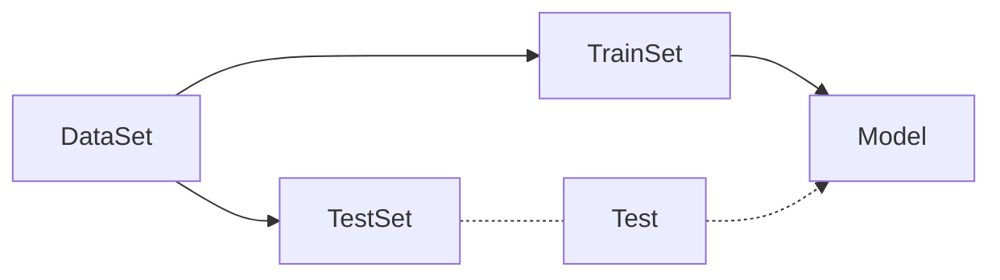
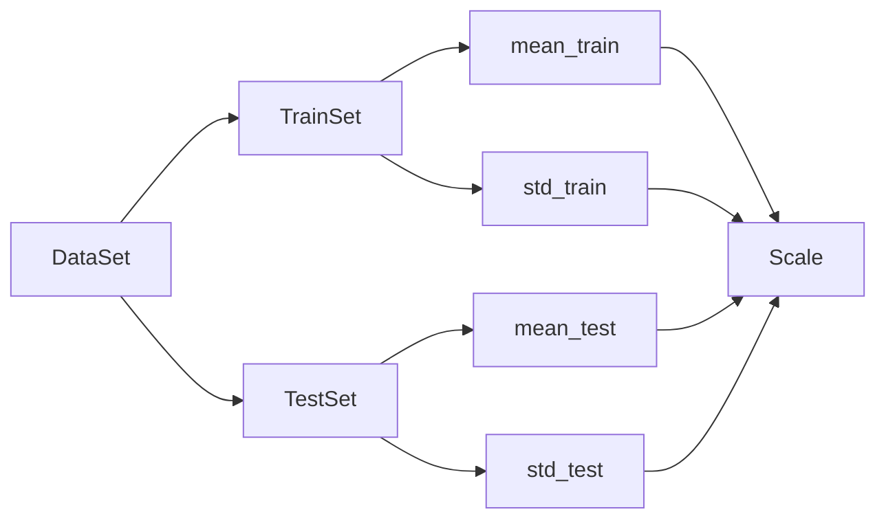
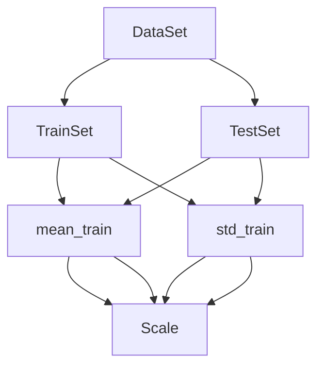
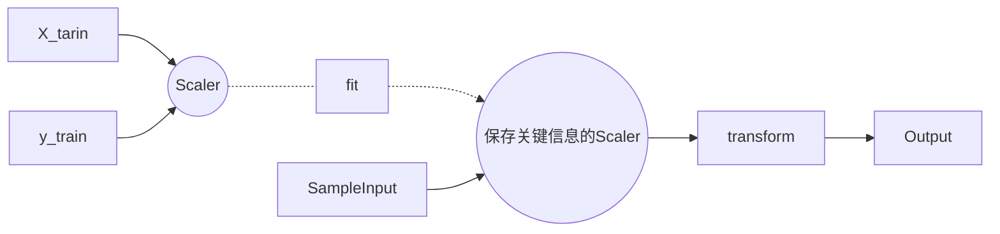

# 机器学习算法基础内容

#### 目录：

* [基础计算](#BasicStatisticalCalculation)

* [Train Test Split](#TrainTestSplit)
* [分类(classify)算法的评价指标(Accuracy)](#ClassificationAlgorithmPerformanceEvaluation)
* [超参数](#HyperParameter)
* [数据归一化Feature Scaling](#FeatureScaling)
    * [最值归一化 normalization](#FeatureScaling_Normalization)
    * [均值方差归一化 standardization](#FeatureScaling_Standardization)
* [衡量回归模型的性能的指标](#RegressionModelPerformanceEvaluation)
    * [衡量回归模型性能的指标：MSE](#RegressionModelPerformanceEvaluation_MSE)
    * [衡量回归模型性能的指标：RMSE](#RegressionModelPerformanceEvaluation_RMSE)
    * [衡量回归模型性能的指标：RMSE](#RegressionModelPerformanceEvaluation_MEA)
    * [衡量回归模型性能的指标：R Squared](#RegressionModelPerformanceEvaluation_R_Squared)

#### 基础计算

##### 平均值Mean

一般使用函数$Mean()$表示，在NumPy中为`numpy.mean()`

对于$X = (x_1, x_2, \cdots x_i)$，元素总数为$m$，其均值$\bar{X}$为：
$$
\bar{X} = \frac 
		{\sum^m_{i=1} x_i}
		{m}
$$

##### 方差Variance

一般使用函数$Var()$表示，在NumPy中为`numpy.var()`

对于$X = (x_1, x_2, \cdots x_i)$，元素总数为$m$，其均值为$\bar{X}$，方差$s^2_{X}$为：
$$
s^2_X = \frac 
		{\sum^m_{i=1}(x_i - x)^2 }
		{m}
$$

##### 标准差Standard Deviation

一般使用函数$Std()$表示，在NumPy中为`numpy.std()`，使用希腊字母$\sigma$表示。

**“平方和的平均”减去“平均的平方”。**

对于$X = (x_1, x_2, \cdots x_i)$，元素总数为$m$，其均值为$\bar{X}$，方差$s^2_{X}$，标准差为：
$$
\sigma_X = \sqrt{
	\frac{1}{m}
	\sum^m_{i=1}(
		x_i - \bar{X}
	)^2
}
$$
上述公式可以使用如下代换化简：
$$
\begin{align}
\sum^m_{i=1}(
	x_i - \bar{X}
)^2 &= 
\sum^m_{i=1}(
	x_i - 2x_i\cdot\bar{X}+\bar{X}^2
)^2 \\ &=
(\sum^m_{i=1} x_i^2) - m \cdot \bar{X}^2
\end{align}
$$
所以：
$$
\begin{align}
\sigma_X &= \sqrt{
	\frac{1}{m}
	\sum^m_{i=1}(
		x_i - \bar{X}
	)^2
} \\ &=
\sqrt{
	\frac{1}{m}
	(\sum^m_{i=1} x_i^2) - \frac{1}{m}\cdot m \cdot \bar{X}^2
} \\ &=
\sqrt{
	\frac
	{\sum^m_{i=1}x_i^2}
	{m}
	-
	\bar{X}^2
}
\end{align}
$$

#### Train Test Split

假设有一批训练数据，我们使用全部的数据训练出一个模型，并且尝试把模型用于真是的环境中，即：

数据集->模型->使用，会出现几个问题：

* 模型很差，真实损失(比如，股市，一个很差的模型会导致在股市上真正的损失)
* 真实环境难以拿到真是的label(无法拿到label，就无法判断一个模型的好坏)

一个有效的解决方法就是，把训练用的数据集拆分成两份，一份用于测试，一份用于训练，这个做法叫做

**Train Test Split**

[实现](../models/model_selection.py)

即:

这个流程中我们可以人为的指定训练，测试集在原始数据集中的占比。

测试数据中有真实的Label值，可以很好的判断模型的好坏。

当然这样也会产生问题，比如过拟合

(这里没写完)

#### 分类(classify)算法的评价指标(Accuracy)

[实现](../models/metrics.py)

计算模型产生的label和测试数据集已有的label之间的差异即可

比如180个有179个分类准确，则，其分类准确度为 $179 / 180$

#### 超参数

* 超参数: 在算法运行前需要决定的参数
* 模型参数：算法过程中学习的参数

kNN算法没有模型参数，但是k是kNN算法中的超参数

寻找好的超参数，比如kNN算法中的k，需要一定的领域知识，经验，实验等。

当然，也可以使用网格搜索的方法来完成。详细部分见notebook网格搜索

#### 数据归一化Feature Scaling

假设，有这样两个数据:

|         | 肿瘤大小(cm) | 发现天数(days) |
| :-----: | :----------: | :------------: |
| Sample1 |      1       |      200       |
| Sample2 |      5       |      100       |

如果使用这样的一组数据，作为训练数据集，样本间的距离被发现时间这一项所主导

若，我们将发现时间转化为年 

| | 肿瘤大小(cm) | 发现天数(years) | 
| :-----: | :----------: | :-------------: | 
| Sample1 | 1 | 200=0.55年 | 
|Sample2 | 5 | 100=0.27年 |

可以发现，样本间的距离又会被肿瘤大小所影响 这是因为两种数据之间的量纲不一致导致的。

解决的方案很简单，就是将数据进行归一化，**将所有的数据映射到同一尺度**

##### 最值归一化 normalization

把所有的数据映射到$0-1$之间：

$$
x_{scale} = \frac{x - x_{min}} {x_{max} - x_{min}}
$$

对于每一个特征我们都求出其最大值和最小值，比如对于肿瘤大小我们就可以找出最大的肿瘤和最小的肿瘤的数据，然后用每一个肿瘤的大小减去最小的肿瘤的大小然后除以最大最小肿瘤之间的差

* 适用于分布有明显边界的情况，比如学生的分数，最左值就是0，最右值就是满分，图像的像素等
* 受outlier影响较大，比如打工人和马云收入。

一个更好的解决方案就是：

##### 均值方差归一化 standardization

[Scaler实现](../models/preprocessing.py)

把所有的胡数据归一到均值为0方差为1的分布中

这样做并不保证数据在0~1之间，但是可以保证其均值为0，整体数据的方差为1

* 适用于数据分布没有明显的边界，可能存在极端数据的情况 当然，这不意味着有明显边界的数据不适用这种方法

$$
\begin{align}
x_{scale} &= \frac{x - \bar{x}} {S} \\ 
\bar{x} &= \frac{1}{n} \sum_{i=1}^n x_i (均值) 
\\ S &= \frac { \sum_{i=1}^n
x_i-\bar{x}} {n - 1} (方差)
\end{align}
$$

将归一化算法用在机器学习的过程中的时候有一个注意事项

数据集被拆分为训练数据集和测试数据集以后，就要开始训练模型，归一化操作具体怎么来做？

一个显而易见的浅显方式是

也就是说，将训练数据集和测试数据集分别进行归一化，然后训练后测试。

这个方法是**错误的**

正确的做法应该是

将测试数据集使用训练数据集求取的平均值和方差来进行归一化

换句话说：

$$
\frac{(x_{test} - mean_{train})} {std_{train}}
$$

原因如下：

* 真实环境很有可能无法得到所有测试数据的均值和方差
* 对数据的归一化也是算法的一部分

总结来说就是我们需要**保存训练数据得到的均值和方差**

#### 衡量回归模型的性能的指标

[实现](../models/metrics.py)

判断一个模型是否很好的解决了分类问题非常简答， 只需要统计一下分类对的个数和总个数，就可以很好的描述模型的准确率。

一个简单的例子，比如[简单线性回归模型](./03-LinearRegression.md#SimpleLinearRegression)中，目标是找到一个$a$和$b$，使得损失函数

$$
\sum^m_{i=1} (
	y_i - ax_i - b
) ^ 2
$$
尽可能地小，但是根据机器学习的[Train Test Split](#TrainTestSplit)，该目标应该转化为，使得损失函数：

$$
\sum^m_{i=1} (
	y_{itrain} - ax_{itrain} - b
) ^ 2
$$

尽可能地小，也就是使得

$$
\sum^m_{i=1} (
	y_{itrain} - \hat{y}_{train}
) ^ 2
$$

尽可能地小。

事实上，这个损失本身就是一个衡量的方法，对于不同的$(a, b)$来说，这个式子所产生的值是有大小之分的，根据这个大小，我们就可以说哪一个$(a, b)$更优。

训练过程结束后，得到了$(a, b)$，将其带入

$$
\hat{y}_{train} = ax_{itest} + b
$$

就可以相应的得到每一个$x_{test}$ 对应的 $\hat{y}_{train}$。

相应的衡量标准就变成了：
$$
\sum^m_{i=1} (
	y_{itest} - \hat{y}_{test}
) ^ 2 \tag{BaseMeasurements}
$$
注意，这里的$y$的下标已经是$test$了，意味着这里的y使用的是测试数据集中的数据。

但是有一个问题，就是这个[衡量标准](#BaseMeasurements)，是和m（测试数据集中的数据条目数）相关的，不同的算法使用这个衡量标准来进行衡量，一个产生了的结果是1000，一个是800，就能说800的更优吗？不可以，因为m是不确定的。因此，引入一个新的标准：[MSE](https://zh.wikipedia.org/zh-hans/%E5%9D%87%E6%96%B9%E8%AF%AF%E5%B7%AE)

##### 衡量回归模型性能的指标：MSE

MSE标注全程叫做Mean Squared Error, 均方误差，其实这个算法并没有做很多事情，只是在[上述标准](#BaseMeasurements)的基础上，除以m（测试数据条目数），去处样本数量对结果产生的影响，**只拿平均一个测试样本的误差说事儿**，其表达式为：
$$
\frac {1}{m} \cdot
\sum^m_{i=1}(
	y_{itest} - \hat{y}_{itest}
)^2 \tag{MSE}
$$

但是这就是万全之策了吗？

并不，还有量纲上的问题，比如预测房产价格中，以万元为单位，其产生的数字的单位是【万元的平方】，很好理解，因为上述表达式中的$y_{itest}, \hat{y}_{itest}$。两个数的单位都是万元，其差的单位也是万元，差的平方的单位就是万元的平方。把这一堆万元的平方加起来再除以一个常数$m$，其单位依旧是万元的平方，这个量纲甚至不具备可解释性，“我的算法产生的预测的房产价格的结果和实际数据的误差是1w平方元”，这就会造成麻烦，一个有效的解决方案就是，将结果开方，使用[RMSE](https://zh.wikipedia.org/zh/%E5%9D%87%E6%96%B9%E6%A0%B9%E8%AF%AF%E5%B7%AE)来作为衡量标准

##### 衡量回归模型性能的指标：RMSE

根据上述描述，其表达式为：
$$
\sqrt{MSE_{test}} = \sqrt {
	\frac{1}{m} \cdot
	\sum^m_{i=1} (
		y_{itest} - \hat{y}_{itest}
	) ^2
}
\tag{RMSE}
$$
其全称为 Root Mean Squared Error，均方根误差。

MSE和RMSE区别只在于量纲，MSE大，RMSE跟着也会大。区别只在于作报告时，对量纲是否敏感，使用RMSE采用同样的量纲的话，背后的误差更加明显。

##### 衡量回归模型性能的指标：MAE

Mean Absolute Error，平均绝对误差MAE，表达式为：
$$
\frac {1}{m} \cdot
\sum^m_{i=1}|
	y_{itest} - \hat{y}_{itest}
| \tag{MAE}
$$
使用差值的绝对值的和的均值也可以衡量模型的优劣，在简单线性回归模型中，推到损失函数时，因为绝对值函数不是一个处处可导的函数，所以放弃了使用绝对值，但是衡量算法标准时，这完全行得通。

**评价算法使用的标准和训练模型时最优化的目标函数是可以完全不一致的**

##### 衡量回归模型性能的指标：R Squared

对于分类算法来说，最好的情况就是百分之百全部分类正确，最坏的情况也就是没有一个分类正确

但是对于回归模型来说，怎么才能把其性能映射入1~0之间呢？

就是使用R Squared 指标来衡量模型。其算式为：
$$
R^2 = 1 - \frac 
	{SS_{residual}}
	{SS_{total}}
\tag{R Squared}
$$
其中$SS_{residual}$，是 Residual Sum of Squares(n. 剩余，残留物)，$SS_{total}$是Total Sum of Squares。其表达式为：
$$
SS_{residual} = 
	\sum_i (\hat{y}_i - y_i) ^2
\\
SS_{total} = 
	\sum_i(\bar{y} - y_i)^2
$$
其中，$\bar{y}$为$y$项的均值，$\hat{y}_i$为预测值。故：
$$
R^2 = 1 - \frac
	{\sum_i (\hat{y}_i - y_i) ^2} 
	{\sum_i(\bar{y} - y_i)^2}
\tag{R Squared}
$$
表达式中

1. 分子，也就是$SS_{residual}$，是**使用我们的模型预测产生的错误**，预测值与真值的差的平方的和
2. 分母，也就是$SS_{total}$，是**使用模型$y=\bar{y}$预测产生的错误**，这个模型是与$x$无关的，不管是哪个$x$，输出都是$y$的均值，这是一个非常朴素的预测结果，统计学/机器学习领域，我们称之为Baseline Model。

Baseline Model非常的朴素，其错误应该是比较多的，因为其完全不考虑$x$，而自己的模型的预测错误应该是比较少的。

R Squared模型意味着：使用baseline 模型会产生一些错误，使用自己的模型也会产生一些错误但是也会减少一些错误，用1减去这两者的商，相当于是计算自己的模型相对于baseline模型拟合住的数据（也就是没有产生错误的指标）

$R^2$指标的性质：

* $R^2 \le 1$
* $R^2$越大越好。当模型不犯任何错误的时候，$R^2$取得最大值1。
* 当模型等于基准模型时，$R^2$为0
* 当$R^2 \lt 0$，说明学习到的模型还不如基准模型。对于线性模型来说，很有可能是数据不存在任何线性关系。

回过头来看$R^2$的表达式，分时部分中，若分子分母之间同时除以$m$，其结果不变，但是分子部分就变成了[MSE](#RegressionModelPerformanceEvaluation_MSE)，分母部分就变成了方差：
$$
R^2 = 1 - \frac
	{\sum_i (\hat{y}_i - y_i) ^2} 
	{\sum_i(\bar{y} - y_i)^2}
	= 1 - \frac
	{ [\sum_i (\hat{y}_i - y_i)^2] / m}
	{[\sum_i(\bar{y} - y_i)^2] / m}
	= 1 - \frac 
	{MSE(\hat{y}, y)}
	{Var(y)}
\tag{R Squared}
$$
