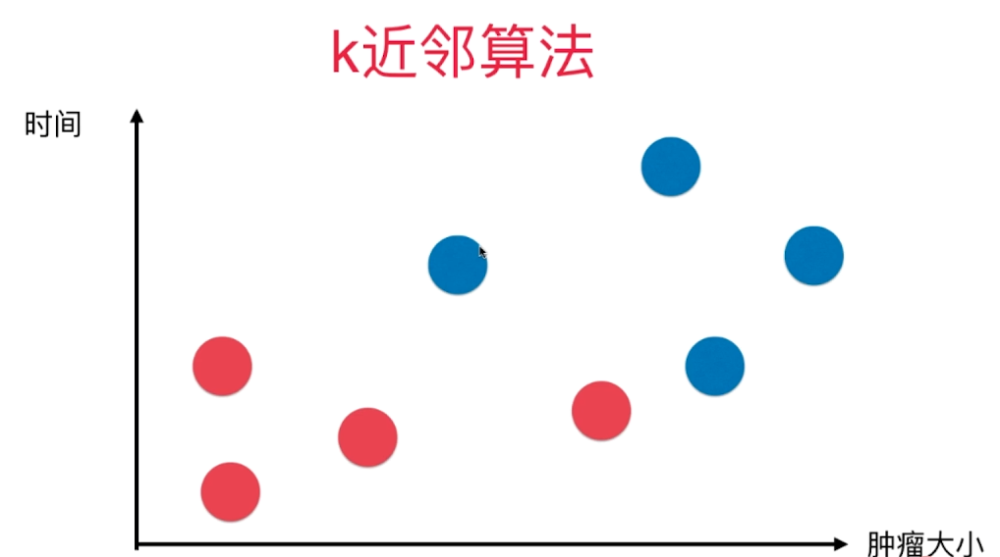
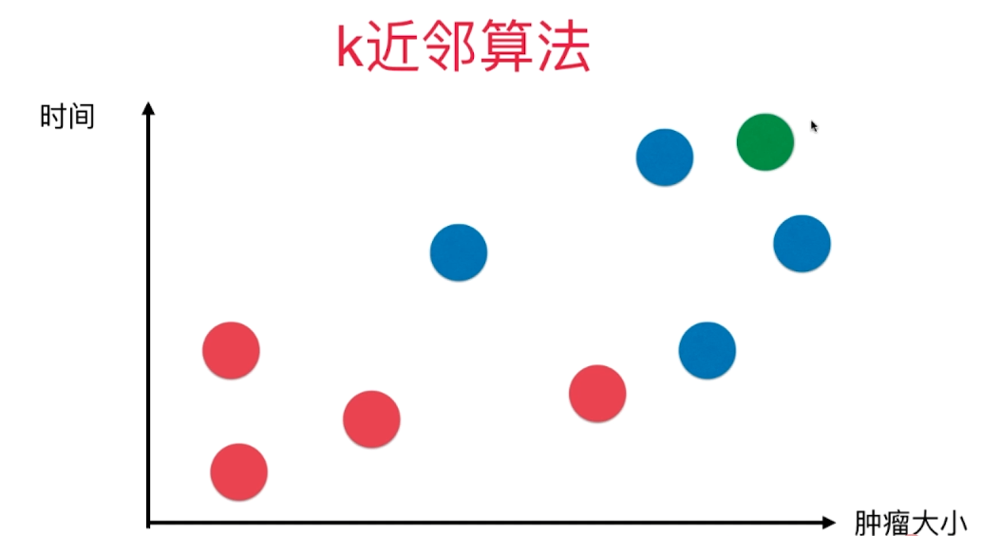
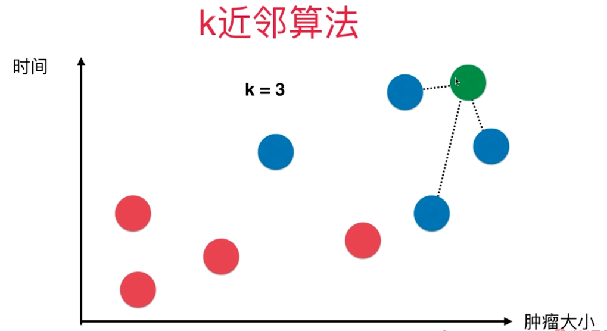
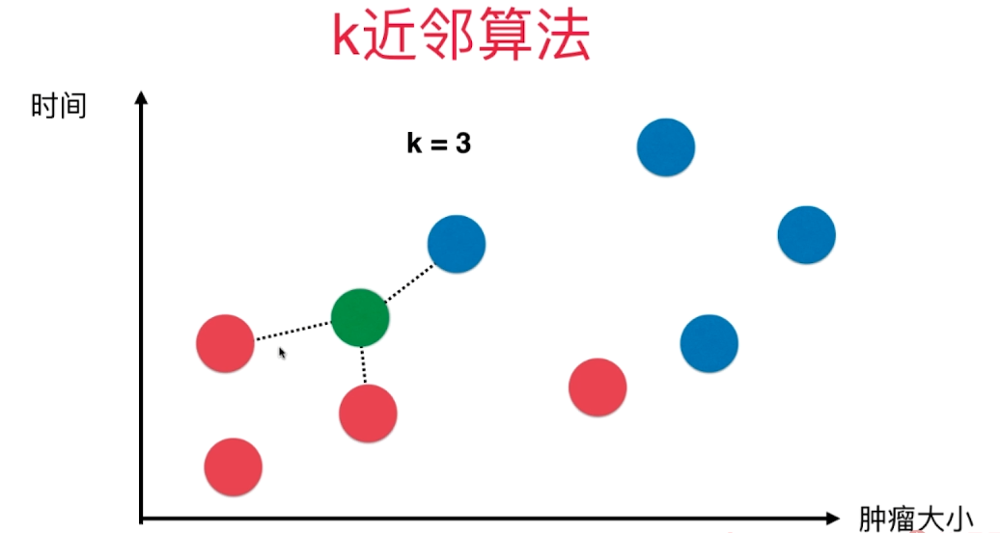
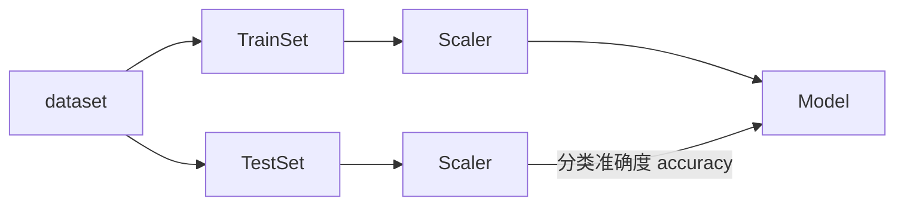

# kNN 算法

[算法实现](../modules/KNN.py)

目录：

* [简单的算法描述](#descriptions)
* [补充](#other)
    * [k近邻算法中提到的距离](#sample-distance-in-kNN)
        * [欧拉距离](#eula-distance)
        * [闵可夫斯基距离](#min-distance)
    * [更多有关kNN算法](#more-about-kNN)
    * [机器学习的流程](#flow-of-ML)

kNN 算法，又叫做 k近邻算法，其优点有：

* 思想极度简单
* 应用数学少
* 效果好
* 可以解释机器学习算法使用过程中的很多细节问题
* 更完整的刻画机器学习应用的流程

#### 简单的算法描述

假设，有一个机器学习的程序，被用来判断一个肿瘤的良恶性。假设肿瘤的良恶性只和肿瘤的生长时间以及肿瘤的大小油有关。 已知一组肿瘤数据，包含三个内容，肿瘤的大小，生长时间，以及良性/恶性标签（Label）。

横轴：大小

纵轴：生长时间

红色：良性

蓝色：恶性

这是我们的基本数据集，假设说，有一个新的样本进来，下图绿色的点为新的样本，需要判断其是良性还是恶性。

 </img>

使用KNN算法，首先需要取一个k值，假设，$k = 3$，当然，k的取值不是固定的，这是一个参数

对于每一个需要预测的数据点，kNN算法所作的事情非常简单：

* 在所有的样本点中，寻找出距离这个要预测的点最近的k个点(刚刚这里取$k=3$)
* 统计这k个点的标签，看哪一种标签居多
* 预测值为占比大的标签

这个例子中，距离要预测的样本点最近的三个点如下，这三个点都是恶性，所以也意味着，这个新的样本点也极有可能为恶性。

 </img>

再比如，有一个新的样本点

 </img>

距离其最近的三个数据点的标签为2红1蓝，所以也就意味着，这个新的样本点有极大的可能性是良性的。

#### 补充

##### k近邻算法中提到的距离

对于kNN算法来说，其步骤中有一个非常重要的步骤：计算距离，那么如何定义两个样本点之间的距离呢？ 一个简单的方法就是使用**欧拉距离**

######  欧拉距离

若，$A=(x_a, y_a), B=(x_b, y_b)$为二维空间空间中的两个点，则，其欧拉距离$d$为： 
$$
d(A, b) = \sqrt {
(x_a - x_b)^2 + (y_a - y_b)^2 }
$$

若将其推广，

若，$A=(x_a, y_a, z_a), B=(x_b, y_b, z_b)$为3维空间空间中的两个点，则，其欧拉距离$d$为： 

$$
d(A, B) = \sqrt {
(x_a - x_b)^2 + (y_a - y_b)^2 + (z_a - z_b)^2 }
$$
现在将距离推广到N维空间，欧拉距离的表示方法为： 
$$
A = (X_1^{(a)}, X_2^{(a)}, \cdots X_n^{(
a)})  \\ B = (X_1^{(b)}, X_2^{(b)}, \cdots X_n^{(b)}) \\ d(A,B) = \sqrt { \sum_{i=1}^{n} (
X_i^{(a)} - X_i^{(b)}
) ^ 2 }
$$
也并不是说，必须使用欧拉距离 事实上，定义空间中两个点的距离的方法有很多，比如曼哈顿距离，明可夫斯基距离等等，欧拉距离只是明可夫斯基距离的一个特例而已

###### 闵可夫斯基距离

将，欧拉距离进行推广 若
$$
P = (x_1, x_2, \cdots, x_n) \in R^n \\ Q = (y_1, y_2, \cdots, y_n) \in R^n \\ d(P, Q) =
\left[ \sum^n_{i=1} |x_i-y_i|\right]^{\frac{1}{p}}
$$

事实上，欧拉距离，曼哈顿距离，都是闵可夫斯基距离的特例，其中$p=2$时为欧拉距离，$p=1$时为曼哈顿距离

当然，也有其他的方法

比如：

* 向量空间预先相似度 Cosine Similarity
* 调整余相似度，Adjusted Cosine Cimilarity
* 皮尔森相关系数 Pearson Correlation Coefficient
* Jaccard 相似度，Jaccard Coefficient

#####  更多有关kNN算法

* 解决分类问题
* 天然的可以解决多分类问题
* 思想简单，效果强大

缺点：

* 效率低下
* 训练数据集有m个样本，n个特征，则预测一个新的数据需要$O(m\times n)$
* 高度数据相关
* 预测结果不具有可解释性
* 维数灾难（随着维度的增加，看似相近的两个点之间的距离越来越大），当然可以是试着使用降维来解决

| 维度  |           坐标到坐标           | 距离  |
| :---: | :----------------------------: | :---: |
|       |              0~1               |   1   |
|   2   |        $(0,0)$~$(1, 1)$        | 1.414 |
|   3   |      $(0,0,0)$~$(1, 1,1)$      | 1.73  |
|  64   | $(0,0,\cdots)$~$(1, 1,\cdots)$ |   8   |
| 10000 | $(0,0,\cdots)$~$(1, 1,\cdots)$ |  100  |

当然，可以是用树结构比如KD-Tree，Ball-Tree来进行优化

##### 机器学习的流程

