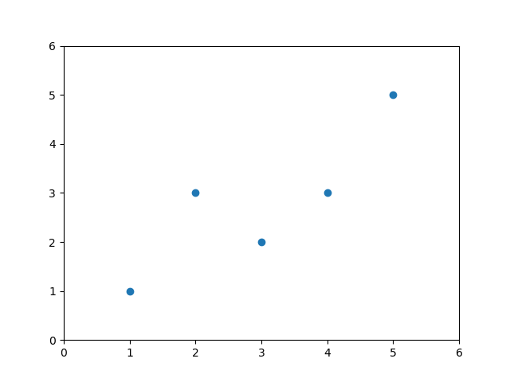
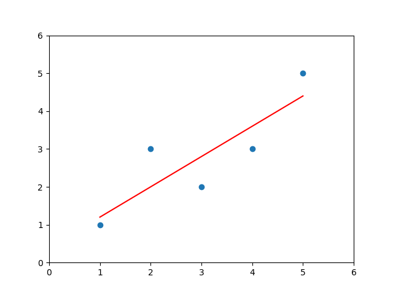
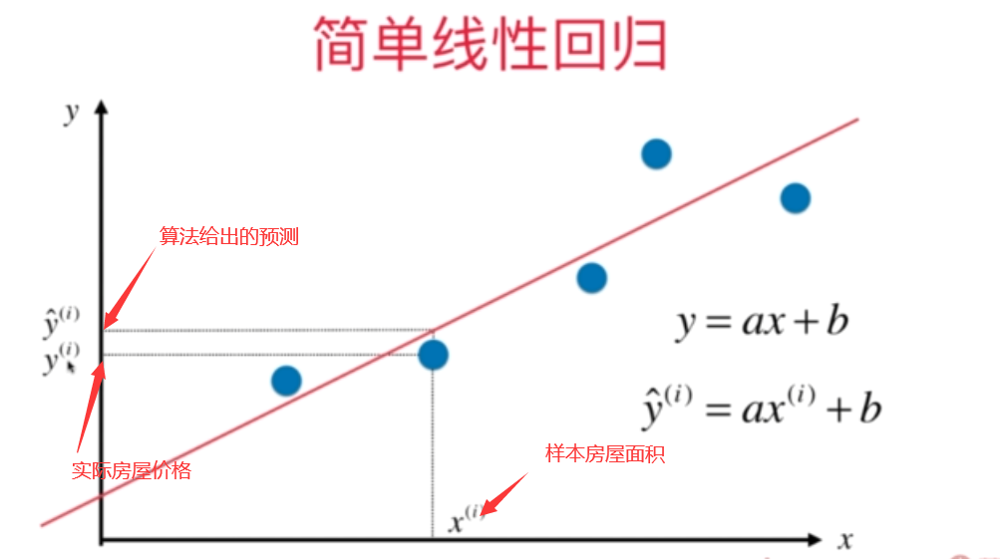

# Linear Regression

目录：

* [简单的描述](#Descriptions)
* [简单线性回归](#SimpleLinearRegression)
    * [如何描述预测值与真值的差距](#TrueValuePrediectValueDistance)
    * [一个典型地机器学习模型](#A-tyipical-ML-Model)
    * [最小二乘法推导简单线性回归损失函数](#LossFunctionOfSimpleLinearRegressionByLeastSquares)
* [多元线性回归](#MultipleLinearRegression)
    * [多元线性回归的数学表达](#MathReprOfMLR)

线性回归算法

* 解决回归问题
* 思想简单，容易实现
* 许多强大的非线性模型的基础
* 结果具有良好的可解释性（可以学习到真实世界的真正的知识）
* 蕴含机器学习中的很多重要思想

#### 简单的描述

假设，有一组房屋价格是数据，包含房屋的面积和房屋的价格两个内容：

横轴表示房屋面积，纵轴表示价格。

每一个房屋就是图中的一个点。

线性回归算法假设，这些房屋的价格和面积呈现一定的线性关系，随着房屋面积的增大，房屋价格也在提高，并且不是指数级这种夸张的增大。

在这样的一种假设下，我们需要寻找一条**直线**，穿梭在样本之间，最大程度的**拟合（fit）**样本特征和样本输出标记（这里就是纵轴）之间的关系。

即，图中的红色直线。

对于分类问题，比如之前kNN算法中提到的肿瘤，横轴纵轴都是样本的特征，点的标记（颜色）是样本输出标记，但是在这个例子中，横轴就是样本的特征，纵轴就是输出标记。

在回归问题中，要预测的内容是一个具体的数值，数值是分布在一个连续的空间中的，并不是离散的，需要占用一个坐标轴。

样本的特征只有一个，称之为：**简单线性回归**

样本特征有多个的时候，称为：**多元线性回归**

#### 简单线性回归（Simple Linear Regression）

[实现](../models/SimpleLinearRegression.py)

只有一个特征，一个输出标记，即，在二维平面中找出一条直线，来拟合样本

2D空间中的直线的表达式为：

$$
y = ax + b
$$

$a$为斜率，$b$为截距

对于一组数据$X=(x_1, x_2, \cdots,x_i)$来说，若，找到了拟合样本数据点的直线的截距$b$和斜率$a$

其，预测数据$\hat{Y} = (\hat{y_1},\hat{y_2},\cdots,\hat{y_i})$，中的每一个点，就可以使用

$$
\hat{y_i} = ax_i + b
$$

来表示。

其中，得到的$\hat{y_i}$就是使用简单 线性回归法的到的预测值，也就是算法的输出。

预测值$\hat{y_i}$和真值$y_i$之间是**存在差距的**

所谓的最佳拟合的直线，应该是，真值和预测值之间的差距最小的。

##### 如何表示预测值$\hat{y_i}$和真值$y_i$之间的差距呢？

一个简单方法就是使用减法：$y_i - \hat{y_i}$

但是，真值不是总是大于预测值的，一组数据$X$中所有的样本的预测值和其真值的差可能是有正负差别的，加起来可能为0，**不能很好的表示预测值$\hat{y_i}$和真值$y_i$之间的差距**。

一个解决方案就是使用差的绝对值来表示，但是问题是，**绝对值函数不是一个处处可导的函数**，所以也不考虑

最优解，就是，真值和预测值之间的差距$d_i$表达为：

$$
d_i = (y_i - \hat{y_i})^2
$$
的形式，考虑所有的样本，所有的$m$个样本的预测值和真值的差距的和$D$，就表示为：

$$
D = \sum^m_{i = 1} (y_i - \hat{y_i}) ^ 2
$$

那么，目标就非常明确了，使得预测值和真值之间的差距最小，即，使得
$$
D = \sum^m_{i = 1} (y_i - \hat{y_i}) ^ 2
$$
取得最小值。又，$\hat{y_i}$有自己的表达式，故：

$$
\begin{align}
D &= \sum^m_{i = 1} (y_i - \hat{y_i}) ^ 2\\
\hat{y_i} &= ax_i + b \\
D &= \sum^m_{i = 1} (y_i - ax_i - b)^2
\end{align}
$$

即，目标变成了，找到一个特定的$a$ 和$b$，使得：
$$
D = \sum^m_{i = 1} (y_i - ax_i - b)^2
$$
取得最小值。另外，使用平方还有一个好处：**限制最大误差尽可能地小**

#### 一个典型地机器学习模型

一句题外话，机器学习许多的算法其实就是这样的过程，找到某个特定的参数，使得某一个函数的取值尽可能大，或者尽可能小，线性回归算法这里的函数就是上述的$D$

这种需要最小化的函数，一般称之为**损失函数（loss function），即模型没有度量出来的部分，损失的部分**，需要最大化的函数，一般称之为**效用函数（utility functions），即模型度量出来的部分**
所以，机器学习的任务模型类似于：

近乎所有的参数学习（即创建一个模型，机器学习的任务就是找出模型需要的参数）算法都是这样的套路：

* 线性回归
* SVM
* 多项式回归
* 逻辑回归
* 神经网络

所以，有一颗学科非常重要：《最优化原理》，其中有一个非常重要的分支叫做《凸优化》。

回到正题，使得$D$尽可能小，是一个典型的最小二乘法的问题：最小化误差的平方

通过推导，$a$和$b$的表达式为：

$$
\begin{align}
a &= \frac 
		{\sum^m_{i=1} (x_i - \bar{x})(y_i - \bar{y})} 
		{\sum^m_{i=1} (x_i - \bar{x}) ^ 2} \\
		
b &= \bar{y} - a\bar{x}
\end{align}
$$
其中，$\bar{x}$为所有$x_i$的均值，$\bar{y}$为所有$y_i$的均值

##### 最小二乘法推导简单线性回归损失函数

过程如下：
$$
J(a, b) = \sum^m_{i = 1} (y_i - ax_i - b)^2
$$
$J$是关于$a$, $b$的函数，$y_i, x_i$都是已知的，是监督学习提供的数据，使得这个函数尽可能小。
求取最小值，实际上是一个求解极值的过程，求函数极值的一个方法就是对这个函数的各个分量进行求导，使其导函数的值为0，即：
$$
\begin{align}
J(a, b) &= \sum^m_{i = 1} (y_i - ax_i - b)^2 \\
let, \frac {\partial J(a, b)}{\partial a} &= 0 \\
let, \frac {\partial J(a, b)}{\partial b}& = 0 \\
\end{align}
$$
对$b$求导，根据链式求导法则：
$$
\frac {\partial J(a, b)}{\partial b} = \sum^m_{i=1} 2(y_i -ax_i -b )(-1) = 0
$$
相当于求和时，每一个被求和的项前面都有一个-2，删除这个-2，并不影响其等于0的性质，所以:
$$
\frac {\partial J(a, b)}{\partial b} = \sum^m_{i=1} (y_i -ax_i -b ) = 0
$$
对于求和计算而言，是允许拆分的，系数也可以提取出来，
比如
$$
(1+2+3) + (3+4+5) = (1+3) + (2+4) + (3+5)
$$
也就是说:

$$
\begin{align}
\frac {\partial J(a, b)}{\partial b} &= \sum^m_{i=1} (y_i -ax_i -b ) \\
&= \sum^m_{i=1} y_i - a\sum^m_{i=1}x_i - \sum^m_{i=1}b = 0
\end{align}
$$
因为$b$是一个常数，有m个样本，也就是把m个$b$相加，也就是$mb$:
$$
\frac {\partial J(a, b)}{\partial b} = \sum^m_{i=1} y_i - a\sum^m_{i=1}x_i - mb = 0
$$
移项：
$$
\begin{align}
\sum^m_{i=1} y_i - a\sum^m_{i=1}x_i - mb &= 0 \\
\sum^m_{i=1} y_i - a\sum^m_{i=1}x_i& = mb
\end{align}
$$
两边同时除以m，等式右边化为$b$，对于等式的左边：
* 全体m个$y_i$求和再除以m，意味着这个表达式就是$y_i$的平均值
* 全体m个$x_i$求和再除以m，意味着这个表达式就是$x_i$的平均值

因此：
$$
b = \bar{y} - a\bar{x}
$$

至此，$b$的表达式已经推到出来了

那么，对于$a$来说：
$$
\begin{align}
J(a, b) &= \sum^m_{i = 1} (y_i - ax_i - b)^2 \\
let, \frac {\partial J(a, b)}{\partial a} &= 0 \\
b &= \bar{y} - a\bar{x}
\end{align}
$$
对$a$求导：

$$
\frac {\partial J(a, b)}{\partial a} = \sum^m_{i = 1} 2(y_i - ax_i - b)(-x_i) = 0
$$
去掉系数$2$和$x_i$前面的$-1$并不影响其等于0的性质，并且带入$b$的表达式:
$$
\frac {\partial J(a, b)}{\partial a} = 
	\sum^m_{i = 1} 
	(y_i - ax_i - \bar{y}+a\bar{x})x_i = 0
$$
将括号外的$x_i$乘进去，并且把含a的项放在一起：
$$
\begin{align}
\sum^m_{i = 1} 
	(y_ix_i - ax_i^2 - \bar{y}x_i + a\bar{x}x_i) &=0 \\
\sum^m_{i = 1} 
	(y_ix_i  - \bar{y}x_i - ax_i^2 + a\bar{x}x_i) &=0\\
\end{align}
$$
将求和符号拆分，把含有a和不含有a的项拆分，并且提取a：

$$
\begin{align}
\sum^m_{i = 1} 
	(y_ix_i  &- \bar{y}x_i) 
- 
\sum^m_{i = 1} 
	(ax_i^2 - a\bar{x}x_i)&=0 \\
	
\sum^m_{i = 1} 
	(y_ix_i  &- \bar{y}x_i) 
- 
a\sum^m_{i = 1} 
	(x_i^2 - \bar{x}x_i)&=0 \\
\end{align}
$$

然后移项，然后除法操作时的左边只保留a：

$$
\begin{align}
	%% 第一个式子
    &\sum^m_{i = 1} 
        (y_ix_i  - \bar{y}x_i) 
    - 
    a\sum^m_{i = 1} 
        (x_i^2 - \bar{x}x_i) &= &0 \\
	%% 第二个式子
    &a\sum^m_{i = 1} 
        (x_i^2 - \bar{x}x_i) 
    &=&
    \sum^m_{i = 1} 
        (y_ix_i  - \bar{y}x_i)\\
	%% 第三个式子
    &a &= &\frac
        {
            \sum^m_{i = 1}(y_ix_i  - \bar{y}x_i)
        } 

        {
            \sum^m_{i = 1} (x_i^2 - \bar{x}x_i) 
        }
    
\end{align}
$$
至此，$a$的表达式就已经求解，但是，为了方便再编程中使用，加速其计算，还可以对$a$进行进一步化简。
对于等式的上半部，其中$x_i \bar{y}$的$\bar{y}$是一个常数，可以提取出来：
$$
\sum^m_{i = 1}(y_ix_i  - \bar{y}x_i) = 
\sum^m_{i = 1}y_ix_i  - \sum^m_{i = 1}\bar{y}x_i = 
\sum^m_{i = 1}y_ix_i  - \bar{y}\sum^m_{i = 1}x_i
$$
若，我们在单独的考虑$\bar{y}\sum^m_{i = 1}x_i$，如果我们使其除以总数$m$，又乘以总数$m$，结果不变，但是可以化简其形式：

$\sum^m_{i = 1}x_i$除以$m$，意味着把所有的$x_i$相加，除以总数，其实就是均值，
$$
\bar{y}\sum^m_{i = 1}x_i = \bar{y}\sum^m_{i = 1}x_i * \frac{m}{m} = 
m \bar{y} \cdot \bar{x}
$$

还没完，继续考虑$m \bar{y} \cdot \bar{x}$，
总数$m$乘以平均值$\bar{y}$，其实就是$y_i$求和，也就是$\bar{x} \sum^m_{i = 1} y_i$，也就是：
$$
\sum^m_{i = 1}\bar{y}x_i=
\bar{y}\sum^m_{i = 1}x_i = 
\bar{y}\sum^m_{i = 1}x_i * \frac{m}{m} = 
m \bar{y} \cdot \bar{x} = 
\bar{x} \sum^m_{i = 1} y_i =
\sum^m_{i = 1} \bar{x} y_i
$$
从左到右，其实把x和y对调了，本来是对y求均值，现在对x求均值。
另外，因为$\bar{x}, \bar{y}$都是常数，所以$m\cdot \bar{x} \cdot \bar{y} $可以理解成m个$ \bar{x} \cdot \bar{y} $相加：
$$
m \bar{y} \cdot \bar{x} = 
\sum^m_{i=1} \bar{x} \cdot \bar{y}
$$
根据上面的推论：

* 在$a$的表达式分子的部分加上一个$\bar{x}\cdot\bar{y}$，再减去一个$\bar{x}y_i$不影响其数值
* 在$a$的表达式分母的部分加上一个$\bar{x}^2$（也就是$\bar{x}\bar{x}$)，再减去一个$\bar{x}x_i$不影响其数值

$$
a = \frac
	{
		\sum^m_{i = 1}(
			y_ix_i  - \bar{y}x_i - \bar{x}y_i + \bar{x}\bar{y}
         )
	} 
	
	{
		\sum^m_{i = 1} (
			x_i^2 - \bar{x}x_i- \bar{x}x_i + \bar{x}^2
		) 
    }
$$

然后因式分解，上半部分其实就是$(a-b)(c-d)$的形式，下半部分合并同类项，就变成了 $x_i^2 + \bar{x}^2-2\bar{x}x_i$，也就是完全平方公式的形态，也就可以化简为：

$$
a = \frac 
		{\sum^m_{i=1} (x_i - \bar{x})(y_i - \bar{y})} 
		{\sum^m_{i=1} (x_i - \bar{x}) ^ 2} \\
		
b = \bar{y} - a\bar{x}
$$

#### 多元线性回归（Multiple Linear Regression）

[实现](../models/LinearRegression.py)

##### 多元线性回归的数学表达

目标依旧是，使得损失函数
$$
\sum^m_{i=1}(y_i-\hat{y}_i)^2
$$
尽可能地小，但是，这里并不是找到一组$(a, b)$，而是找到一组$n+1$个$\theta=(\theta_0, \theta_1, \cdots,\theta_n)$，使得目标函数取得最小值，$\hat{y}$的表达式变成了：
$$
\hat{y}_i = \theta_0 + \theta_1X_i^1+ \theta_2X_i^2+ \theta_nX_i^n \\
\theta = (\theta_0, \theta_1, \theta_2, \cdots, \theta_n)^T\\
X_n = (X_0, X_1, X_2, \cdots, X_n)^T
$$
其中，$\theta_n$为每一项的系数，$X_i^n$为数据集中第$i$个样本的第$n$个参数（i行n列）。

比如，这个训练数据集

| 房价$y$万元 | 房屋面积$X^1$ | 房屋楼层$X^2$ | 房屋地理位置$X^3$ | ...  |
| :---------: | :-----------: | :-----------: | :---------------: | :--: |
|     111     |      222      |      333      |        444        | ...  |
|     555     |      666      |      777      |        888        | ...  |
|     ...     |      ...      |      ...      |        ...        | ...  |

一行就是一个房屋样本：
$$
111 = \theta_0 +  \theta_1 \times222 + \theta_2 \times333 + \theta_3 \times444 \\
555 = \theta_0 + \theta_1 \times666 + \theta_2 \times777 + \theta_3 \times888
$$
第一个样本房屋的面积数据$X_1^1$就是$222$

若，现在各个$\theta$的值已经是已知数了，测试这些$\theta$值构成的所谓的模型的性能，

有一组测试数据集：

| 预测的房价$\hat{y}$万元 | 已知的房屋面积$X^1$ | 已知的房屋楼层$X^2$ | 已知的房屋地理位置$X^3$ | ...  |
| :---------------------: | :-----------------: | :-----------------: | :---------------------: | :--: |
|       $\hat{y}_1$       |         233         |         334         |           556           |      |
|       $\hat{y}_1$       |         779         |         877         |           455           |      |
|           ...           |         ...         |         ...         |           ...           | ...  |

根据$\hat{y}$的表达式，预测房屋的价格，就应该是：
$$
\hat{y}_1 = \theta_0 + \theta_1 \times233 + \theta_2 \times334 + \theta_3 \times556 \\
\hat{y}_2 = \theta_0 + \theta_1 \times779 + \theta_2 \times877 + \theta_3 \times455
$$
将$\hat{y}$的表达式进行转化：
$$
\begin{align}
X &= 
\left\{
\begin{matrix}
	X_1^1 & X_2^1& \cdots & X_n^1 \\
	X_1^1 & X_2^1& \cdots & X_n^1 \\
	\cdots & \cdots & \cdots \cdots & \cdots \\
	X_1^m & X_2^m& \cdots & X_n^m \\
\end{matrix}
\right\} \\

X_b &= 
\left\{
\begin{matrix}
	1 & X_1^1 & X_2^1& \cdots & X_n^1 \\
	1 & X_1^1 & X_2^1& \cdots & X_n^1 \\
	\cdots & \cdots & \cdots \cdots & \cdots \\
	1 & X_1^m & X_2^m& \cdots & X_n^m \\
\end{matrix}
\right\} \\

\theta &= 
\left\{
\begin{matrix}
	\theta_0 \\
	\theta_1 \\
	\theta_2 \\
	\cdots \\
	\theta_n \\
\end{matrix}
\right\} \\
\hat{y} &= X_b \cdot \theta
\tag{数学表达}
\end{align}
$$
其中，n为样本表格又多少列，m为样本表格有多少行（m行n列）。

* $X$是数据矩阵。
* $X_b$实在$X$地基础上，在最左边增加一全部都是1的列，因为$\theta_0$是一个常数。
* $\theta$是机器学习学习到的参数，也就是所谓的*模型*
* $\hat{y}$是一个向量，其中的元素是使用$\theta$对$X$中每一样样本进行预测的结果。

比如上述的[预测数据样例](#SampleTestDataChart)，就可以表示为：
$$
\begin{align}
X &= 
\left\{
\begin{matrix}
	233 & 334 & 556 \\
	779 & 887 & 455
\end{matrix}
\right\}, \\

X_b &= \left\{
\begin{matrix}
	1 & 233 & 334 & 556 \\
	1 & 779 & 887 & 455
\end{matrix}
\right\}, \\

\theta &= 
\left\{
\begin{matrix}
	\theta_0 \\
	\theta_1 \\
	\theta_2 \\
	\theta_3 \\
\end{matrix}
\right\} ,\\

\hat{y} &= X_b \cdot \theta 
\\ &=
\left\{
\begin{matrix}
	&\theta_0 + \theta_1\times 233 + \theta_2\times 334 + \theta_3\times 556 &\\
	&\theta_0 + \theta_1\times 779 + \theta_2\times 887 + \theta_3\times 455 &\\
\end{matrix}
\right\} = 
\left\{
\begin{matrix}
	&\hat{y}_1& \\
	&\hat{y}_2&
\end{matrix}
\right\}\tag{示例测试数据的数学表达}
\end{align}
$$

到此为止，可以重新整理目标函数，因为$\hat{y} = X_b \cdot \theta$，所以原目标函数$\sum^m_{i=1}(y_i-\hat{y}_i)^2$就可以转化为：
$$
(y - X_b \cdot \theta)^T(y-X_b \cdot \theta)
$$
前半部分是一个$1\times m$的行向量，后半部分是一个$m\times 1$的列向量，这两个向量相乘的结果是一个值，所以目标就是估计一个$\theta$使得上述矩阵运算的结果尽可能地小。

思路也很简单，就是使用最小二乘法，对每一个量求导，然后求极值，但是过程相对复杂，这里只写结果：
$$
\theta = (X_b^T X_b)^{-1} X_b^T y \tag{Norlmal Equation}
$$
这个式子被称为，**多元线性回归地正规方程解**

不需要记忆，一查哪儿都有，并且除了最小二乘法还有别的方法可以推导。

这个求解有一个问题：时间复杂度高，高达$O(n^3)$，即便是优化后，也高达$O(n^{2.4})$。

优点就是不需要对数据做归一化处理。

更加好用地方法，参考下一章，梯度下降法。
