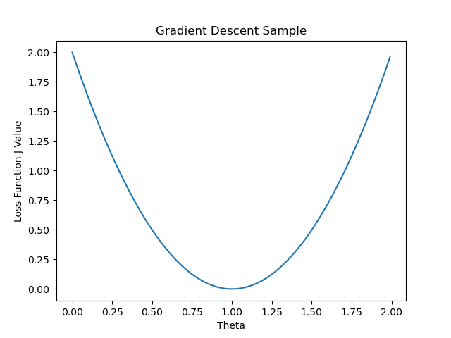
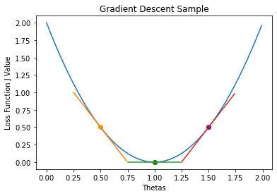
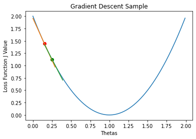
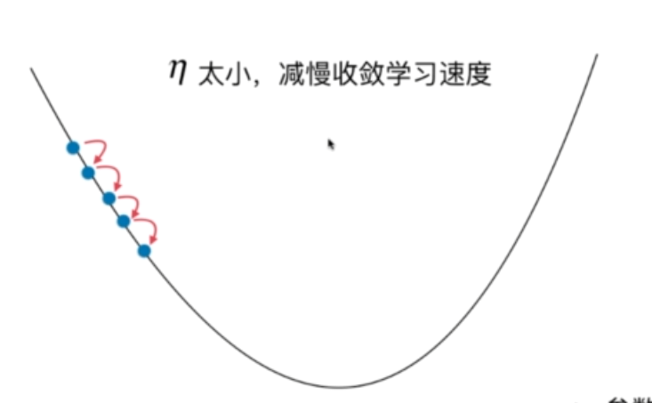
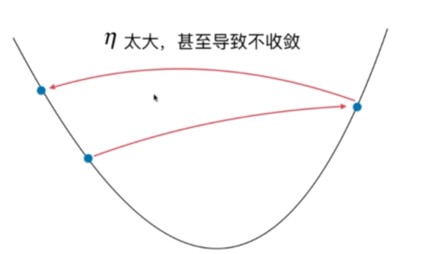
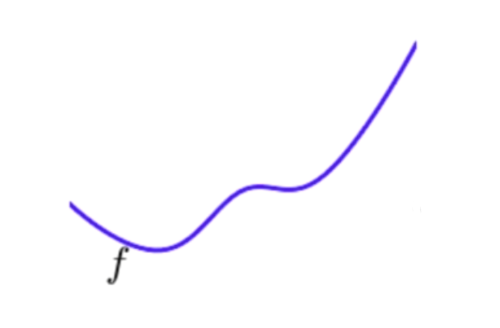
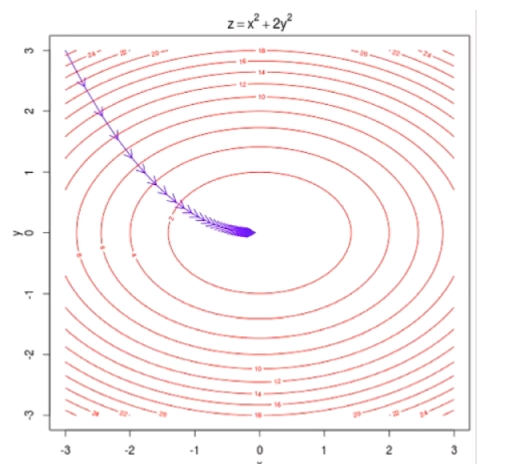
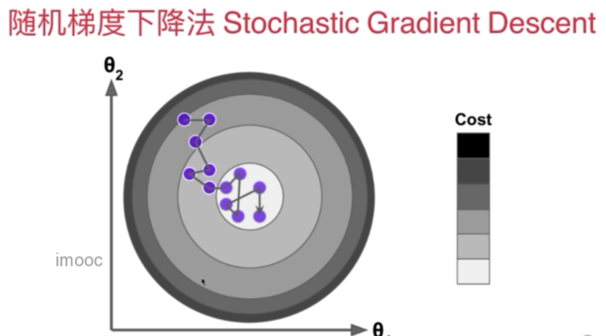

# Gradient Descent

目录：

* [梯度下降法介绍](#Introduction-Of-Gradient-Descent)
* [线性回归中的梯度下降法](#Gradient-Descent-in-LR)
* [线性回归中的梯度下降法](#Stochastic-Gradient-Descent)
* [图像绘制代码](#Plot-code)


### <span id="Introduction-Of-Gradient-Descent">梯度下降法介绍</span>

* 不是一个机器学习算法
* 是一种基于搜索的最优化方案
* 作用：最小化一个损失函数
* 需要最大化效用函数时可以使用梯度上升法。

<p style="align:center"></p>


当我们定义了一个损失函数$J$，y轴为损失函数$J$的取值，x轴为损失函数$J$的参数$\theta$的取值。

损失函数应该在一定范围内有一个最小值，最小化这个损失函数的过程来说，相当于在这个坐标系中找到一个点参数，使得损失函数$J$取得最小值。

在这个例子中，损失函数处于二位平面，相当于参数只有一个，并且我人为的指定其表达式为：
$$
\begin{align}
J &= 2 \theta^2 -4\theta + 2 \\
\frac{dJ}{d\theta} &= 4\theta-4
\end{align}
$$
并且$\theta$的取值范围是$[0, 2)$

直线方程组，导数代表斜率，在曲线方程中，导数代表每个点的切线的斜率，换一个角度来理解，导数其实意味着，$\theta$单位变化时，$J$相应的变化。其实就是斜率的定义。

<p style="align:center"></p>


* 橙色的点上，导数是一个负值，此时，$\theta$若减小（往左诺），$J$将变大（往上挪）
* 绿色的点上，导数为0，此时，$\theta$不论左右移动都使得$J$增大。
* 红色的点上，导数是一个正值，此时，$\theta$若减小（往左诺），$J$将变大（往下挪）

也就是说，导数其实也可以代表一个方向，对应$J$增大的方向

* 在橙色的点上，导数是负值，$J$增大的方向，是x轴的负方向
* 在红色的点上，导数是正值，$J$增大的方向，是x轴的正方向

如果想找到$J$的最小值，在任意点上，只需要取导数的相反数即可，搜索工程上对应也需要一个步长，移动多少总得确定下来，这个值一般我们用$\eta$来表示。

对于一个点来说：

* 求出其导数，就知道$J$增大的方向，要找出减少方向需要乘以$-1$
* 知道$J$减少的方向，需要确定一个步长，用于搜索。

$\eta$的值，不是固定的，但是一般取$0.1$。

下图中，从橙色的点，向$J$减少的方向前进一定的步数，就会抵达绿色的点

<p style="align:center"></p>

只要步长合适，重复一定次数的前进，就可以抵达$J$的最小值，也就是$\theta=1.00$的时候


这个思想就是，**梯度下降法**，1维的函数的导数叫做导数，在多维函数中，要对各个方向的分量求导，最终得到的方向就是所谓的”梯度“。

另外，对于$\eta$

* 它被称作学习率(Learning Rate)
* 其取值将影响获得最优解的速度
* 取值不合适甚至无法得取最优解
* 他是梯度下降法的一个超参数

$\eta$太小：

<p style="align:center"></p>

$\eta$太大：

<p style="align:center"></p>

对于梯度下降法，在例子中是一个二次函数，它显然有唯一的极值点，但是并不是所有的函数都有唯一的极值点，很多时候，机器学习使用的梯度下降法面临的函数是很复杂的，比如：

<p style="align:center"></p>

这个函数，有两个极小值，最小值在左边，使用梯度下降法进行搜索的话，初始点从右开始，搜索到的第一个”最小值“，显然不是这个函数的最小值，这种情况被叫做*局部最优解*，然而左边的极小值才是*全局最优解*。

解决方案：

* 多次运行，随机化初始点。
* 梯度下降法的初始点也是一个超参数。

详细内容参见[模拟梯度下降法](../notebooks/chp4-Gradient-Descent-And-Linear-Regression/01-Gradient-Descent-Simulations.ipynb)


### <span id="Gradient-Descent-in-LR">线性回归中的梯度下降法</span>

可以确定地是$\theta=(\theta_0, \theta_1, \cdots,\theta_n)$是一个向量，内涵的元素都是**未知量**，参考[梯度下降法介绍](#Introduction-Of-Gradient-Descent)中的横坐标，有$(n+1)$个元素，即便是简单线性回归法里，也是一个包含两个元素的向量。

多个参数$\theta$，其导数$\frac{dJ}{d\theta}$应该也是一个包含$(n+1)$个元素的向量：
$$
\frac{dJ}{d\theta} = 
\nabla J = (
	\frac{\partial J}{\partial \theta_0}, 
	\frac{\partial J}{\partial \theta_1}, 
	\cdots,
	\frac{\partial J}{\partial \theta_n}, 
)
$$
**梯度代表方向，对应损失函数$J$增大最快的方向。**

比如对这个函数：
$$
J = z = x^2 + 2y^2
$$
使用梯度下降法：

<p style="align:center"></p>

红色的一圈一圈的是等高线，也就是损失函数$J$的取值，越是靠外，$J$的取值越大，反之越小。

图的中心达到$J$的最小值。

从起始点开始，到最小值为止，有无数条通路，但是**梯度所代表的方向是下降最快的**

回到线性回归法的目标，使得损失函数$J$最小
$$
\begin{align}

J &= \sum^m_{i=1} (y_i - \hat{y}_i)^2 \\
\hat{y}_i &= \theta_0 + \theta_1 X_i^1 + \theta_2 X_i^2 + \cdots + \theta_n X_i^n \\
J &= \sum^m_{i=1} (
	y_i - \theta_0 
	- \theta_0 X_i^1 
	- \theta_1 X_i^2 
	- \cdots - 
	\theta_n X_i^n
)^2

\end{align}
$$
其中：

* $\hat{y}_i$表示对需要预测的第$i$样本的预测值
* $X_i^n$，上标表示需要预测的第$i$个样本的第$n$的特征，比如房产数据的房屋面积，坐标等
* $m$表示样本总个数

在$J$上，对$\theta$求梯度：
$$
\begin{align}

\nabla J(\theta) &= 
\left \{
\begin{matrix}
	\frac{\partial J}{\partial \theta_0}, \\
	\frac{\partial J}{\partial \theta_1}, \\
	\cdots,\\
	\frac{\partial J}{\partial \theta_n} 
\end{matrix}
\right \}
\\ &=  

\left \{
\begin{matrix}
	\sum^m_{i=1}2(y_i - X_i^b\theta)\cdot (-1) \\
	\sum^m_{i=1}2(y_i - X_i^b\theta)\cdot (-X_i^1)\\
	\sum^m_{i=1}2(y_i - X_i^b\theta)\cdot (-X_i^2) \\
	\cdots \\
	\sum^m_{i=1}2(y_i - X_i^b\theta)\cdot (-X_i^n) \\
\end{matrix}
\right \}
\\ &=
2 \cdot
\left \{
\begin{matrix}
	\sum^m_{i=1}(X_i^b\theta - y_i), \\
	\sum^m_{i=1}(X_i^b\theta - y_i)\cdot (X_i^1) \\
	\sum^m_{i=1}(X_i^b\theta - y_i)\cdot (X_i^2) \\
	\cdots \\
	\sum^m_{i=1}(X_i^b\theta - y_i)\cdot (X_i^n) \\
\end{matrix}
\right \}
\end{align}
$$
其中:

* $X_i^b$是一个矩阵，$X_i^b = (1, X_i^1, X_i^2, \cdots X_i^n)$，$i$表示第$i$个样本，$n$表示样本的第$n$个特征，为了给$\theta_0$，也就是常数项凑一个向，在原本的数据表格的基础上加上了一列1
* $\theta=(\theta_0, \theta_1, \cdots,\theta_n)$

举个实际的例子：

房产数据：

| 预测房价 | 房子面积$(m^2)$ | 房子地理位置 | 空气污染 | 第n个特征 |
| :--------------------------: | :------: | :--: | :--: | ---------------------------- |
| $\hat{y}_1$ | 150 | 123 | 12312 | ... |
| $\hat{y}_2$ | 200 | 121 | 3423 | $X_1^n$   |
| ... | ... | ... |    .     | $X_2^n$   |
| $\hat{y}_i$ | $X_i^1$ | $X_i^1$ | $X_i^1$ | $X_i^n$ |

这个数据对应的$X_i^b, \hat{y}_i$，be like:
$$
X_i^b = 
\left \{
\begin{matrix} 
	1 & 150 & 123 \\
	1 & 200 & 121 \\
	  &\cdots &
\end{matrix} 
\right \}
$$
 回到梯度的表达式：
$$
\nabla J(\theta)=
2 \cdot
\left \{
\begin{matrix}
	\sum^m_{i=1}(X_i^b\theta - y_i), \\
	\sum^m_{i=1}(X_i^b\theta - y_i)\cdot (X_i^1) \\
	\sum^m_{i=1}(X_i^b\theta - y_i)\cdot (X_i^2) \\
	\cdots \\
	\sum^m_{i=1}(X_i^b\theta - y_i)\cdot (X_i^n) \\
\end{matrix}
\right \}
$$
在这个式子中，每一项前都有一个求和符号，也就意味着，样本越多，梯度越大，这是不合理的。

应该消除样本数量对梯度的影响。给整个梯度值除以$m$即可
$$
\nabla J(\theta)=
\frac{2}{m} \cdot
\left \{
\begin{matrix}
	\sum^m_{i=1}(X_i^b\theta - y_i), \\
	\sum^m_{i=1}(X_i^b\theta - y_i)\cdot (X_i^1) \\
	\sum^m_{i=1}(X_i^b\theta - y_i)\cdot (X_i^2) \\
	\cdots \\
	\sum^m_{i=1}(X_i^b\theta - y_i)\cdot (X_i^n) \\
\end{matrix}
\right \}
$$
也就意味着给目标函数$J$乘了一个$\frac{1}{m}$：
$$
J = \frac{1}{m} \sum^m_{i=1}(y_i - \hat{y}_i)^2
$$
这个式子非常眼熟，实际上他就是，MSE
$$
J(\theta) = MSE(y, \hat{y})
$$
在有些教材里，也会把多元线性回归的损失函数写成：
$$
J = \frac{1}{2m} \sum^m_{i=1}(y_i - \hat{y}_i)^2
$$
这样做的好处很简单，就是求梯度的时候，由平方产生的2会被他抵消。两倍的差距在实际应用中差别不大。用谁都可以。

使用梯度下降法，允许对目标函数进行一定的修整，不是目标函数的所有形态都适合使用梯度下降法。


### <span id="Stochastic-Gradient-Descent">随机梯度下降法SGD</span>

在梯度下降法的介绍中提到的做法，有时候也叫批量梯度下降法(Batch gradient descent)，每一次计算梯度时，都需要对**所有的样本**中所有的信息进行批量的计算。

观察这个公式：


$$
\nabla J(\theta)=
\frac{2}{m} \cdot
\left \{
\begin{matrix} 
	& \textcolor{red}{\sum^m_{i=1}}(X_i^b\theta - y_i), \\
	& \textcolor{red}{\sum^m_{i=1}}(X_i^b\theta - y_i)\cdot (X_i^1) \\
	& \textcolor{red}{\sum^m_{i=1}}(X_i^b\theta - y_i)\cdot (X_i^2) \\
	& \cdots \\
	& \textcolor{red}{\sum^m_{i=1}}(X_i^b\theta - y_i)\cdot (X_i^n) \\
\end{matrix}
\right \}
$$
在批量梯度下降的时候，需要对每一个维度进行$m$次计算，毕竟有个求和。

回顾梯度下降法求多元线性回归的损失函数的最小值的操作，如果$m$，也就是样本的个数，很大的时候，计算梯度本身也是非常好使的。

这个问题，可以这样改进，每一次只**取一个样本进行计算**，去掉$\Sigma$，并且对$i$，每次都取固定的值。相应的也不需要除以$m$了。
$$
\nabla J(\theta)=
2 \cdot
\left \{
\begin{matrix}
	(X_i^b\theta - y_i), \\
	(X_i^b\theta - y_i)\cdot (X_i^1) \\
	(X_i^b\theta - y_i)\cdot (X_i^2) \\
	\cdots \\
	(X_i^b\theta - y_i)\cdot (X_i^n) \\
\end{matrix}
\right \}
$$
向量化以后：
$$
\nabla J(\theta)=
2 \cdot
\left \{
\begin{matrix}
	(X_i^b\theta - y_i), \\
	(X_i^b\theta - y_i)\cdot (X_i^1) \\
	(X_i^b\theta - y_i)\cdot (X_i^2) \\
	\cdots \\
	(X_i^b\theta - y_i)\cdot (X_i^n) \\
\end{matrix}
\right \} = 2 \cdot (X_b^{(i)}) \cdot (X_b^{(i)}\theta-y^{(i)})
$$
对于$X_b^{(i)}$，每次只取一行。使用这个式子作为搜索的方向（不是梯度，这个式子已经不是损失函数的梯度了）。

每一次都随机取得一个$i$，对$i$进这个式子的计算。这个式子也是一个向量，也可以表达一个方向，向这个方向进行迭代，获取损失函数的最小值。

搜索过程就像是这样：

<p style="align:center"></p>

如果是批量梯度下降法，他会从外面的一个点，朝着最小值，坚定不移的，往中心走。随机梯度下降法每次获得的方向不能保证是损失函数减少的方向，更不能保证是减小速度最快方向。所以搜索路径会左一下右一下。

即使他有一定的不可预知性，但是实验告诉我们，随机梯度下降法可以带我们来到损失函数的最小值的附近（不一定是最小值）。当$m$非常大的时候，这是使用精度换取计算时间的方法。

另外，在随机梯度下降法中，学习率$\eta$的取值也变得很重要，甚至不能是一个固定的值。很有可能随机梯度下降法已经到了最小值附近了，随机得过程不够好，然后学习率又是个固定式，就会导致它有可能跳去最小值得周围。

所以，在随机梯度下降得过程中，学习率应该是递减的。

所以，需要设计一个函数，用于输出一个学习率，随着随机梯度下降法的循环次数的增加，学习率应该越来越小。

这个函数的最简单的表示方法就是:
$$
\eta = \frac{1}{n_{iters}}
$$
这个方法可行，但是有时候会有一些问题，当循环次数比较少的，eta值下降的特别快，循环次数从1变到2，eta一下就下降了50%。循环次数从10000增长到10001时，eta却又下降了万分之一，下降速度的比率又太小。

为了缓解这种情况，需要在分母上添加一个常数：
$$
\eta = \frac{1}{n_{iters} + b}
$$
当然，分子一直取1的话，有可能也达不到目的，所以分子也换成一个常数：
$$
\eta = \frac{a}{n_{iters} + b}
$$
更加灵活一些。

正因如此，这个$a$和$b$，就是随机梯度下降法的两个超参数。

经验上，a一般取5，b一般取50。

这种逐渐递减的思想，是模拟一个在搜索领域非常重要的思想：模拟退火的思想。


### <span id="Plot-code">上述图片绘制代码</span>

```Python
# 上述图像的绘制代码
import matplotlib.pyplot as plt
import numpy as np
# 原函数
def J(thetas: np.ndarray):
    return 2 * thetas ** 2 - 4 * thetas + 2
# 函数导数
def dj(thetas: np.ndarray):
    return 4 * thetas - 4

# 绘制直线，point是在哪个点，k是斜率，X是取值范围
# 使用点斜式表达直线
def line(point, X, k):
    return k * (X - point[0]) + point[1]

# 橙，绿，红三点
dj_ls_0_point_on_J = Thetas[50], Y[50]
dj_eq_0_point_on_J = Thetas[100], Y[100]
dj_gt_0_point_on_J = Thetas[150], Y[150]

# 橙，绿，红三点的导数
dj_ls_0 = dj(dj_ls_0_point_on_J[0])
dj_eq_0 = dj(dj_eq_0_point_on_J[0])
dj_gt_0 = dj(dj_gt_0_point_on_J[0])

# 绘图
plt.plot(Thetas, Y)
plt.scatter(*dj_ls_0_point_on_J, color="orange")
plt.scatter(*dj_eq_0_point_on_J, color="g")
plt.scatter(*dj_gt_0_point_on_J, color="purple")

# 绘制橙，绿，红三点的切线
plt.plot(Thetas[25:75], line(dj_ls_0_point_on_J, Thetas[25:75], dj_ls_0))
plt.plot(Thetas[75:125], line(dj_eq_0_point_on_J, Thetas[75:125], dj_eq_0))
plt.plot(Thetas[125:175], line(dj_gt_0_point_on_J, Thetas[125:175], dj_gt_0))
# plt.plot(Thetas, dY, color="r")
plt.xlabel("Thetas")
plt.ylabel("Loss Function J Value")
plt.title("Gradient Descent Sample")
plt.show()
```