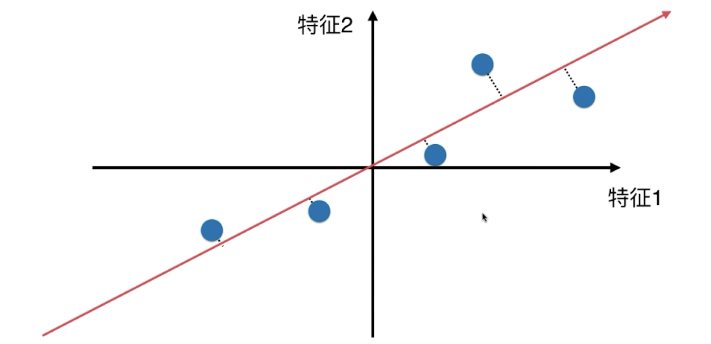
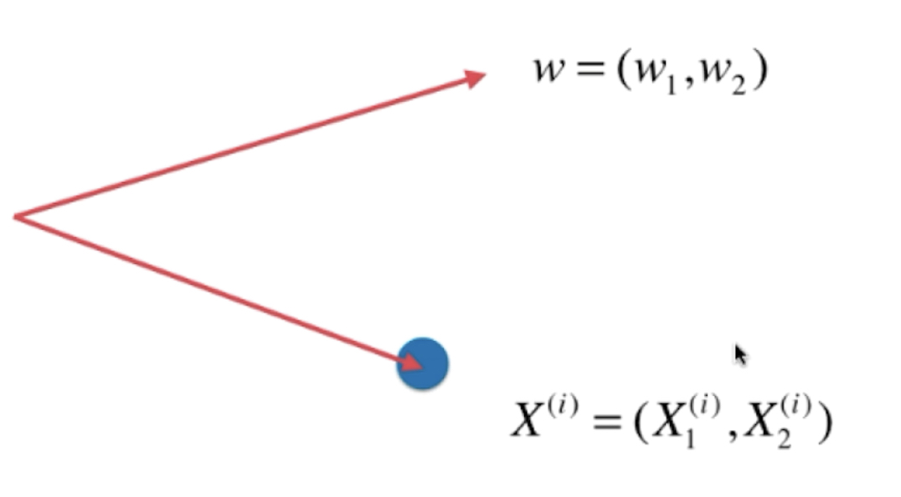
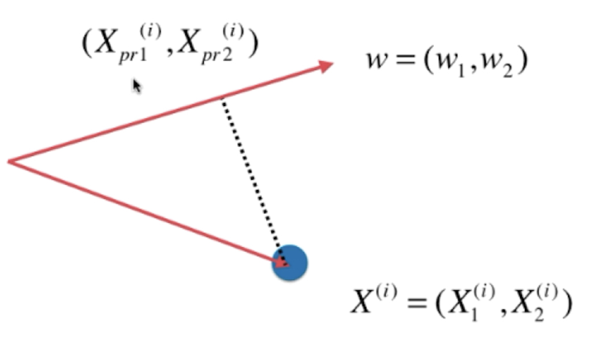

# Principal component analysis and Gradient Ascent

主成分分析以及梯度上升法

### 主成分分析

这是一个：

* 非监督的机器学习算法
* 主要用于数据的降维（用于可视化，算法的加速）
* 通过降维，找到更加便于人类理解的特征
* 用于可视化，用于去噪

的算法。

#### 原理

如图，有一组数据：

$x$, $y$分别是两个特征，现在如果我们需要将其进行降维操作，一个显而易见的办法就是丢弃一个特征，比如，我们丢弃y特征，只保留x，则，数据点会变成：

同理，我们也可以丢弃x特征，只保留y：

怎么判断，哪一个方案更优呢？

在这个情况在，显然是丢弃y，保留x这个方案更优。

其原因在于，点和点之间的距离是更大的，也就是说点和点之间有着更好的可区分度。并且，**点和点之间的距离相对较大也更好的保留了原先的点和点之间的关系。**

但这并不最优解，如果我们可以合并两个特征，用一根直线将原先的数据点串起来：

一根斜线，如果可以把所有的数据点都映射到这条直线上，将数据点都移到这跟直线上，这样做和原先的数据点的差距更小。

这种方法想对于【把数据映射到X/Y轴】上来说，更加好的保留了数据点之间原先的距离信息，数据的区分度也更加的明显。

为了找到这个轴，需要搞清楚两个问题：

* 如何找这个让样本间间距最大的轴？
* 如何定义样本间间距？ 

对于第二个问题来说，统计学上有一个可以直接定义样本间间距的指标：方差（Variance，描述样本整体分布疏密的指标，方差越大，分布越稀疏，反之越紧密）[公式在这里](./01-Basic_knowledge.md)

确定下样本间间距的定义后，问题一就变成了：

* 找到一个轴，使得样本空间的所有的点映射到这个轴后，**方差**最大

步骤如下：

1. 将样本的均值归零(demean)，也就是使得所有的样本都减去样本的均值。

   假设有一组样本如下：

   

   在进行Demean后，起样本分布就会变成这样：

   

   样本的分布并没有被改变，只是修改了坐标轴。使得样本在每一个维度的均值都是0。

   回头看方差的公式
   $$
   Var(x) = \frac{1}{m}\sum_{i=1}^m(x_i - \bar{x})^2
   $$
   其中，$\bar{x} = 0$,也就意味着可以将其化简为：
   $$
   Var(x) = \frac{1}{m}\sum_{i=1}^m(x_i)^2
   $$

2. 我们想要一个轴的方向  $w = (w_1, w_2, \cdots w_n)$本节事例中就是两个，使得所有的样本映射到$w$后，有：

   $$
   Var(X_{project}) = \frac{1}{m} \sum^m_{i=1} ||X^{(i)}_{project} -\bar{X}_{project}||^2
   $$
   最大，其中

   * $X$是映射后的样本点。在本节的事例中的样本点（也就是X），都是一个包含了两个维度的数据的向量，所以使用$||$来表示，不使用括号。
   * $\bar{X}_{project}$也是一个包含了N个（本例中就是2个）平均值的向量。

   简单说，就是 **使得这两个向量（数据-数据的均值）相减之后所得到的向量的模的平方最大**，另外，前一步中已经做过了Demean，所以$\bar{X}$里都是0，所以可以进一步化简：
   $$
   Var(X_{project}) = \frac{1}{m} \sum^m_{i=1} ||X^{(i)}_{project}||^2
   $$

进一步的问题出现了，$X_{project}$到底是谁，如何使用原本的数据$X^{(i)}$来表示？

* 对于一组二维的数据来说，我们已经找到了方向$w = (w_1, w_2)$，
* 现在有一个数据点$X^{(i)} = (X_1^{(i)}, X_2^{(i)})$，其中$X_1^{(i)}, X_2^{(i)}$是数据这个数据样本的两个值。

将$X^{(i)} = (X_1^{(i)}, X_2^{(i)})$映射到$w = (w_1, w_2)$上，其实就是做一条垂直线，交点位置就是映射后的点：

我们管这个点叫做$X^{(i)}_{pr} = (X^{(i)}_{pr1},X^{(i)}_{pr2})$

在公式
$$
Var(X_{project}) = \frac{1}{m} \sum^m_{i=1} ||X^{(i)}_{project}||^2
$$
中，真正要求的就是向量$X^{(i)}_{pr} = (X^{(i)}_{pr1},X^{(i)}_{pr2})$的模的平方。

有没有发现，这就是点乘(dot product)的定义：
$$
X^{(i)} \cdot w = ||X^{(i)}|| \cdot ||w|| \cdot \cos{\theta}
$$
其中$ \cos{\theta}$是两个向量的夹脚的余弦值。

另外，$w$是一个方向向量，也就意味着其模为1，所以可以进一步演化：
$$
X^{(i)} \cdot w = ||X^{(i)}||\cdot \cos{\theta}
$$
另外，
$$
X^{(i)} \cdot w  = ||X^{(i)}_{project}||
$$
所以，公式：
$$
Var(X_{project}) = \frac{1}{m} \sum^m_{i=1} ||X^{(i)}_{project}||^2
$$
可以转化为：
$$
Var(X_{project}) = \frac{1}{m} \sum^m_{i=1} ||X^{(i)} \cdot w ||^2
$$
另外$X^{(i)}, w $都是向量，向量的点乘的结果是一个数，所以要写成这样：
$$
Var(X_{project}) = \frac{1}{m} \sum^m_{i=1} (X^{(i)} \cdot w )^2
$$
最终，目标确定：

找到一个$w$，使得：
$$
Var(X_{project}) = \frac{1}{m} \sum^m_{i=1} (X^{(i)} \cdot w )^2
$$
最大。

如果把它展开，按照点乘的规则展开：
$$
\begin{align}
Var(X_{project}) 	&= \frac{1}{m} \sum^m_{i=1} (X^{(i)} \cdot w )^2 \\
								 	&= \frac{1}{m} \sum^m_{i=1} (X_1^{(i)}w_1 + X_2^{(i)}w_2 + \cdots + X_n^{(i)}w_n)^2 \\
								 	&= \frac{1}{m} \sum^m_{i=1} (\sum_{j=1} ^ n X_j^{(i)} w_j)^2
\end {align} \\
$$
最终，主成分分析法，变成了一个目标函数最优化的问题，如何优化捏？当然是，**梯度上升法**。

### 使用梯度上升法解决PCA

目标：求$w$，使得：
$$
f(X) = \frac{1}{m} \sum^m_{i=1} (X_1^{(i)}w_1 + X_2^{(i)}w_2 + \cdots + X_n^{(i)}w_n)^2
$$
最大。（这里不用$J(X)$，采用用$f(X)$，因为$J(X)$用来表示损失函数。另外，这个式子中，X是已知的，是非监督学习提供的样本信息（毕竟没有label，没有y这一项，没有y这一项的信息），$w$才是未知数（所以求导是对w进行求导而不是对X进行求导）
$$
\nabla f = 

\left \{
  \begin{matrix}
    \frac{\partial f}{\partial w_1} \\
    \frac{\partial f}{\partial w_2} \\
    \frac{\partial f}{\partial w_3} \\
    \cdots \\
    \frac{\partial f}{\partial w_n}
  \end{matrix}
\right \} = 

\frac{2}{m}
\left \{
  \begin{matrix}
  	\sum_{i=1}^m (X_1^{(i)}w_1 + X_2^{(i)}w_2 + \cdots + X_n^{(i)}w_n)X_\textcolor{red}{1}^{(i)} \\
  	\sum_{i=1}^m (X_1^{(i)}w_1 + X_2^{(i)}w_2 + \cdots + X_n^{(i)}w_n)X_\textcolor{red}{2}^{(i)} \\
  	\sum_{i=1}^m (X_1^{(i)}w_1 + X_2^{(i)}w_2 + \cdots + X_n^{(i)}w_n)X_\textcolor{red}{3}^{(i)} \\
  	\cdots \\
  	\sum_{i=1}^m (X_1^{(i)}w_1 + X_2^{(i)}w_2 + \cdots + X_n^{(i)}w_n)X_\textcolor{red}{n}^{(i)} \\
  \end{matrix}
\right \} = 
\frac{2}{m}
\left \{ 
	\begin{matrix}
		\sum_{i=1}^m (X^{(i)} w_1) X_1^{(i)} \\
		\sum_{i=1}^m (X^{(i)} w_2) X_2^{(i)}\\
		\cdots \\
		\sum_{i=1}^m (X^{(i)} w_n) X_n^{(i)}
	\end{matrix}
\right\}
$$
到此为止其实已经可以去编程实现了，但是，还可以进一步向量化。
$$
\nabla f = 
\frac{2}{m}
\left \{ 
	\begin{matrix}
		\sum_{i=1}^m (X^{(i)} w_1) \\
		\sum_{i=1}^m (X^{(i)} w_2) \\
		\cdots \\
		\sum_{i=1}^m (X^{(i)} w_n)
	\end{matrix}
\right\} =
	
\frac{2}{m} \cdot (X^{(1)} w, X^{(2)} w, \cdots, X^{(m)} w, ) \cdot
\left [
\begin {matrix}
	X_1^{(1)} & X_2^{(1)} & X_3^{(1)} & \cdots & X_n^{(1)} \\
	X_1^{(2)} & X_2^{(2)} & X_3^{(2)} & \cdots & X_n^{(1)} \\
	X_1^{(3)} & X_2^{(3)} & X_3^{(3)} & \cdots & X_n^{(1)} \\
	\cdots & \cdots & \cdots & \cdots & \cdots \\ 
	X_1^{(m)} & X_2^{(m)} & X_3^{(m)} & \cdots & X_n^{(m)} \\
\end {matrix}
\right] = 
\frac{2}{m} \cdot (Xw)^T \cdot X
$$
后面这一大坨其实就是入的数据本身。因此：
$$
\nabla f = \frac{2}{m} \cdot (Xw)^T \cdot X = \frac{2}{m}\cdot X^T(Xw)
$$
