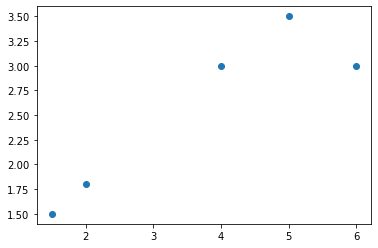
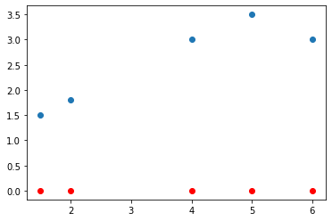
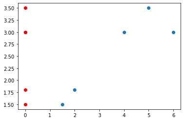
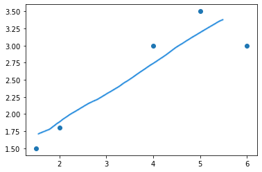

# Principal component analysis and Gradient Ascent

主成分分析以及梯度上升法

### 主成分分析

这是一个：

* 非监督的机器学习算法
* 主要用于数据的降维
* 通过降维，找到更加便于人类理解的特征
* 用于可视化，用于去噪

的算法。

#### 原理

如图，有一组数据：

$x$, $y$分别是两个特征，现在如果我们需要将其进行降维操作，一个显而易见的办法就是丢弃一个特征，比如，我们丢弃y特征，只保留x，则，数据点会变成：

同理，我们也可以丢弃x特征，只保留y：

怎么判断，哪一个方案更优呢？

在这个情况在，显然是丢弃y，保留x这个方案更优。

其原因在于，点和点之间的距离是更大的，也就是说点和点之间有着更好的可区分度。并且，点和点之间的距离相对较大也更好的保留了原先的点和点之间的关系。

但这并不最优解，如果我们可以合并两个特征，用一根直线将原先的数据点串起来：

一根斜线，如果可以把所有的数据点都映射到这条直线上，将数据点都移到这跟直线上，这样做和原先的数据点的差距更小。

那么问题来了：

* 如何找这个让样本间间距最大的轴？
* 如何定义样本间间距？ 

对于第二个问题来说，统计学上有一个可以直接定义样本间间距的指标：方差（Variance）[公式在这里](./01-Basic_knowledge.md)

确定下样本间间距的定义后，问题一就变成了：

* 找到一个轴，使得样本空间的所有的点映射到这个轴后，**方差**最大

步骤如下：

1. 将样本的均值归零(demean)
2. 我们想要一个轴的方向  $w = (w_1, w_2)$，使得$Var(X_{project}) = \frac{1}{m} \sum^m_{i=1} ||X^{(i)} -\bar{X}_{project}||^2 $最大

