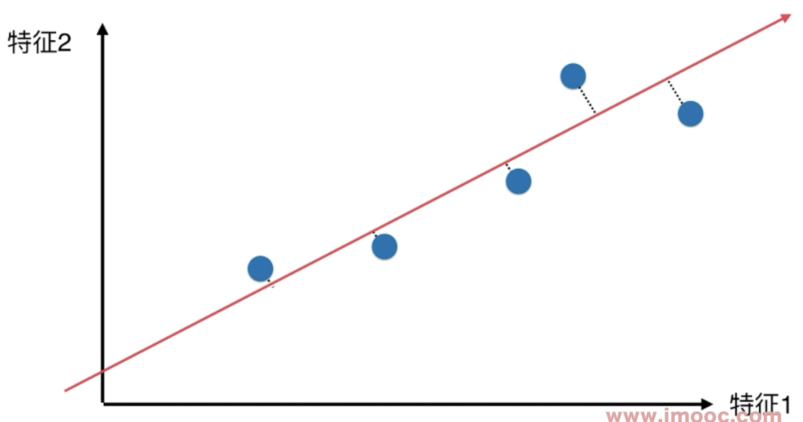
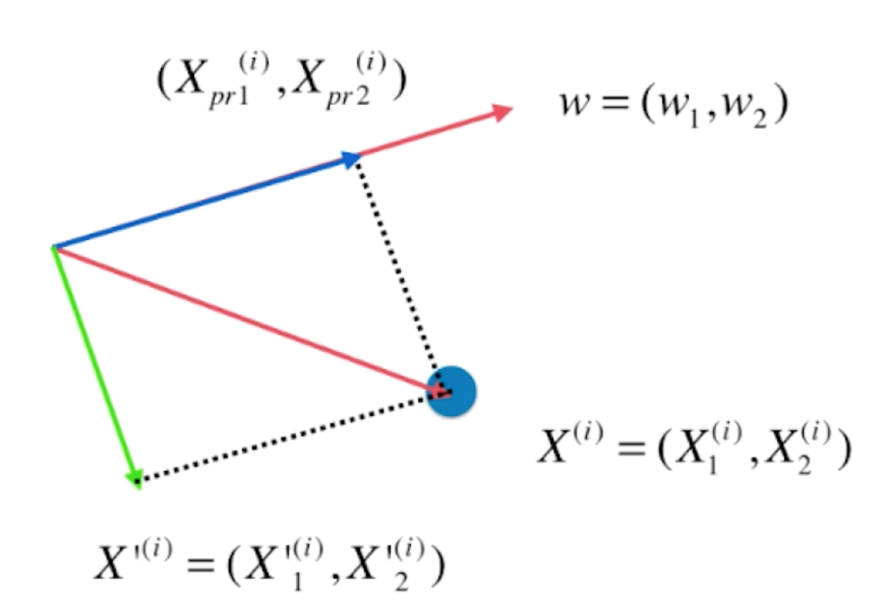
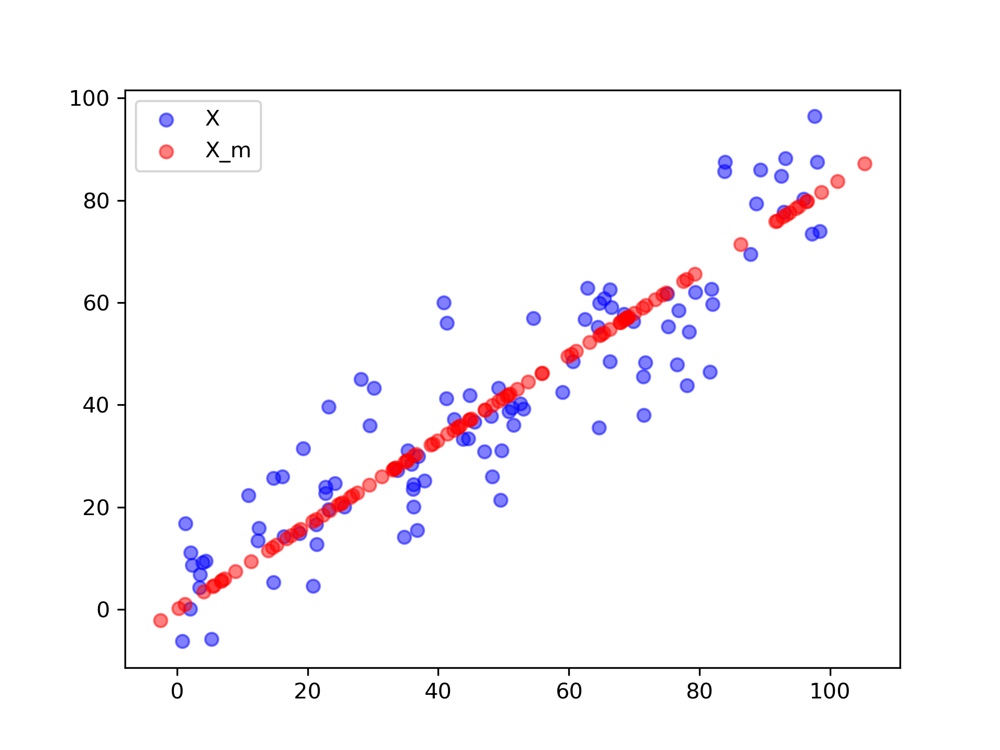

# 主成分分析以及梯度上升法

主成分分析以及梯度上升法

目录：

* [什么是主成分分析](#About-PCA)
* [使用梯度上升法求解主成分分析](#Gradient-Ascent-in-PCA)
* [前N个主成分](#first-n-C)
* [数据映射](#data-project)
* [PCA对数据的降噪作用](#Data-Denoise-By-PCA)

#### 主成分分析

这是一个：

* 非监督的机器学习算法
* 主要用于数据的降维（用于可视化，算法的加速）
* 通过降维，找到更加便于人类理解的特征
* 用于可视化，用于去噪

的算法。原理如下：

如图，有一组数据：

$x$, $y$分别是两个特征，现在如果我们需要将其进行降维操作，一个显而易见的办法就是丢弃一个特征，比如，我们丢弃y特征，只保留x，则，数据点会变成：

同理，我们也可以丢弃x特征，只保留y：

怎么判断，哪一个方案更优呢？

在这个情况在，显然是丢弃y，保留x这个方案更优。

其原因在于，点和点之间的距离是更大的，也就是说点和点之间有着更好的可区分度。并且，**点和点之间的距离相对较大也更好的保留了原先的点和点之间的关系。**

但这并不最优解，如果我们可以合并两个特征，用一根直线将原先的数据点串起来：

一根斜线，如果可以把所有的数据点都映射到这条直线上，将数据点都移到这跟直线上，这样做和原先的数据点的差距更小。

这种方法想对于【把数据映射到X/Y轴】上来说，更加好的保留了数据点之间原先的距离信息，数据的区分度也更加的明显。

为了找到这个轴，需要搞清楚两个问题：

* 如何找这个让样本间间距最大的轴？
* 如何定义样本间间距？ 

对于第二个问题来说，统计学上有一个可以直接定义样本间间距的指标：方差（Variance，描述样本整体分布疏密的指标，方差越大，分布越稀疏，反之越紧密）[公式在这里](./01-Basic_knowledge.md)

确定下样本间间距的定义后，问题一就变成了：

* 找到一个轴，使得样本空间的所有的点映射到这个轴后，**方差**最大

步骤如下：

1. 将样本的均值归零(demean)，也就是使得所有的样本都减去样本的均值。

   假设有一组样本如下：

   

   在进行Demean后，起样本分布就会变成这样：

   

   样本的分布并没有被改变，只是修改了坐标轴。使得样本在每一个维度的均值都是0。

   回头看方差的公式
   $$
   Var(x) = \frac{1}{m}\sum_{i=1}^m(x_i - \bar{x})^2
   $$
   其中，$\bar{x} = 0$,也就意味着可以将其化简为：
   $$
   Var(x) = \frac{1}{m}\sum_{i=1}^m(x_i)^2
   $$

2. 我们想要一个轴的方向  $w = (w_1, w_2, \cdots w_n)$本节事例中就是两个，使得所有的样本映射到$w$后，有：

   $$
   Var(X_{project}) = \frac{1}{m} \sum^m_{i=1} ||X^{(i)}_{project} -\bar{X}_{project}||^2
   $$
   最大，其中

   * $X$是映射后的样本点。在本节的事例中的样本点（也就是X），都是一个包含了两个维度的数据的向量，所以使用$||$来表示，不使用括号。
   * $\bar{X}_{project}$也是一个包含了N个（本例中就是2个）平均值的向量。

   简单说，就是 **使得这两个向量（数据-数据的均值）相减之后所得到的向量的模的平方最大**，另外，前一步中已经做过了Demean，所以$\bar{X}$里都是0，所以可以进一步化简：
   $$
   Var(X_{project}) = \frac{1}{m} \sum^m_{i=1} ||X^{(i)}_{project}||^2
   $$

进一步的问题出现了，$X_{project}$到底是谁，如何使用原本的数据$X^{(i)}$来表示？

* 对于一组二维的数据来说，我们已经找到了方向$w = (w_1, w_2)$，
* 现在有一个数据点$X^{(i)} = (X_1^{(i)}, X_2^{(i)})$，其中$X_1^{(i)}, X_2^{(i)}$是数据这个数据样本的两个值。

将$X^{(i)} = (X_1^{(i)}, X_2^{(i)})$映射到$w = (w_1, w_2)$上，其实就是做一条垂直线，交点位置就是映射后的点：

我们管这个点叫做$X^{(i)}_{pr} = (X^{(i)}_{pr1},X^{(i)}_{pr2})$

在公式
$$
Var(X_{project}) = \frac{1}{m} \sum^m_{i=1} ||X^{(i)}_{project}||^2
$$
中，真正要求的就是向量$X^{(i)}_{pr} = (X^{(i)}_{pr1},X^{(i)}_{pr2})$的模的平方。

有没有发现，这就是点乘(dot product)的定义：
$$
X^{(i)} \cdot w = ||X^{(i)}|| \cdot ||w|| \cdot \cos{\theta}
$$
其中$ \cos{\theta}$是两个向量的夹脚的余弦值。

另外，$w$是一个方向向量，也就意味着其模为1，所以可以进一步演化：
$$
X^{(i)} \cdot w = ||X^{(i)}||\cdot \cos{\theta}
$$
另外，
$$
X^{(i)} \cdot w  = ||X^{(i)}_{project}||
$$
所以，公式：
$$
Var(X_{project}) = \frac{1}{m} \sum^m_{i=1} ||X^{(i)}_{project}||^2
$$
可以转化为：
$$
Var(X_{project}) = \frac{1}{m} \sum^m_{i=1} ||X^{(i)} \cdot w ||^2
$$
另外$X^{(i)}, w $都是向量，向量的点乘的结果是一个数，所以要写成这样：
$$
Var(X_{project}) = \frac{1}{m} \sum^m_{i=1} (X^{(i)} \cdot w )^2
$$
最终，目标确定：

找到一个$w$，使得：
$$
Var(X_{project}) = \frac{1}{m} \sum^m_{i=1} (X^{(i)} \cdot w )^2
$$
最大。

如果把它展开，按照点乘的规则展开：
$$
\begin{align}
Var(X_{project}) 	&= \frac{1}{m} \sum^m_{i=1} (X^{(i)} \cdot w )^2 \\
								 	&= \frac{1}{m} \sum^m_{i=1} (X_1^{(i)}w_1 + X_2^{(i)}w_2 + \cdots + X_n^{(i)}w_n)^2 \\
								 	&= \frac{1}{m} \sum^m_{i=1} (\sum_{j=1} ^ n X_j^{(i)} w_j)^2
\end {align} \\
$$
最终，主成分分析法，变成了一个目标函数最优化的问题，如何优化捏？当然是，**梯度上升法**。

#### 使用梯度上升法解决PCA

[实现](../notebooks/chp5-PCA-And-Gradient-Ascent/01-Implement-PCA-in-Basic-Gradient-Ascent.ipynb)

目标：求$w$，使得：
$$
f(X) = \frac{1}{m} \sum^m_{i=1} (X_1^{(i)}w_1 + X_2^{(i)}w_2 + \cdots + X_n^{(i)}w_n)^2
$$
最大。（这里不用$J(X)$，采用用$f(X)$，因为$J(X)$用来表示损失函数。另外，这个式子中，X是已知的，是非监督学习提供的样本信息（毕竟没有label，没有y这一项，没有y这一项的信息），$w$才是未知数（所以求导是对w进行求导而不是对X进行求导）
$$
\nabla f = 

\left \{
  \begin{matrix}
    \frac{\partial f}{\partial w_1} \\
    \frac{\partial f}{\partial w_2} \\
    \frac{\partial f}{\partial w_3} \\
    \cdots \\
    \frac{\partial f}{\partial w_n}
  \end{matrix}
\right \} = 

\frac{2}{m}
\left \{
  \begin{matrix}
  	\sum_{i=1}^m (X_1^{(i)}w_1 + X_2^{(i)}w_2 + \cdots + X_n^{(i)}w_n)X_\textcolor{red}{1}^{(i)} \\
  	\sum_{i=1}^m (X_1^{(i)}w_1 + X_2^{(i)}w_2 + \cdots + X_n^{(i)}w_n)X_\textcolor{red}{2}^{(i)} \\
  	\sum_{i=1}^m (X_1^{(i)}w_1 + X_2^{(i)}w_2 + \cdots + X_n^{(i)}w_n)X_\textcolor{red}{3}^{(i)} \\
  	\cdots \\
  	\sum_{i=1}^m (X_1^{(i)}w_1 + X_2^{(i)}w_2 + \cdots + X_n^{(i)}w_n)X_\textcolor{red}{n}^{(i)} \\
  \end{matrix}
\right \} = 
\frac{2}{m}
\left \{ 
	\begin{matrix}
		\sum_{i=1}^m (X^{(i)} w_1) X_1^{(i)} \\
		\sum_{i=1}^m (X^{(i)} w_2) X_2^{(i)}\\
		\cdots \\
		\sum_{i=1}^m (X^{(i)} w_n) X_n^{(i)}
	\end{matrix}
\right\}
$$
到此为止其实已经可以去编程实现了，但是，还可以进一步向量化。
$$
\nabla f = 
\frac{2}{m}
\left \{ 
	\begin{matrix}
		\sum_{i=1}^m (X^{(i)} w_1) \\
		\sum_{i=1}^m (X^{(i)} w_2) \\
		\cdots \\
		\sum_{i=1}^m (X^{(i)} w_n)
	\end{matrix}
\right\} =
	
\frac{2}{m} \cdot (X^{(1)} w, X^{(2)} w, \cdots, X^{(m)} w, ) \cdot
\left [
\begin {matrix}
	X_1^{(1)} & X_2^{(1)} & X_3^{(1)} & \cdots & X_n^{(1)} \\
	X_1^{(2)} & X_2^{(2)} & X_3^{(2)} & \cdots & X_n^{(1)} \\
	X_1^{(3)} & X_2^{(3)} & X_3^{(3)} & \cdots & X_n^{(1)} \\
	\cdots & \cdots & \cdots & \cdots & \cdots \\ 
	X_1^{(m)} & X_2^{(m)} & X_3^{(m)} & \cdots & X_n^{(m)} \\
\end {matrix}
\right] = 
\frac{2}{m} \cdot (Xw)^T \cdot X
$$
后面这一大坨其实就是入的数据本身。因此：
$$
\nabla f = \frac{2}{m} \cdot (Xw)^T \cdot X = \frac{2}{m}\cdot X^T(Xw)
$$
#### 求数据的前N个主成分

[实现](../notebooks/chp5-PCA-And-Gradient-Ascent/02-Getting-First-N-Components.ipynb)

假设特征有N个维度，用$R_1, R2, \cdots, R_N$表示，到此为止，我们将$R_1, R_2$融合成了一个特征，姑且称之为$R_{pj1}$，如何将这个融合后的主成分与$R_3$融合呢？然后在将与$R_3$融合后的特征在于$R_4$融合，一直到$R_N$

这就是这一节的目的。

做法很简单，由于已经求出了第一主成分，将数据在第一主成分上的分量去掉。

回到这个图：

现在我们已经求出了$w$，若我们使用$X^{(i)} = (X_1^{(i)}, X_2^{(i)})$点乘$w$，就可以得到$||X_{project}^{(i)}||$，也就是投射后的向量的模，再在使用这个模去点乘$w$，就能得到这个向量本身$X_{project}^{(i)}= (X_{pr1}^{(i)}, X_{pr2}^{(i)})$(模就是向量的大小，$w$是它的方向)。

我们要把$X^{(i)} = (X_1^{(i)}, X_2^{(i)})$这个样本，在$X_{project}^{(i)}$这个方向上的分量去掉，怎么做呢？

直接用$X^{(i)} = (X_1^{(i)}, X_2^{(i)})$减去$X_{project}^{(i)}$。

相减之后的几何意义，就是把$X^{(i)} = (X_1^{(i)}, X_2^{(i)})$这个样本，映射到了一个与$X_{project}^{(i)}$相垂直的轴上，这个轴，就相当于是把数据在第一主成分上的分量去掉，如果管这个垂直的轴叫做$X^{(i)} = (X_1'^{(i)}, X_2'^{(i)})$的话，它的表达式为：
$$
X'^{(i)} = X^{(i)} - X^{(i)}_{project}
$$
几何上的表示就是：

求出第一主成分以后，将数据在第一个主成分上的分量去掉，在新的数据上求第一主成分，新的数据上求出来的第一主成分就是最原始的数据的第二主成分，再往后就是第三，第四，第n主成分，如此循环。

#### 高维数据向低维数据映射

[实现](../notebooks/chp5-PCA-And-Gradient-Ascent/03-Data-Projection.ipynb)

到此为止，已经阐述了如何求取出合成数据维度的方法，但是数据本身依然是存在于高维空间，本节的就将阐述如何使用求取的主成分对数据进行降维操作。

$X$如果是数据集($m$行$n$列)，$W$有（$k$行$n$列），$k$表示求取出的前$k$个主成分，$n$代表每个主成分的坐标轴应该有$n$个元素。 

主成分分析本质就是从一个坐标系转换到另一个坐标系，原先的坐标系有$n$个维度的话，转换后的坐标系也有$n$个维度，只不过对于转换的坐标系，我们取出它前$k$个，说这$k$个方向更加重要，于是就形成了$W$这个矩阵，数据降维就是将样本矩阵$X$这个$n$维数据转换成$k$维数据。

$$
X = \left \{
    \begin{matrix}
		X_1^{(1)} & X_2^{(1)} & \cdots & X_n^{(1)} \\ 
		X_1^{(2)} & X_2^{(2)} & \cdots & X_n^{(2)} \\ 
		\cdots & \cdots & \cdots & \cdots \\
		X_1^{(m)} & X_2^{(m)} & \cdots & X_n^{(m)}
    \end{matrix}
\right \}
 \\
W = \left \{
    \begin{matrix}
		W_1^{(1)} & W_1^{(1)} & \cdots& W_n^{(1)} \\ 
		W_1^{(2)} & W_2^{(2)} & \cdots& W_n^{(2)} \\ 
		\cdots & \cdots & \cdots & \cdots \\
		W_1^{(k)} & W_2^{(k)} & \cdots& W_n^{(k)}
    \end{matrix}
\right \}
$$
回顾之前所说的:

*对于一个样本$X^{(i)} = (X_1^{(i)}, X_2^{(i)})$，点乘$w$，就可以得到$||X_{project}^{(i)}||$，也就是投射后的向量的模，再在使用这个模去点乘$w$，就能得到这个向量本身$X_{project}^{(i)}= (X_{pr1}^{(i)}, X_{pr2}^{(i)})$。*

推广，如果将这一个样本，分别点乘这$k$个$w$，就能得到这一个样本在$k$个$w$上的映射的大小。这$k$个元素和在一起就能表示这一个样本映射到$k$个轴的坐标系上的相应的样本的大小。

$k$是比$n$小的，如此这般就完成这一个样本向低维数据的映射，以此类推，对所有的样本进行这样的过程。

总结来说，就是进行了一个矩阵的乘法：
$$
X_{k} = X \cdot W_k^T
$$
这里是$W_k$的转置。$X$是一个$m \times n$的矩阵，$W_k^T$是一个$n \times k$的矩阵。进行运算后, dot(mn, nk) = mk的矩阵。

一旦获取了$X_{k}$：
$$
X_k = \left \{
    \begin{matrix}
		X_1^{(1)} & X_2^{(1)} & \cdots & X_n^{(1)} \\ 
		X_1^{(2)} & X_2^{(2)} & \cdots & X_n^{(2)} \\ 
		\cdots & \cdots & \cdots & \cdots \\
		X_1^{(m)} & X_2^{(m)} & \cdots & X_k^{(m)}
    \end{matrix}
\right \}
 \\
W = \left \{
    \begin{matrix}
		W_1^{(1)} & W_1^{(1)} & \cdots& W_n^{(1)} \\ 
		W_1^{(2)} & W_2^{(2)} & \cdots& W_n^{(2)} \\ 
		\cdots & \cdots & \cdots & \cdots \\
		W_1^{(k)} & W_2^{(k)} & \cdots& W_n^{(k)}
    \end{matrix}
\right \}
$$
通过这样的运算：
$$
X_k \cdot W_k
$$
是可以恢复数据的，但是恢复后的数据和$X$不是同一个，所以使用$X_m$来描述：
$$
X_m = X_k \cdot W_k
$$
**这里不转置了**。$X_k$是一个$m \times k$的矩阵，$W_k^T$是一个$k \times n$的矩阵。进行运算后, dot(mk, kn) = mn的矩阵。

$X_m$与$X$是有区别的：

数据经过降维再恢复，所有的数据点都回到了再主成分这个轴上相应的位置上，此时，这些红色的点在一条直线上，每一个点都是被一个2维的特征表示（注，一个点就是一个样本），完全可以把它放在一个一维的轴上用一个数值来表示，这就是PCA降维的基本原理。

值得注意的是，降维的过程中，失去了一些信息，这些信息不能恢复回来，恢复的过程只不过是再高维的空间里表达低维的数值，就像，这些被塞进了一维空间中的点被表示在2维空间中一样。

另外，如果降维的时候，$k$取值$n$的话，也就是完全没有降维的话，$X * W_n$ 再乘以 $W_n^T$的转置，那么结果肯定还是原来的$X$。

但关键是，如果降维，意味着你取的$ k < n$，此时 $W_k$ 和$W_k$ 的逆并不是方阵，此时，从代数的角度看，$X\cdot W_k $再乘以 $W_k$ 的转置，结果不再是原来的 $X$ 了。也就是，$X * W_n * W_n^T$ 的结果，和 $X * W_k * W_k^T (k < n)$ 的结果，是不一样的。

PCA 降维后，每一个维度已经失去了语义。如果既想保留语义，又想降维，不应该使用 PCA 算法，甚至大部分的降维算法都不适用。而应该选择特征选择（Feature Selection）或者特征提取（Feature Extraction）的算法。LASSO 本身就可以做特征选择。还有大量特征选择/特征提取的算法，存在于各个领域的领域知识中，属于领域知识。比如金融领域通过 k 线图可以得到的诸多金融指标。

关于sklearn中的PCA使用，请[参考代码](../notebooks/chp5-PCA-And-Gradient-Ascent/04-PCA-in-scikit-learn.ipynb)

#### PCA对数据的降噪作用

在此之前，请先[参考实验代码](../notebooks/chp5-PCA-And-Gradient-Ascent/05-Using-Mnist.ipynb)。本节的说明大部分在代码中，务必配合代码食用。

实验的结尾中，对数据进行PCA，保留90%的方差信息，进行kNN以后，准确度**有所提升**。

为什么减少了数据的维度，准确率反而上升了呢？从本节的题目中就能看出这个问题的回答：PCA对数据有降噪的作用。

在本节中将引入一个新的例子来说明这个问题，请[参考代码](../notebooks/chp5-PCA-And-Gradient-Ascent/06-PCA-for-Noise-Reduction.ipynb)

#### 人脸识别与特征脸

在[之前的章节](#data-project)中提到了，将$n$维度空间的数据映射到$k$维空间的方法，使用PCA求出$W_k$，然后做运算。对于每一个样本都跟$W_k$的每一行做点乘，得到的结果相当于是将样本映射到相应的$W$的一行所表示的轴中映射向量的大小。但是$W$也是有$n$列，其维度与X是一样的，如果把W的每一行都想象成一个样本的话，这个样本代表什么呢？

W的每一行都是一个方向，第一行是最重要的方向，第二行是次重要方向，以此类推。

如果把W的每一行都想象成一个样本，那么推过来就是第一行所表示的那个样本是最重要的那个样本，最能反应X这个矩阵原来的特征的那个样本，第二行是次重要的样本，也能很好的反应X的样本的原来的特征。

在人脸识别中，X的每一行都是个样本，都是一个人脸的图像，而W中的每一行也可以理解成一个人脸，W中的人脸，就是特征脸，之所以称之为特征脸，是因为每一个特征脸对应的都是一个主成分，它相当于表达了一部分原来的样本中的人脸数据的特征。

特征脸的英文叫做Eigenface，这个说法和矩阵的那个Eigenvalue对应的，矩阵有特征向量，特征值这些概念，这个东西就和特征值对应。

[接下来就用代码来看看特征脸是个什么妖魔鬼怪](../notebooks/chp5-PCA-And-Gradient-Ascent/07-Eigenface.ipynb)
