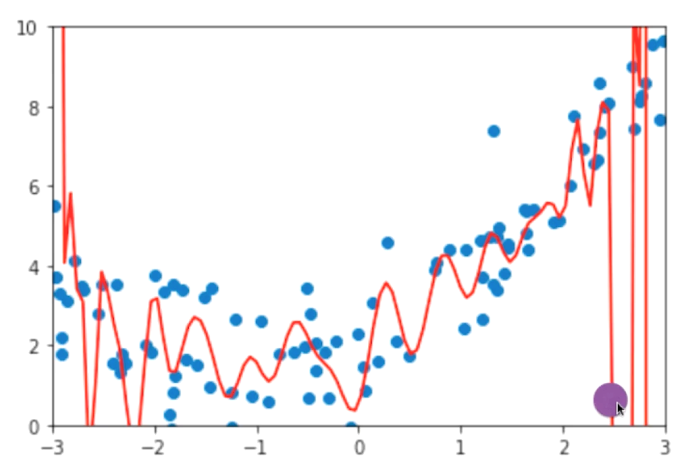
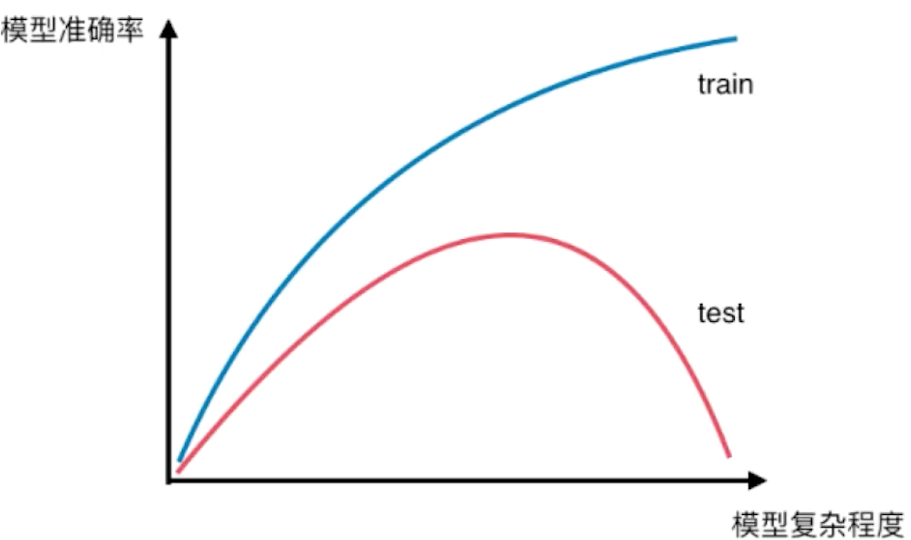
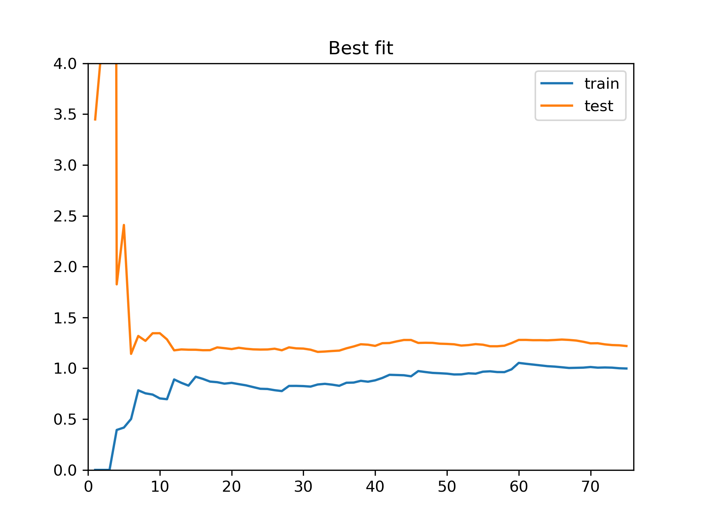
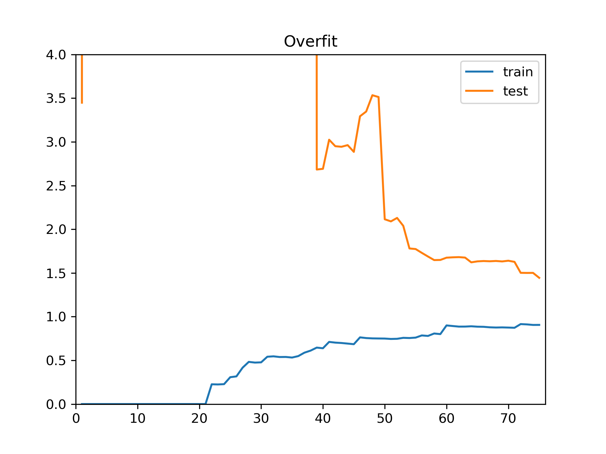
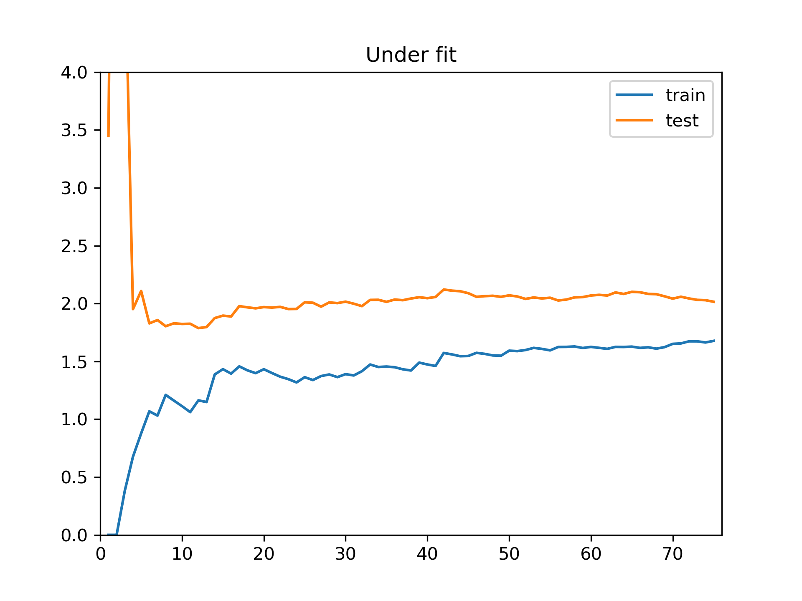
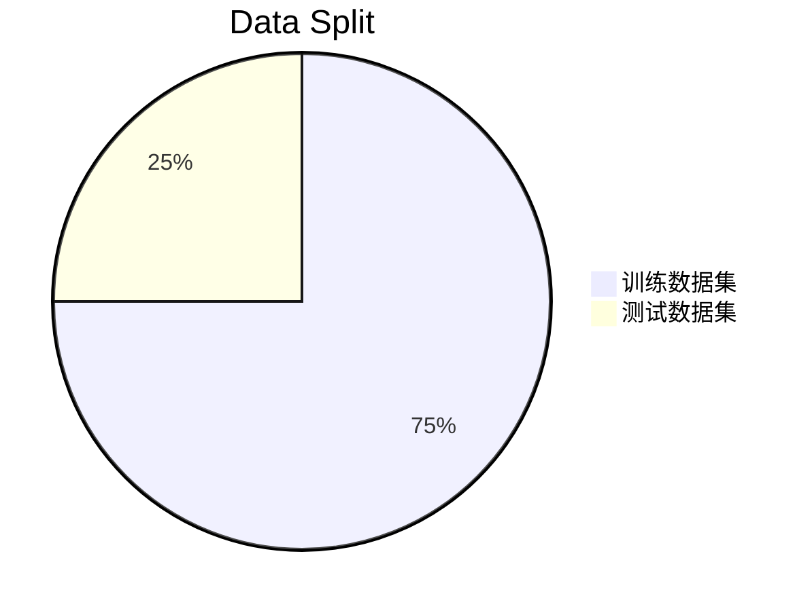
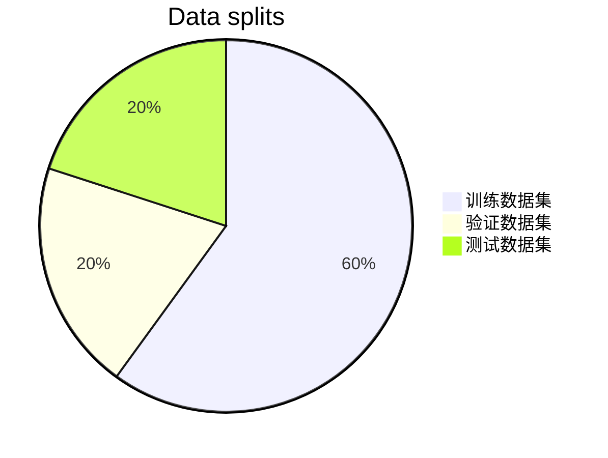
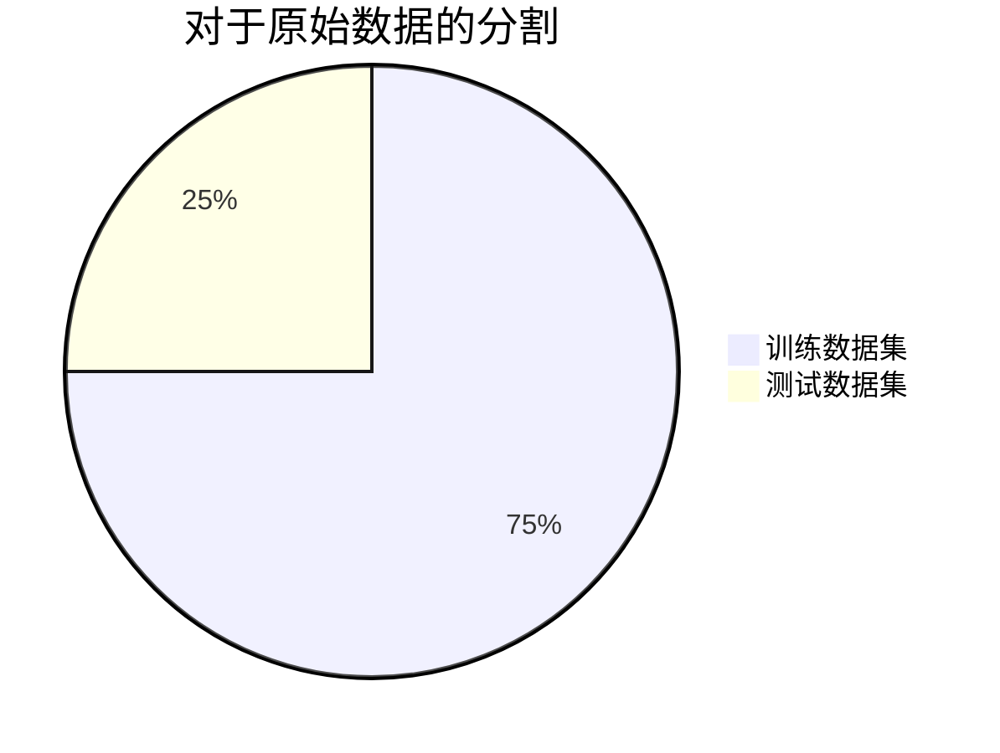
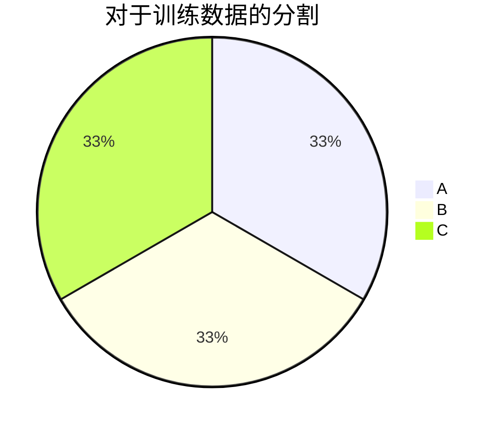
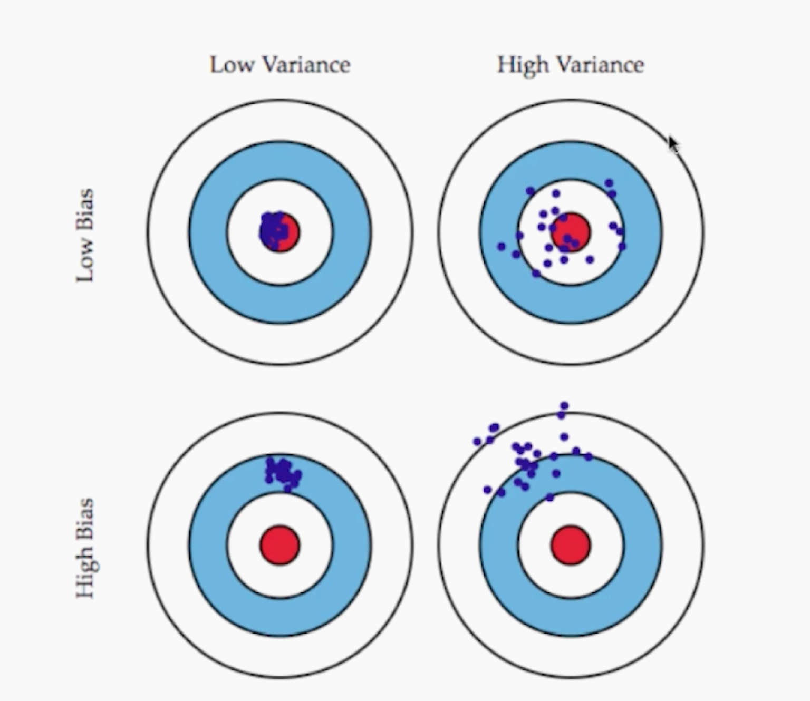

# 多项式回归和模型泛化

对于线性回归算法来说，要求预测的结果与输入数据之间存在明显的线性关系，但是更多的时候，其关系可能是非线性的，本章将引入一个新的算法，来解决这个问题。

### 目录

* [多项式回归](#Polynomial-Regression)
* [过拟合和欠拟合](#Overfit-Underfit)
* [学习曲线](#Learning-Curve)
* [验证数据集与交叉验证](#validation-and-cross-validation)
* [偏差方差权衡](#Bias Variance Trade off)
* [模型的正则化](#Regularization)

### 多项式回归

==本节的代码比较多，代码里也有许多应用的说明，结合代码一起食用==

对于含有线性关系的数据，只需要找出拟合输入与输出的直线（精确一点应该是用于确定这根直线的系数），就可以解决问题。

如果一组数据的输入与输出之前，存在2次曲线的关系，那么我们所需要求解的曲线的表达式就是
$$
y = ax^2 + bx +c
$$
这个式子虽然叫做二次方程，但是如果：

* 将$x^2$强行解释成一个特征
* 将$x$解释成一个特征

本来特征只有一个，标记也只有一个，经过这样的解释，数据集就有了两个特征+一个标记。这样来理解的话，这样的一个式子依然是一个**线性的**，但是，从$x$的角度来看，这就是**非线性的**了。

给原有的样本添加了一些新的特征，这些特征是原来样本的多项式项，比如$x^2$，就是对$x$进行平方，增加了这些特征之后，就可以使用线性回归的思路更好的拟合原来的数据，但是究其本质，是对原来的特征而言，这种非线性的曲线。

参考[代码](../notebooks/chp6-Polynomial-Regression-and-Model-Generalization/01-Polynomial-Regression.ipynb)

补充，[Pipeline的知识点](../notebooks/chp6-Polynomial-Regression-and-Model-Generalization/02-Polynomial-Regression-and-Pipeline.ipynb)

通过代码演示，可以看到多项式回归并没有什么新的机器学习的思路，只是添加了更多次数的项，作为新的特征。这个和PCA算法对数据进行降为的操作是相反的。

### 过拟合与欠拟合

多项式回归固然好用，但是过度的使用，就很容易造成过拟合，使用不当也会造成欠拟合。

==这里将使用一个实际的例子来展示什么叫做过拟合和欠拟合，参考本节[代码](../notebooks/chp6-Polynomial-Regression-and-Model-Generalization/03-Overfit-and-Underfit.ipynb)==

通过例子可以看出，degree的数值越大，拟合的就越好，道理很简单，这么多样本点，总能找到一根曲线，这根曲线可以把所有的样本点都串起来，使得整体的MSE最小，甚至为0。

从degree=2到10到100，MSE一直在降低。

虽然从MSE的角度来看越来越小，但是，degree越高的曲线，越能反应样本走势吗？

答案是否定的，用一个非常高维的样本，产生了一根曲线，MSE确实很小，但是得到的曲线并不是想要的样子，别忘了最开始生产数据的时候，只是做了个2次曲线分布的样本。**为了拟合所有的样本点，曲线变得太过复杂了**，这就是所谓的**过拟合（Overfitting）**

例子最开始用的直线也没有很好的拟合数据样本，他的错误在于degree太低。不是太复杂，而是太简单，这就叫做**欠拟合（Underfitting）**

应用中，最常见的其实是过拟合。工作中主要解决的问题也就是这个问题。

比如例子中的过拟合的曲线：

红色的曲线是模型，蓝色的样本数据，使用这个过拟合的模型预测出一个结果，作为紫色的点。显然，紫色点并不在样本的分布趋势上。

这个预测值很有可能是错误的。换言之：模型拟合样本做的很好，但是对于新的样本来说，精确度就不足了。也可以说，**这个模型的泛化能力很弱，或者说由此及彼的能力很差**。训练模型的目的不在于拟合了多少原先的样本，在于拟合后，对于新来的数据能有多好的表现。

需要的是有泛化能力的模型。训练数据集和测试数据集的分离的做法，就很好的帮助我们发现模型是否有过拟合现象。

[回到代码](../notebooks/chp6-Polynomial-Regression-and-Model-Generalization/04-Why-Train-Test-Split.ipynb)

可以看到，通过这种方式，MSE的差别是越来越大的。有效的帮助我们发现了Overfit的情况。

代码中所实验的，是模型的复杂度，degree越高，模型越复杂。

通常来说，机器学习的算法都存在这样关系：

从欠拟合到合适到过拟合，不同的算法所获取的这个图可能是不一样的，但是整体的趋势是这样的。

总结来说

* 欠拟合，算法所训练的模型不能完整的表述数据关系，寻找到的特征可能太朴素。
* 过拟合，算法所训练的模型过多的表达了数据间的噪音关系，学习到的特征却又太细节了。
* 通过训练，测试分离的方法，可以帮助发现过拟合。

我们需要找到就是泛化能力最好的那里。

网格搜索的策略，使用不同参数的组合训练出模型，然后找到泛化能力最强的那个，也是这么个道理。

### 学习曲线

这张图描述的是模型复杂度和模型准确率的关系，其中可以很好的观察到过拟合，欠拟合等状况，同时这也是一个比较理论的图像，比较清晰，大多数情况下是没办法针对某一个模型画出这样清晰的曲线的。

并且有些模型并不适合绘制这样的图像，比如kNN算法，虽然内在是有这样的逻辑关系。

对于欠拟合，过拟合，还有另一个曲线可以描述：学习曲线。

**学习曲线：随着训练样本的逐渐增多，算法训练出的模型的表现能力。**

很好理解，人类学习知识的时候也是不断的将数据输入大脑，然后拟合各项数据，随着数据增多，对知识的掌握程度也就越好，对于机器学习也是一样的。

[参考说明代码](../notebooks/chp6-Polynomial-Regression-and-Model-Generalization/05-Learning-Curve.ipynb)

<table><tr>
 <td></td>
<td></td>
</tr></table>

对于过拟合：

* 训练数据集中，误差不大，甚至和最佳的情况差不多，更极端一些，degree更高的时候，训练数据集上的误差会更小
* 测试数据集中，距离训练数据集的误差比较远，这就意味着模型的泛化能力不行，对于新的数据来说误差比较大

<table><tr>
<td></td>
<td></td>
</tr></table>

对于欠拟合：

* 左右对比：趋于稳定的位置不同，欠拟合的情况相对最好的情况来说，稳定的位置更高
* 在欠拟合中，模型在训练数据集，测试数据集中都表现的不好，误差都比较大

### 验证数据集与交叉验证

测试数据集的意义：

1. 如果把所有的数据用作训练数据生产模型，容易**发生过拟合却不自知**
2. 分割成训练，测试数据集，通过测试数据集判断模型的好坏，帮助发现欠拟合/过拟合的情况。
3. 发生过拟合，欠拟合以后更换超参数，重新训练模型。

这就完全靠谱吗？当然，比只用训练数据来测试模型要靠谱的多。但是**他也有不靠谱的地方。**

比如：模型是否有可能针对特定测试数据集过拟合？

有没有可能，某个超参数下训练出来的模型，是针对测试数据集表现的优秀的？

因为发现模型测试数据集上表现不良的时候，会人为的调整参数，这有点“围绕着测试数据集打转”的意思，也就是“想办法找到一组参数，使得训练出来的模型在测试数据集上表现良好。”。

因为测试数据集是已知的，这种行为相当于，“针对测试数据集进行调参。”

如何解决呢？

很简单：把数据集分成三部分：

操作步骤也很简单：

1. 使用训练数据集创建模型。
2. 使用验证数据集测试，针对验证数据集进行参数调整，直到找到一组参数，使得模型在验证数据集上表现最优。
3. 使用测试数据集进行测试，使用这个结果，作为最终衡量模型性能的数据集。

这样做，测试数据集是不参与模型的创建的。验证，训练数据集都参与了模型的创建。一个用来评判，一个用来训练，这两种操作都意味着参与了模型的创建。

测试数据集不参与创建模型，对于模型来说，测试数据是完全不可知的。相当于模拟了真实的环境。

这就意味着：

* 训练数据集，用于模型创建。
* 验证数据集，用于超参数调整。
* 测试数据集，最终衡量模型性能。

这个做法依然是存在问题的。

每一次的验证的数据，都是随机的从训练数据集中切出来的，训练的模型可能过拟合验证数据集，一旦验证数据集有比较极端的数据，可能导致模型不准确。

为了解决这个问题，就有了**交叉验证(Cross Validation)**

然后将训练数据集分成$k$份（下图将k取3）：

然后进行排列组合：

* 使用BC训练，用A做验证，产生模型$M_1$
* 使用AC训练，用B做验证，产生模型$M_2$
* 使用AB训练，用C做验证，产生模型$M_3$

这样就得到了三个模型，然后衡量这k个模型的性能，取平均，这平均值，就是调参的结果。

这样做，有一个求平均的过程，所以不会因为某一份验证数据集中有极端数据而产生偏差。

这样做比只设立一个验证数据集更加保险。

[参见代码](../notebooks/chp6-Polynomial-Regression-and-Model-Generalization/06-Validation-and-Cross-Validasion.ipynb)

把训练数据集分成k份训练，这种做法叫做**k-folds 交叉验证（k-folds cross validasion）**

缺点：每次都得训练k个模型，相当于整体性能满了k倍

极端情况下，k-folds 交叉验证可以变成**留一法LOO-CV（Leave-One-Out Cross Validation）**

训练数据集有m个样本，就把训练数据集分成m份，每次都将m-1份用于训练，用1个去验证，然后平均，作为准确度，这样做，完全不受随机的影响，最接近模型真正的性能指标。但是计算量奇大无比。学术中可能用的比较多，论文需要严谨嘛毕竟。

### 偏差方差权衡

偏差（Bias），观察左下角的图，目标是中心的红点，打靶子的话，所有的子弹都偏离了中心的红点，这就是有比较高的偏差。

方差（Variance），观察右上角的图，基本都围绕着目标，但是子弹分散在目标的周围，描述这个分散的程度的值，就是方差。

对于机器学习来说，某个实际的问题就是目标，拟合的模型就是我们打出去的子弹，这就有可能犯偏差/方差的错误。

模型误差，来自于三方面：

* 偏差（Bias），和模型息息相关
* 方差（Variance），和模型息息相关
* 不可避免的误差（这部分错误是客观存在的，无能为力的，比如采集的数据本身就有噪音）

导致偏差（Bias）的主要原因：

* 对问题的假设不正确（比如对非线性数据使用线性回归）。
* 模型的Underfitting就是一个实际的会产生偏差的例子。
* 特征与想解决的问题没有关系，比如名字与成绩。

导致方差（Variance）的主要原因：

* 模型过于复杂，比如使用高阶多项式，数据一点点的扰动都会较大的影响模型，模型没有学习到实质的知识，而过于关注数据的噪音，学习到了过多的噪音。
* 模型Overfitting就是一个实际会产生方差的例子。

对于方差和偏差来说：

* 有些算法是天生的高方差（Hight Variance）算法，比如kNN。
* 非参数学习（kNN，决策树就是非参数学习）通常都是高方差算法，**因为不对数据进行任何假设**。
* 有一些算法是天生的高偏差（Hight Bias）算法， 比如线性回归。
* 参数学习通常都是高偏差算法，**因为对数据具有极强的假设**。

大多数算法具有相应的参数，可以调整偏差和方差，比如kNN中的k，线性回中使用多项式回归（调整degree）等。

偏差和方差通常是互相矛盾，互相制约的：

* 降低偏差，会提高方差
* 降低方差，会提高偏差

一个理想的机器学习模型，是低偏差，低方差的，实际情况下没这么理想，算法会出现错误，此时就要研究这个算法的错误主要是方差还是偏差，想办法使其平衡，不要太高的方差（模型泛化能力太差），不要太高的偏差（不然就偏离了问题的本质），错误本身不能避免，只能尽可能平衡。

调参实际就会在解决这个问题。**在机器学习领域，主要挑战来自于方差。（只局限于算法层面，不考虑问题，因为人类有时候对问题的理解太过于肤浅，比如对金融市场的理解，对疾病的理解）**

一直到我自己撰写这篇笔记为止，有不少人尝试使用历史的金融数据来预测未来的金融市场的走向，但是结果都是不尽理想的。因为愚蠢的人类总是做一些愚蠢的假设，使用的数据和问题之间没什么联系，这就引进了巨大的偏差。

如果有一个神仙，可以使得选择的数据和遇到的问题之间有良好的联系，那么，进一步的主要的挑战，也许就是不偏差，而是方差了。

在实际的机器学习生产领域，遇到方差过大的问题，一般有以下几个解决方法：

* 降低模型的复杂度（比如多项式回归中的Degree，比如kNN的k）。

* 减少数据维度，降噪。

* 增加样本数量（模型太复杂，可是样本数量太少，使得样本数量不足以支撑计算出模型中复杂的参数，比如神经网络，深度学习）。

* 使用验证集。

* 
 模型正则化（一个标准化的解决方案）

### 模型正则化

#### 岭回归

回到这个例子：

这是多项式回归算法过拟合后产生的模型。模型非常的陡峭，实际上如果观察模型的数据值，可以发现，多项式的每个项前面的系数$(\theta_0 + \theta_1 x_1 + \theta_1 x_1 \cdots)$，那个$\theta$值，有些系数会非常大。

模型正则化，就是希望可以限制这个系数的大小，在这里用[一段代码](../notebooks/chp6-Polynomial-Regression-and-Model-Generalization/07-Model-Regularization.ipynb)来整这个$\theta$值，以及展示正则化。

模型正则化怎么解决这个问题呢？回到线性回归的目标：

使得
$$
\sum_{i=1}^m (y^{(i)} - \theta_0 - \theta_1X_1^{(i)} - \theta_2X_2^{(i)}-\cdots\ \theta_nX_n^{(i)})
$$
尽可能的小。换句话说，就是，使得目标函数：
$$
J(\theta) = MSE(y, \hat{y}; \theta)
$$
尽可能的小，让真实值与预测值的MSE尽可能的小，去调整$\theta$。

模型正则化旨在限制参数$\theta$的值。那么对于上述目标函数来说，加入模型正则化后，目标就变成了,使得
$$
J(\theta) = MSE(y, \hat{y}; \theta) + \alpha\frac{1}{2}\sum_{i=1}^n\theta_i^2
$$
尽可能小的。

前半部分的MSE不变，加入的部分是，所有的参数的平方和的一半乘以某个常数$\alpha$。这样做之后，要使得损失函数$J$最小，就不紧要顾及MSE这一项，还需要考虑到后面这一项，而后面这一项式所有的系数的平方和，使得这一项最小就意味着需要使得所有的系数都尽可能小。

当然需要注意一些细节：

* 后半部分的求和中，是1到n，**不考虑$\theta_0$这一项**，因为$\theta_0$不是任何一个X的系数，他是个截距，只决定整个曲线的高低。不决定每一部分的陡峭和缓和。

* 二分之一加不加都可以，因为使用梯度下降法优化这个目标函数$J$的时候需要求导，后面的$\theta_i$头顶上有个平方，微分以下这个平方就下来了，如果有个二分之一，就可以吃掉这个平方引入的2。不要也行

* 这个$\alpha$是一个新的超参数，因为新的目标中包含了似的所有的系数的平方和尽可能的小，这个小的程度占整个优化损失函数程度的多少。

  * 等于0的时候就意味着没有模型正则化
  * 如果是正无穷的话，前面的MSE的比重就很小，主要的优化任务就是**使得所有的$\theta_i$最小**，极端情况下所有的$\theta_i$都得是0，才能最小
  * 对于不同的数据，需要考虑是重点优化MSE，还是重点优化屁股后面的那个系数的平方和，需要对$\alpha$进行调惨

* $\alpha$是个常数，乘以屁屁后面的二分之一，也是个常数，不加入二分之一也是可以的，因为这一部分和$\alpha$本身是融合在一起的。 

模型正则化的方式有很多，像是上面这张加入了屁股后面这一项的方式，通常叫做**岭回归 Ridge Regression**，山岭的意思。

[岭回归代码](../notebooks/chp6-Polynomial-Regression-and-Model-Generalization/08-Riindge-Regreesion.ipynb)
