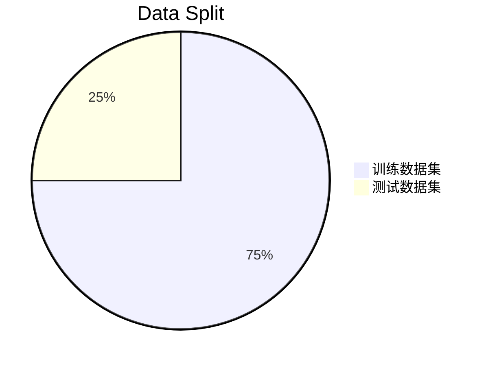
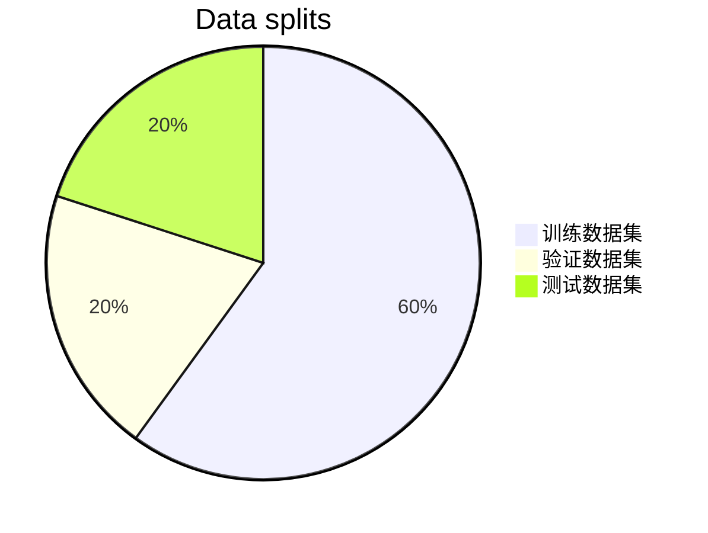
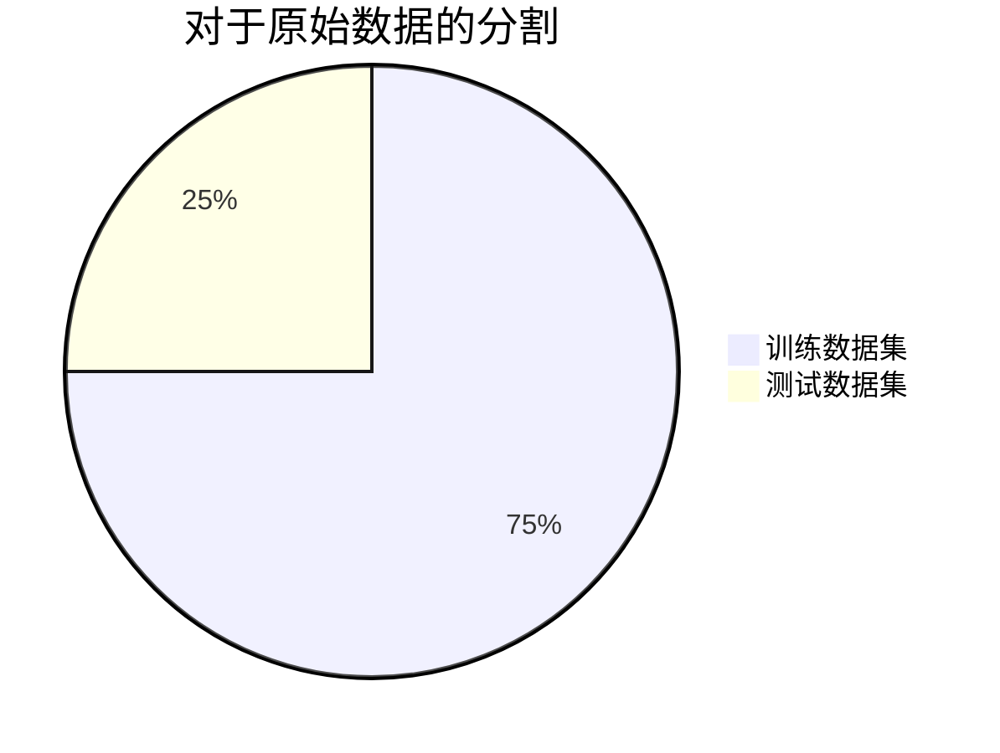
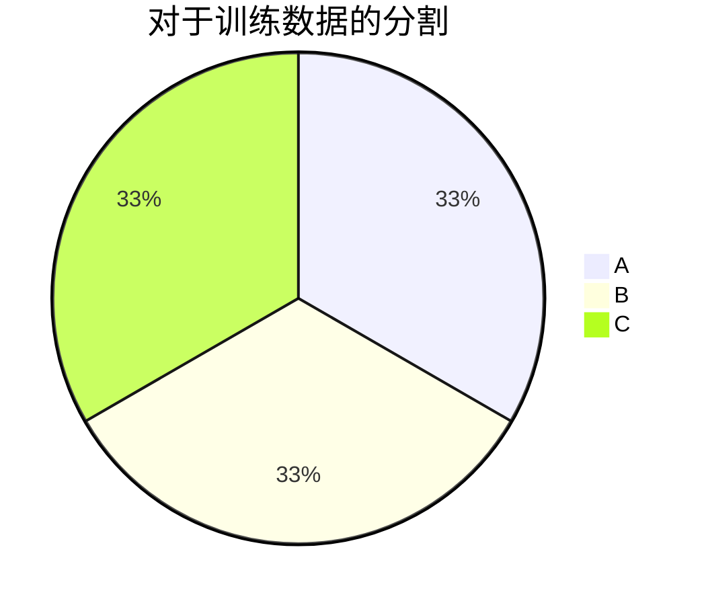

# 多项式回归和模型泛化

对于线性回归算法来说，要求预测的结果与输入数据之间存在明显的线性关系，但是更多的时候，其关系可能是非线性的，本章将引入一个新的算法，来解决这个问题。

### 目录

* [多项式回归](#Polynomial-Regression)
* [过拟合和欠拟合](#Overfit-Underfit)
* [学习曲线](#Learning-Curve)
* [验证数据集与交叉验证](#validation-and-cross-validation)

### 多项式回归

==本节的代码比较多，代码里也有许多应用的说明，结合代码一起食用==

对于含有线性关系的数据，只需要找出拟合输入与输出的直线（精确一点应该是用于确定这根直线的系数），就可以解决问题。

如果一组数据的输入与输出之前，存在2次曲线的关系，那么我们所需要求解的曲线的表达式就是
$$
y = ax^2 + bx +c
$$
这个式子虽然叫做二次方程，但是如果：

* 将$x^2$强行解释成一个特征
* 将$x$解释成一个特征

本来特征只有一个，标记也只有一个，经过这样的解释，数据集就有了两个特征+一个标记。这样来理解的话，这样的一个式子依然是一个**线性的**，但是，从$x$的角度来看，这就是**非线性的**了。

给原有的样本添加了一些新的特征，这些特征是原来样本的多项式项，比如$x^2$，就是对$x$进行平方，增加了这些特征之后，就可以使用线性回归的思路更好的拟合原来的数据，但是究其本质，是对原来的特征而言，这种非线性的曲线。

参考[代码](../notebooks/chp6-Polynomial-Regression-and-Model-Generalization/01-Polynomial-Regression.ipynb)

补充，[Pipeline的知识点](../notebooks/chp6-Polynomial-Regression-and-Model-Generalization/02-Polynomial-Regression-and-Pipeline.ipynb)

通过代码演示，可以看到多项式回归并没有什么新的机器学习的思路，只是添加了更多次数的项，作为新的特征。这个和PCA算法对数据进行降为的操作是相反的。

### 过拟合与欠拟合

多项式回归固然好用，但是过度的使用，就很容易造成过拟合，使用不当也会造成欠拟合。

==这里将使用一个实际的例子来展示什么叫做过拟合和欠拟合，参考本节[代码](../notebooks/chp6-Polynomial-Regression-and-Model-Generalization/03-Overfit-and-Underfit.ipynb)==

通过例子可以看出，degree的数值越大，拟合的就越好，道理很简单，这么多样本点，总能找到一根曲线，这根曲线可以把所有的样本点都串起来，使得整体的MSE最小，甚至为0。

从degree=2到10到100，MSE一直在降低。

虽然从MSE的角度来看越来越小，但是，degree越高的曲线，越能反应样本走势吗？

答案是否定的，用一个非常高维的样本，产生了一根曲线，MSE确实很小，但是得到的曲线并不是想要的样子，别忘了最开始生产数据的时候，只是做了个2次曲线分布的样本。**为了拟合所有的样本点，曲线变得太过复杂了**，这就是所谓的**过拟合（Overfitting）**

例子最开始用的直线也没有很好的拟合数据样本，他的错误在于degree太低。不是太复杂，而是太简单，这就叫做**欠拟合（Underfitting）**

应用中，最常见的其实是过拟合。工作中主要解决的问题也就是这个问题。

比如例子中的过拟合的曲线：

红色的曲线是模型，蓝色的样本数据，使用这个过拟合的模型预测出一个结果，作为紫色的点。显然，紫色点并不在样本的分布趋势上。

这个预测值很有可能是错误的。换言之：模型拟合样本做的很好，但是对于新的样本来说，精确度就不足了。也可以说，**这个模型的泛化能力很弱，或者说由此及彼的能力很差**。训练模型的目的不在于拟合了多少原先的样本，在于拟合后，对于新来的数据能有多好的表现。

需要的是有泛化能力的模型。训练数据集和测试数据集的分离的做法，就很好的帮助我们发现模型是否有过拟合现象。

[回到代码](../notebooks/chp6-Polynomial-Regression-and-Model-Generalization/04-Why-Train-Test-Split.ipynb)

可以看到，通过这种方式，MSE的差别是越来越大的。有效的帮助我们发现了Overfit的情况。

代码中所实验的，是模型的复杂度，degree越高，模型越复杂。

通常来说，机器学习的算法都存在这样关系：

从欠拟合到合适到过拟合，不同的算法所获取的这个图可能是不一样的，但是整体的趋势是这样的。

总结来说

* 欠拟合，算法所训练的模型不能完整的表述数据关系，寻找到的特征可能太朴素。
* 过拟合，算法所训练的模型过多的表达了数据间的噪音关系，学习到的特征却又太细节了。
* 通过训练，测试分离的方法，可以帮助发现过拟合。

我们需要找到就是泛化能力最好的那里。

网格搜索的策略，使用不同参数的组合训练出模型，然后找到泛化能力最强的那个，也是这么个道理。

### 学习曲线

这张图描述的是模型复杂度和模型准确率的关系，其中可以很好的观察到过拟合，欠拟合等状况，同时这也是一个比较理论的图像，比较清晰，大多数情况下是没办法针对某一个模型画出这样清晰的曲线的。

并且有些模型并不适合绘制这样的图像，比如kNN算法，虽然内在是有这样的逻辑关系。

对于欠拟合，过拟合，还有另一个曲线可以描述：学习曲线。

**学习曲线：随着训练样本的逐渐增多，算法训练出的模型的表现能力。**

很好理解，人类学习知识的时候也是不断的将数据输入大脑，然后拟合各项数据，随着数据增多，对知识的掌握程度也就越好，对于机器学习也是一样的。

[参考说明代码](../notebooks/chp6-Polynomial-Regression-and-Model-Generalization/05-Learning-Curve.ipynb)

<table><tr>
 <td></td>
<td></td>
</tr></table>

对于过拟合：

* 训练数据集中，误差不大，甚至和最佳的情况差不多，更极端一些，degree更高的时候，训练数据集上的误差会更小
* 测试数据集中，距离训练数据集的误差比较远，这就意味着模型的泛化能力不行，对于新的数据来说误差比较大

<table><tr>
<td></td>
<td></td>
</tr></table>

对于欠拟合：

* 左右对比：趋于稳定的位置不同，欠拟合的情况相对最好的情况来说，稳定的位置更高
* 在欠拟合中，模型在训练数据集，测试数据集中都表现的不好，误差都比较大

### 验证数据集与交叉验证

测试数据集的意义：

1. 如果把所有的数据用作训练数据生产模型，容易**发生过拟合却不自知**
2. 分割成训练，测试数据集，通过测试数据集判断模型的好坏，帮助发现欠拟合/过拟合的情况。
3. 发生过拟合，欠拟合以后更换超参数，重新训练模型。

这就完全靠谱吗？当然，比只用训练数据来测试模型要靠谱的多。但是**他也有不靠谱的地方。**

比如：模型是否有可能针对特定测试数据集过拟合？

有没有可能，某个超参数下训练出来的模型，是针对测试数据集表现的优秀的？

因为发现模型测试数据集上表现不良的时候，会人为的调整参数，这有点“围绕着测试数据集打转”的意思，也就是“想办法找到一组参数，使得训练出来的模型在测试数据集上表现良好。”。

因为测试数据集是已知的，这种行为相当于，“针对测试数据集进行调参。”

如何解决呢？

很简单：把数据集分成三部分：

操作步骤也很简单：

1. 使用训练数据集创建模型。
2. 使用验证数据集测试，针对验证数据集进行参数调整，直到找到一组参数，使得模型在验证数据集上表现最优。
3. 使用测试数据集进行测试，使用这个结果，作为最终衡量模型性能的数据集。

这样做，测试数据集是不参与模型的创建的。验证，训练数据集都参与了模型的创建。一个用来评判，一个用来训练，这两种操作都意味着参与了模型的创建。

测试数据集不参与创建模型，对于模型来说，测试数据是完全不可知的。相当于模拟了真实的环境。

这就意味着：

* 训练数据集，用于模型创建。
* 验证数据集，用于超参数调整。
* 测试数据集，最终衡量模型性能。

这个做法依然是存在问题的。

每一次的验证的数据，都是随机的从训练数据集中切出来的，训练的模型可能过拟合验证数据集，一旦验证数据集有比较极端的数据，可能导致模型不准确。

为了解决这个问题，就有了**交叉验证(Cross Validation)**

然后将训练数据集分成$k$份（下图将k取3）：

然后进行排列组合：

* 使用BC训练，用A做验证，产生模型$M_1$
* 使用AC训练，用B做验证，产生模型$M_2$
* 使用AB训练，用C做验证，产生模型$M_3$

这样就得到了三个模型，然后衡量这k个模型的性能，取平均，这平均值，就是调参的结果。

这样做，有一个求平均的过程，所以不会因为某一份验证数据集中有极端数据而产生偏差。

这样做比只设立一个验证数据集更加保险。

[参见代码](../notebooks/chp6-Polynomial-Regression-and-Model-Generalization/06-Validation-and-Cross-Validasion.ipynb)

把训练数据集分成k份训练，这种做法叫做**k-folds 交叉验证（k-folds cross validasion）**

缺点：每次都得训练k个模型，相当于整体性能满了k倍

极端情况下，k-folds 交叉验证可以变成**留一法LOO-CV（Leave-One-Out Cross Validation）**

训练数据集有m个样本，就把训练数据集分成m份，每次都将m-1份用于训练，用1个去验证，然后平均，作为准确度，这样做，完全不受随机的影响，最接近模型真正的性能指标。但是计算量奇大无比。学术中可能用的比较多，论文需要严谨嘛毕竟。
