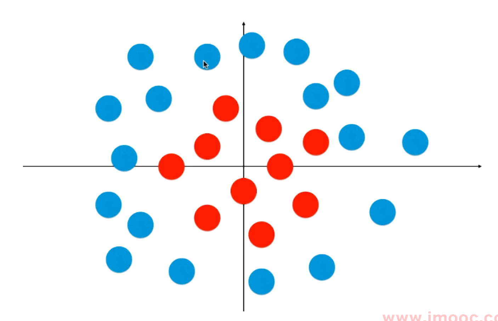
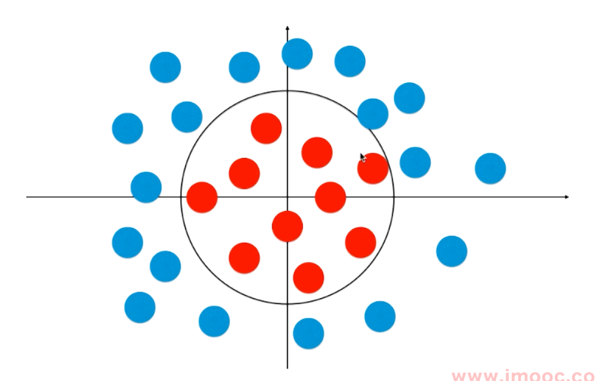

# 逻辑回归算法

本章节目录：

* [简单的算法描述](#descriptions)
* [Sigmoid函数](#Sigmoid-Function)
* [逻辑回归算法的损失函数](#Loss-Function-Of-Logistic-Regression)
* [损失函数的梯度](#Gradient-Of-The-Loss-Function-Of-Logistic-Regression)
* [决策边界](#Decision-Boundary)
* [在逻辑回归中使用多项式特征](#Polynomial-Feature-in-Logisitic-Regression)
* [在逻辑回归中使用模型正则化](#Model-Generalization-in-Logisitic-Regression)
* [OvR and OvO](#OvR and OvO)

#### 简单的算法描述

[代码实现/使用](../notebooks/chp7-Logistic-Regression/01-Implement-Logistic-Regression.ipynb)

对于逻辑回归来说，$\hat{y} = f(x)$所获取到的预测值，本质上是一个概率$p$, 因为是预测出来的，所以也用$\hat{p}$表示，因此，这个简单的表达式也可以换成：
$$
\hat{p} = f(x)
$$
根据函数计算出的概率值，进行分类：
$$
\hat{p} = f(x) \\
\hat{y} = \left \{ 
\begin{align}
1,\space &\hat{p} \ge 0.5 \\
0,\space &\hat{p} \lt 0.5
\end{align}
\right.
$$

因此，逻辑回归既可以是一个回归算法，也可以是一个分类算法，通常作为分类算法用，只可以解决2分类问题

在之前的章节中提到了线性回归算法，其最终求得到预测值的取值范围是正无穷到负无穷(=$(-\infin, \infin)$)，也就是说，可以计算出任意一个值

但是对于逻辑回归算法，最终求得的数值理应是一个概率，也就意味着这个值应该在 $[0, 1]$之间。

一个简单的解决办法就是，使用线性回归算法求出一个值，再把这个值放入函数$\sigma()$中，求出一个 $[0, 1]$之间的值。
$$
\hat{p} = \sigma(\theta^T \cdot x_b)
$$

#### Sigmoid 函数

sigma函数，一般采用**Sigmoid**函数，这个函数的表达式是：
$$
\sigma(t) = \frac{1}{1 + e^{-t}}
$$

其函数图像为：

Sigmoid函数的性质：

* 最左端逐渐趋近于0，但达不到0，最右端逐渐趋近于1，但达不到1，值域在0到1之间。
* 当$x = 0$的时候，函数的取值是0.5
* 当x小于0的时候，x越大，输出越趋近于0.5
* 当x大于0的时候，x越小，输出越趋近于0.5

综上，这个函数可以写成：
$$
\hat{p} = \sigma(\theta^T \cdot x_b) = \frac{1} {1 + e^{-\theta^{T} \cdot x_b}} \\

\hat{y} = \left \{ 
\begin{align}
1, &\hat{p} \ge 0.5 \\
0, &\hat{p} \lt 0.5
\end{align}
\right.
$$
对应的问题来了：

**对于给定的样本数据集$(X, y)$，如何找到参数$\theta$，使得上述表达式，可以最大程度的获得样本数据$X$对应的分类输出$y$？**

 

#### 逻辑回归的损失函数

在之前的表达式

$$
\hat{y} = \left \{ 
\begin{align}
1, &\hat{p} \ge 0.5 \\
0, &\hat{p} \lt 0.5
\end{align}
\right.
$$
中，输出结果的时候被分为两部分，因此，我们也可以试着将损失函数$cost()$分成两部分：
$$
cost = \left \{ 
\begin{align}
  &y(真值) = 1,\text{ p越小，cost越大} \\ 
	&y(真值) = 0, \text{ p 越大，cost越大} 
\end{align}
\right.
$$

* 给定的样本的真值为1时，p越小（=越倾向于将样本分类为0），说明，sigmoid给出的偏离越大。

* 同理，给定的样本的真值为0时，p越大（=越倾向于将样本分类为1），说明，sigmoid给出的偏离越大。

根据上文描述，可以轻松的想到，可以使用这两个函数来表示损失函数：
$$
cost = \left \{
  \begin{align}
  	-\log(\hat{p}) \space, \text{if} \space y = 1 \\
  	-\log(\hat{p} - 1) \space, \text{if} \space y = 0
  \end{align}
\right.
$$
log函数的曲线：

log函数经过(1, 0)这个点，$-\log{(x)}$这个函数的图像是这样的：

但是，注意这里传入的参数是$\hat{p}$，他的取值范围是0到1，y=1时的损失函数的图像为：

可以观察发现：

* $\hat{p}$趋近于0的时候，损失函数输出的值趋近于正无穷，也就是$\hat{p}$越小，cost越大

同理，考虑$\hat{p}$的取值范围，$-\log(\hat{p} - 1)$的图像为：

* $\hat{p}$趋近于1的时候，损失函数输出的值趋近于正无穷，也就是$\hat{p}$越大，cost越大

综上所述，
$$
cost = \left \{
  \begin{align}
  	-\log(\hat{p}) \space, \text{if} \space y = 1 \\
  	-\log(\hat{p} - 1) \space, \text{if} \space y = 0
  \end{align}
\right.
$$
满足给定的条件：

* 真值为1时，p越小（=越倾向于将样本分类为0），说明，sigmoid给出的偏离越大。

* 真值为0时，p越大（=越倾向于将样本分类为1），说明，sigmoid给出的偏离越大。

到此为止并没有结束，因为，cost现在还是有条件的，需要分开计算，最好是合在一起，因此，引入这个函数作为损失函数：
$$
cost = - y \log{(\hat{p})} - (1 - y) \log{(1 - \hat{p})}
$$
这两个函数是等价的，原理很简单，如果$y = 1$，上述等式中的$(1-y)$取值是0，后半部分的log相当于被关闭里，如果$y = 0$，相当于前半部分的log被关闭了，因此，这两个函数是等价的。

这是一个样本对应的输出，如果我们有m个样本，就有m个损失，我么只需要将m个损失加起来即可：

也因此，对于多个输入样本以及这些样本对应的输出，我们有损失函数：
$$
J(\theta) = -\frac{1}{m} \sum_{i = 1} ^ {m}
	y^{(i)} \log{(\hat{p}^{(i)})} + (1 - y^{(i)}) \log{(1 - \hat{p}^{(i)})} \\

\hat{p} = \sigma(X_b^{(i)} \theta) = \frac{1} {1 + e^{-X_b^{(i)} \theta} }
$$
将$\hat{p}$的表达式带入损失函数，有：
$$
J(\theta) = -\frac{1}{m} \sum_{i = 1} ^ {m}
	y^{(i)} \log{(\sigma(X_b^{(i)} \theta))} + (1 - y^{(i)}) \log{(1 - \sigma(X_b^{(i)} \theta) } \\
$$
因此，其底层逻辑就是：**对于给定的样本数据集$(X, y)$，如何找到参数$\theta$，使得$J(\theta)$，达到最小值？**

一个不好的消息就是，对于这个复杂的$J(\theta)$，不能像是线性回归算法那样获取到一个正规方程解，对于$J(\theta)$来说，没有一个数学的解析解

一个好消息是，之前铺垫的梯度下降法，在这里就可以使用了，**这个损失函数是一个凸函数，是没有局部最优解的，只存在唯一的一个全局最优解**。

#### 逻辑回归的损失函数的梯度

先从结论说起，不看推倒的话，看完公式即可：
$$
\nabla J (\theta) = \frac{1}{m} \cdot 
\left \{
\begin{matrix}

   \sum_{i = 1}^m (\hat{y}^{(i)} - y^{(i)}) \\
   \sum_{i = 1}^m (\hat{y}^{(i)} - y^{(i)})\cdot X_1^{(i)} \\
   \sum_{i = 1}^m (\hat{y}^{(i)} - y^{(i)})\cdot X_2^{(i)} \\
   \cdots \\
   \sum_{i = 1}^m (\hat{y}^{(i)} - y^{(i)})\cdot X_n^{(i)} \\
\end{matrix}
\right \}
= \frac{1}{m} \cdot X_b^T \cdot (\sigma(X_b\theta) - y)
$$
推导过程：

先回归目标函数：
$$
J(\theta) = -\frac{1}{m} \sum_{i = 1} ^ {m}
	y^{(i)} \log{(\sigma(X_b^{(i)} \theta))} + (1 - y^{(i)}) \log{(1 - \sigma(X_b^{(i)} \theta) } \\
$$
其对应的梯度表达式为：
$$
\nabla J(\theta) = 
\left \{
    \begin{matrix}
		\frac{\partial J(\theta)}{\partial \theta_{0}} \\ 
		\frac{\partial J(\theta)}{\partial \theta_{1}} \\ 
		\cdots \\
		\frac{\partial J(\theta)}{\partial \theta_{n}}
    \end{matrix}
\right \}
\tag{损失函数的梯度}
$$
其中，最难处理的应该是sigmoid函数，先从这里下手，先对他进行变形：
$$
\sigma(t) = \frac{1}{1+e^{-t}} = (1 + e^{-t})^{-1} \tag{sigmoid函数}
$$
根据求导法则，sigmoid函数的导数为：
$$
\sigma'(t) = -(1+e^{-t})^{-2} \cdot e ^{-t} \cdot(-1) = (1+e^{-t})^{-2} \cdot e^{-t} 
\tag{sigmoid函数的导数}
$$
ok，现在对$\log{\sigma(\cdots)}$下手：
$$
\begin{align}
  (\log{\sigma(t)})' 
  &= \frac{1}{\sigma(t)} \cdot \sigma(t)' \tag{log-1}\\ 
  &= \frac{1}{\sigma(t)}(1+e^{-t})^{-2} \cdot e^{-t} \tag{log-2} \\ 
  &= \frac{1}{(1+e^{-t})^{-1}}\cdot (1+e^{-t})^{-2} \cdot e^{-t} \tag{log-3} \\
  &= (1+e^{-t})^{-1} \cdot e^{-t} \tag{log-4} \\
  &= \frac {e^{-t}}{1+e^{-t}} \tag{log-5} \\
  &= \frac {1+e^{-t}-1}{1+e^{-t}}\tag{log-6} \\
  &= 1 - \frac {1}{1+e^{-t}}\tag{log-7} \\
  &= 1 - \sigma(t)\tag{log-8}
\end{align}
$$

* log-1 代入sigmoid函数的导数，得到log-2
* log-2代入sigmoid函数本身，得到log-3
* log-5的分子+1再-1得到log-6
* log-6化简后得到log-7
* log-7就是$\sigma(t)$函数本身，替换以后，得到log-8，所以$(\log{\sigma(t)})'$的表达式最终为log-8

回到损失函数本身，其有两个部分，由加号链接，我们看前半部分：
$$
\frac{\mathrm{d}\left( y^{(i)} \log \sigma(X_b^{(i)} \theta \right)}
{\mathrm{d}\theta_j} = 
y^{(i)} (1 - \sigma(X_b^{(i)} \theta)) \cdot X_j^{(i)} \tag{前半部分的导数}
$$
其中：

* $y^{(i)}$是一个常数，所以挪到最前面
* log的部分则代入等式log-8中，代换一下就得到了。
* 因为是对$\theta_j$求导，这前面是有个系数的，这个系数是$X$矩阵的第$i$行，的第$j$列，写在最后面

这就是损失函数前半部分的导数。

进入后半部分的求导之前，看一下$log{(1-\sigma (t))}$的导数：
$$
\begin{align}
	(\log{(1-\sigma (t))})' &= \frac{1}{1-\sigma(t)} \cdot(-1) \cdot \sigma(t)'\\
	&= -\frac{1}{1-\sigma(t)} \cdot(1+e^{-t})^{-2} \cdot e^{-t}  \tag{log2-1}\\
\end{align}
$$

* 使用链式法则

尝试化简这个式子，其中：
$$
-\frac{1}{1-\sigma(t)} = \frac{1} {
	\frac{1+e^{-t}} {1+e^{-t}} - 
	\frac{1} {1+e^{-t}}
} = -\frac{1+e^{-t}} {e^{-t}}
$$
把这个式子带回式子log2-1中去
$$
\begin{align}
	(\log{(1-\sigma (t))})' &= -\frac{1}{1-\sigma(t)} \cdot(1+e^{-t})^{-2} \cdot e^{-t}  \tag{log2-1} \\
	&= -\frac{1+e^{-t}}{e^{-t}} \cdot(1+e^{-t}) \cdot e^{-t} \tag{log2-2} \\
	&= -(1+e^{-t})^{-1} \tag{log2-3} \\
	&= -\sigma(t) \tag{log2-4}
\end{align}
$$

* log2-2约分一下，得到log2-3
* log2-3负号后面的部分就是$\sigma(t)$本身，替换得到log2-4，log2-4就是$log{(1-\sigma (t))}$的导数的最后的形态。

最后，看式子的后半部分：
$$
\frac 
	{\mathrm{d} ((1-y^{(i)}) \log(1-\sigma(X_b^{(i)} \theta))) } 
	{\mathrm{d} \theta_j} = 
(1 - y^{(i)}) \cdot (-\sigma(X_b^{(i)} \theta)) \cdot X_j^{(i)}
\tag{后半部分的导数}
$$

* $(1 - y^{(i)})$是一个常数，拿出去，这就是后半部分导数中由点乘符号分割开的三个项中的头一项
* $\log{...}$，参考等式log2-4，将里面的内容代入log2-4，就能获取到后半部分导数的由点乘符号分开的三个项目的中间那一项
* 因为是对$\theta_j$求导，要考虑前面的系数，也就是$X_b^{(i)}$中的第$i$行$j$列的数。

连接前后两个部分：
$$
\begin{align}
&y^{(i)} (1 - \sigma(X_b^{(i)} \theta)) \cdot X_j^{(i)} + (1 - y^{(i)}) \cdot (-\sigma(X_b^{(i)} \theta)) \cdot X_j^{(i)} \tag{J'(theta)-1}\\
&= y^{(i)}X_j^{(i)} - y^{(i)}\sigma(X_b^{(i)} \theta)\cdot X_j^{(i)}
	 -\sigma(X_b^{(i)}\theta)\cdot X_j^{(i)} + y^{(i)}\sigma(X_b^{(i)}\theta)\cdot X_j^{(i)} \tag{J'(theta)-2}\\
 &= y^{(i)}X_j^{(i)} -\sigma(X_b^{(i)}\theta)\cdot X_j^{(i)} \tag{J'(theta)-3}\\
 &= X_j^{(i)}(y^{(i)} - \sigma(X_b^{(i)}\theta))\tag{J(theta)-4}
\end{align}
$$

* $J'(theta)-1$的前后两项拆开可以得到$J'(theta)-2$
* $J'(theta)-2$中一共4项，但是有俩的符号刚好相反，但是本体一致，所以消除掉，得到$J'(theta)-3$
* $J'(theta)-3$提取公因式，得到$J'(theta)-4$

最后整理：
$$
\begin{align}
	\frac{J(\theta)}{\theta_j} &= \frac{1}{m} \sum_{i=1}^m (\sigma(X_b^{(i)}\theta) - y^{(i)})X_j^{(i)} \\
	&=\frac{1}{m} \sum_{i=1}^m (\hat{y}^{(i)} - y^{(i)}) X_j^{(i)}
\end{align}
$$
最终，损失函数的梯度：
$$
\nabla J(\theta) = 
\left \{
    \begin{matrix}
		\frac {\partial J} {\partial \theta_0} \\ 
		\frac {\partial J} {\partial \theta_1} \\ 
		\frac {\partial J} {\partial \theta_2} \\ 
		\cdots\\
		\frac {\partial J} {\partial \theta_n}
    \end{matrix}
\right \} = 
\frac{1}{m}
\left \{
    \begin{matrix}
      \sum_{i=1}^m(\sigma(X_b^{(i)} \theta - y^{(i)})) \\
      \sum_{i=1}^m(\sigma(X_b^{(i)} \theta - y^{(i)})) \cdot X_1^{(i)} \\ 
      \sum_{i=1}^m(\sigma(X_b^{(i)} \theta - y^{(i)})) \cdot X_2^{(i)} \\ 
      \cdots \\
      \sum_{i=1}^m(\sigma(X_b^{(i)} \theta - y^{(i)})) \cdot X_n^{(i)}
    \end{matrix}
\right \}
$$
稍微可以改写一下：
$$
\nabla J(\theta) = 
\frac{1}{m}\left \{
    \begin{matrix}
      \sum_{i=1}^m (\hat{y}^{(i)} - y^{(i)}) \\
      \sum_{i=1}^m (\hat{y}^{(i)} - y^{(i)}) \cdot X_1^{(i)} \\ 
      \sum_{i=1}^m (\hat{y}^{(i)} - y^{(i)}) \cdot X_2^{(i)} \\ 
      \cdots \\
      \sum_{i=1}^m (\hat{y}^{(i)} - y^{(i)}) \cdot X_n^{(i)}
    \end{matrix}
\right \}
$$
回忆，线性回归算法的梯度：
$$
\nabla J(\theta)=
\frac{2}{m} \cdot
\left \{
    \begin{matrix}
    \sum_{i=1}^m (X_b^{(i)} - y^{(i)}) \\
		\sum_{i=1}^m (X_b^{(i)} - y^{(i)}) \cdot X_1^{(i)} \\ 
		\sum_{i=1}^m (X_b^{(i)} - y^{(i)}) \cdot X_2^{(i)} \\ 
		\cdots \\
		\sum_{i=1}^m (X_b^{(i)} - y^{(i)}) \cdot X_n^{(i)}
    \end{matrix}
\right \}
$$
逻辑回归的梯度和线性回归的梯度是有关联的，通过这个规律我们可以快速的对这个梯度的运算进行项量化：
$$
\nabla J(\theta) = \frac{1}{m} \cdot X_b^T \cdot(\sigma(X_b \theta) - y)
$$

#### 决策边界

[代码实现](../notebooks/chp7-Logistic-Regression/02-Decision-Boundry.ipynb)

在逻辑回归的概率的计算式：
$$
\hat{p} = \sigma(\theta^T \cdot x_b)
$$
中：

* 当传入sigmoid中的数值$\theta^T\cdot x_b$，大于等于0时，sigmoid函数输出的值大于等于0.5，$\hat{y}$为1
* 当传入sigmoid中的数值$\theta^T\cdot x_b$，小于0时，sigmoid函数输出的值小于等于0.5，$\hat{y}$为0

$$
\hat{p} = f(x) \\
\hat{y} = \left \{ 
\begin{align}
1,\space &\hat{p} \ge 0.5， \theta^T\cdot x_b \ge 0\\
0,\space &\hat{p} \lt 0.5， \theta^T\cdot x_b \lt 0
\end{align}
\right.
$$

换句话说，将某一个样本分类为1还是0的边界，是$\theta^T\cdot x_b = 0$，这个位置，就是所谓的**决策边界**。

话又说回来，$\theta^T\cdot x_b$是两个向量进行点乘，其结果也代表一条直线。比如，如果$X$有两特征，那么$\theta^T\cdot x_b = 0$又可以写成：
$$
\theta_0 + \theta_1x_1 + \theta_2 x_2 = 0
$$
其中$x_0$是人为添加的一列1，1乘以$\theta_0$还是$\theta_0$，所以忽略$x_0$。

这样的一个式子，是一个直线的表达式。可以想象成$x_1$, $x_2$是两个轴，样本的分类是样本点的不同颜色。

若，由表达式$\theta_0 + \theta_1x_1 + \theta_2 x_2 = 0$所确定的直线，在二维平面中，$x_2$是直线方程$y = k x + b$中的$y$的话，那么，这个式子可以简单的移向成这样：
$$
x_2 = \frac{-\theta_0 - \theta_1x_1}{\theta_2}
$$
之所以这样写，是为了在程序中绘制出这条直线，方便直观的观察，决策边界在哪里。【这一部分有代码，参考notebooks文件夹里chp7的内容】

##### 关于不规则决策边界的绘制方法

直线形式的决策边界的绘制比较简单：只要一个方程就可以了

但是很多时候，决策边界可能是曲线的，甚至难以使用“方程”来表达，对于这种时候，有一个不太聪明的办法，可以解决问题：

比如现在特征还是两个，分类还是两种，我们可以直接把平面内的点进行遍历（步长任意），比如平面的范围是$ 0 \le x \le 10, 0 \le y \le 10$

步长取1，那么就可以把：

$$
(0, 1), (0, 2), (0, 3)\cdots (0, 10) \\
(1, 1), (0, 2), (0, 3)\cdots (1, 10) \\
\cdots \\
(10, 1), (10, 2), (10, 3)\cdots (10, 10) \\
$$

所有的点，都带入算法，让算法给我们一个输出标记，然后把输出标记的颜色画出来

这样就可以得到一个不规则的决策边界。

####  在逻辑回归中使用多项式特征

[代码实现/使用](../notebooks/chp7-Logistic-Regression/03-Polynomial-Feature-in-Logistic-Regression.ipynb)

在此之前，逻辑回归的内核都是一个线性回归的模型，所产生的分类的边界，也是一根直线，然而逻辑回归是不止于此的。 

直线这种分类方式太简单了，可以处理的情况也太简单了，比如有时候有这样的一组数据：

用一根直线不可能完成非线性分布的样本点的分类的。

这里使用一个圆形更好：

圆形对应的方程应该是：
$$
x_1^2 +x_2^2 - r^2 = 0
$$
对于这个样本来说，决策边界应该就是这样子，对r使用不同的值，来确定圆的边界，但让x前面也可以有系数。

在线性回归中我们也做过这样的类似的事情，引入一个多项式项，就可以解决问题。

将$x_1^2$, $x_2^2$看作一个单独的项进行学习，就可以学习到其前面的系数。换句话说，如果学习到的决策边界是这个式子：
$$
x_1^2 +x_2^2 - r^2 = 0
$$
那么，对应的学习到的系数序列就是：$\theta_1 = 1, \theta_2 =1, \theta_0 = -r^2$，其中的半径的那一项为常数。

那么：

* 对于$x_1^2$, $x_2^2$来说，依然是一个线性的决策边界
* $x_1$, $x_2$来说，就是个曲线的决策边界

可以使用从线性回归转换到多项式回归的方法，将线性的逻辑回归转换成非线性的逻辑回归。

#### 在逻辑回归中使用模型正则化

如同前一章所说的，多项式的引入，很容易带来一个问题：过拟合。为了解决过拟合，前一章使用了很长的篇幅来阐述正则化的方法。这里就不过多的描述了。但是这里做一些小的修改：

岭回归中，我们给损失函数加入了一个L2项，LASSO中则是人为的加入了L1项，并且使用一个超参数$\alpha$来控制MSE损失和添加项的优化程度，这里我们反过来：

在损失函数前面加一个超参数$C$，并删除L1/L2前面的$\alpha$：

* $C \cdot J(\theta)+ L1$
* $C \cdot J(\theta)+ L2$

C越大的时候，优化过程中，就更加集中火力的去优化损失函数，反之则集中优化L1/L2，这个系数放在谁前面都差不多。在scikit-learn中，使用这种方式比较多。因为这个正则化是无论如何都得进行的，不能为1或者0，所以干脆把这个控制用的超参数丢到前面去。

这也在提醒我们：

**在模型非常复杂（SVM之流）的时候，最好（或者是一定）加入正则化的项**

[代码实现/使用](../notebooks/chp7-Logistic-Regression/ 04-Logistic-Regression-in-sklearn.ipynb)

#### OvR 与OvO

逻辑回归只能用于解决2分类问题，有没有什么办法可以用它解决多分类问题呢？有滴！但是这个方法不仅可以应用在逻辑回归上，是近乎可以用应用在所有的2分类问题上：

##### OvR （One vs Rest）

1对剩余的所有，也有叫做One vs All，都一样。

比如有${A, B, C, D}$四个类。

如果尝试对$A$类别使用2分类方，可以设计一个算法，这个算法输出为：【A 与 其他】。

这样就可以把4分类转换成2分类，只要多次进行2分类，对于4分类，那就进行4次2分类。有n个类别，就进行n次二分类，选择分类得分最高的那个。

处理一个2分类问题的时间是T的话，进行n分类所需要的时间复杂度就是O(n)。

##### OvO

One v One。依然是4个类别，但是每次挑出两个类别进行2分类，比如【一个样本点是A还是B】，而不是【这个样本点是A还是其他】，有4个类别的话，就可以形成6个两两的对（组合），形成6个2分类问题。

对于一个新的样本，然后让6个2分类模型进行分类，然后进行投票，看在哪个分类的票数高，那他就是哪个分类的。

拓展下来，n个类别就得进行C(n, 2)次分类，选择赢数最高的分类。10个类别，就得进行45次2分类，很显然OvO比OvR的时间消耗更多。虽然耗时更多，但是分类更准确。

[代码实现/使用](../notebooks/chp7-Logistic-Regression/ 05-OvR-OvO.ipynb)
