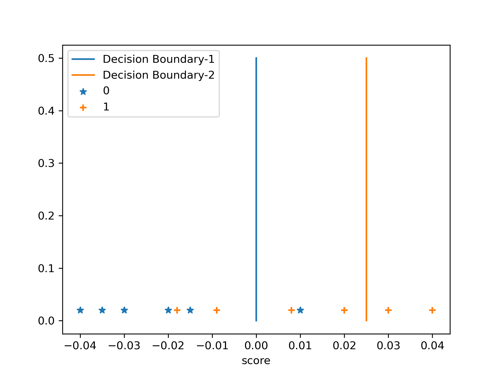
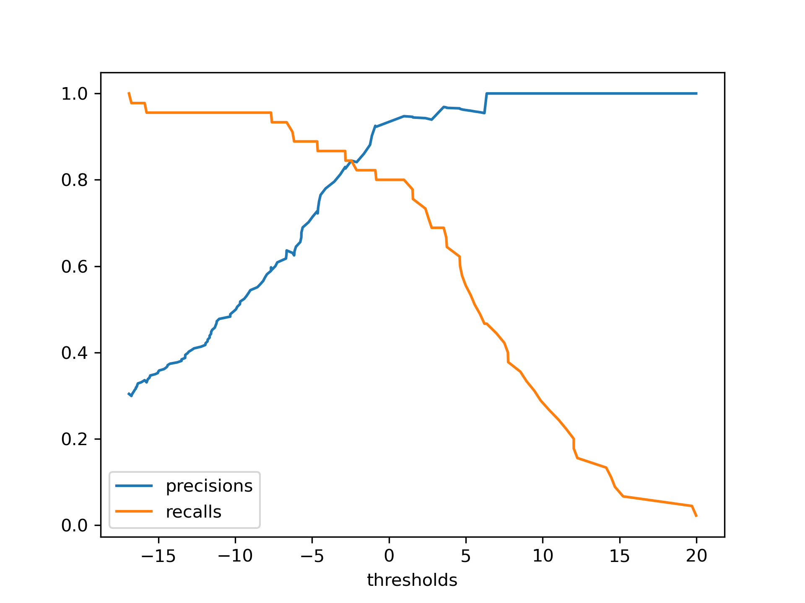
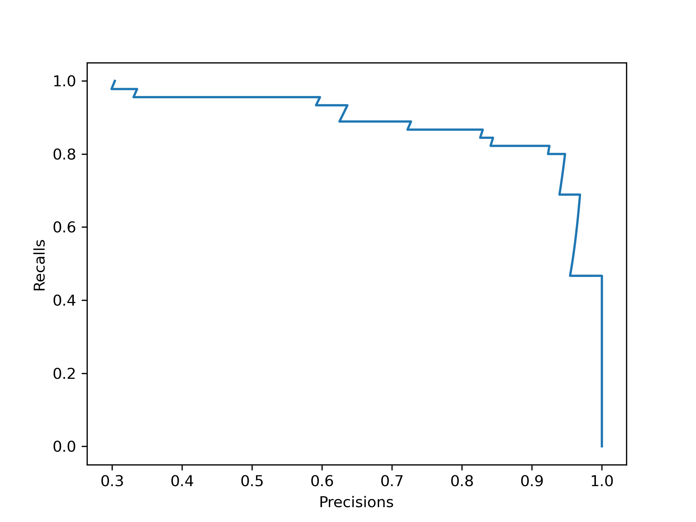
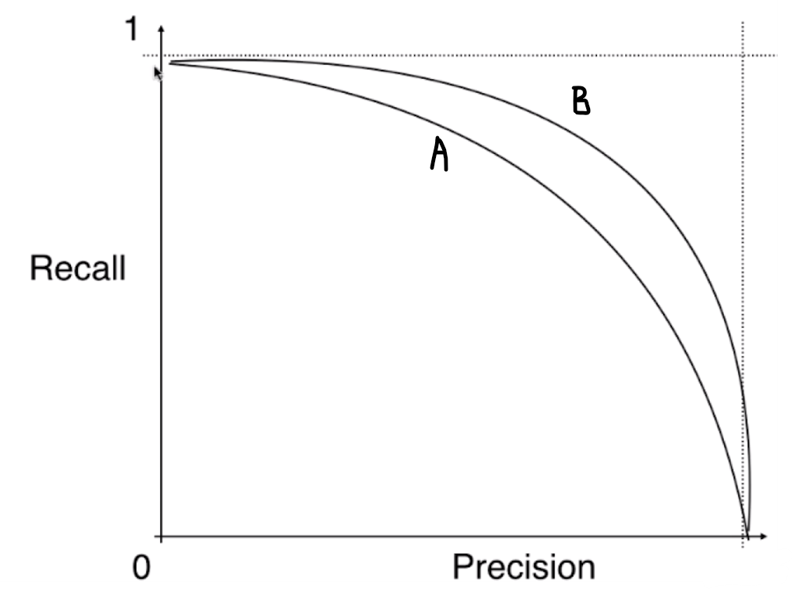
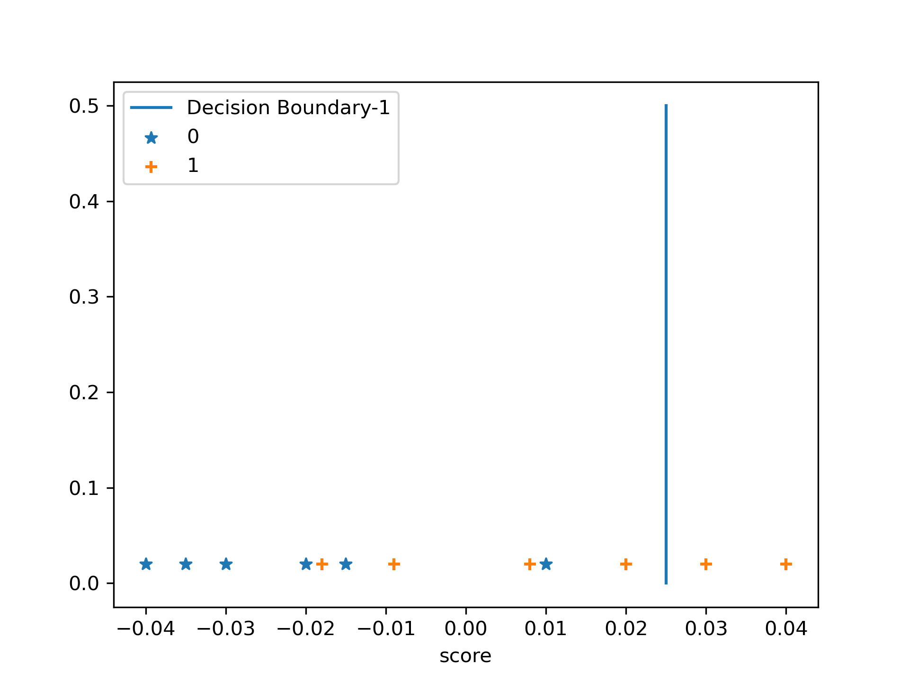
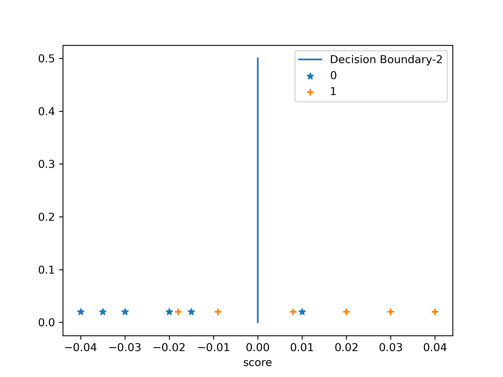
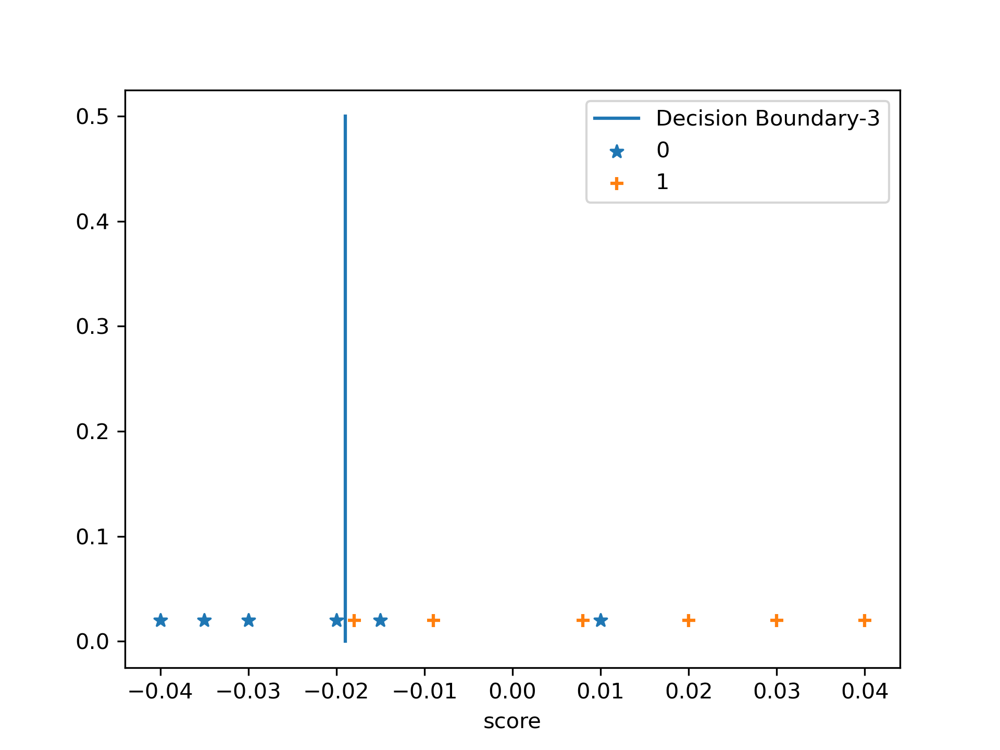
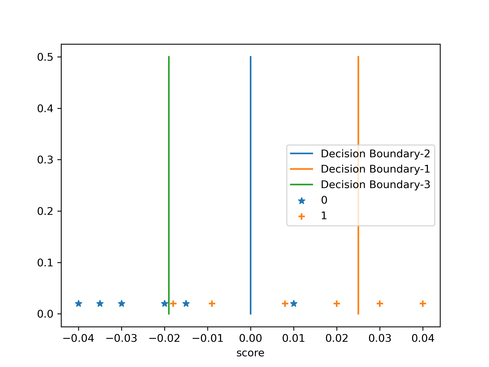

# 分类算法的评价

#### 目录

* [分类准确度的问题](#the-problem-of-classification-accuracy)
* [混淆矩阵](#Confusion Matrix)
* [精准率和召回率](#Precision and recall rate)
* [F1 Score](#F1 Score)
* [Precision-Recall 的平衡](#Balance-of-Precision-Recall)
* [精准率召回率曲线](#Precision-Recall-Curve)
* [ROC曲线](#ROC-Curve)

#### 分类准确度的问题

假设现在有一个癌症预测系统，输入体检的信息，输出是否有癌症。经过训练，这个系统的分类准度在$99.9\%$，我们可以说这是一个好的分类系统吗？

这是不确定的，假设这个癌症的罹患率是0.001，一千个人里只有一个人，系统对于所有的输入样本都输出【没有癌症】，即可达到99.9的准确度，不需要任何机器学习的算法。

更进一步，如果罹患率在万分之一，我们的算法的准确度是99.9%，实际上这个算法甚至不如不做，因为对所有人都标记上“没有癌症”，准确度就可以达到99.99%，摆烂比算法还牛逼。 

**在数据极度偏斜（Skewed Data）的时候，只是用分类准确度是不远远不足的。**

#### 混淆矩阵

##### 对于2分类问题的混淆矩阵

对于2分类问题来说，混淆矩阵是一个2*2的矩阵（也就是说只有4个数字），每一行代表的是真实值，每一列代表的是分类算法的预测值。

因为是二分类问题，所以使用0和1来代表两个不同的类，真实环境中有时也用0-Negative（阴性的）和1-Postiive（阳性的）来表示。

|      |                           0                           |                           1                           |
| :--: | :---------------------------------------------------: | :---------------------------------------------------: |
|  0   | TN-True-Negative(真实值是0，算法预测出来也是0的数量)  | FP-False-Positive(真实值是0，算法预测出来也是1的数量) |
|  1   | FN-False-Negative(真实值是1，算法预测出来也是0的数量) | TP-True-Positive(真实值是1，算法预测出来也是1的数量)  |

* 注意，行代表真实值，列代表预测值。

回到刚才实际的例子，现在有1000个人的健康样本被输入，并且算法给出了值，0代表不患病，1代表患病：

| 真实\预测 |  0   |  1   |
| :-------: | :--: | :--: |
|     0     | 9978 |  12  |
|     1     |  2   |  8   |

这个混淆矩阵的意思就是，在这一万个人中：

* 9978个人真的没病，并且算法也说没病
* 真的没病，但是被说有病的是12个
* 真的有病，但是被说没病的是2个
* 真的有病，并且被标记出来有病的是8个

#### 精准率和召回率

[参考实验代码](../notebooks/chp8-Classification-Performance-Measures/01-Implement-Confusion-Matrix-Precision-and-Recall.ipynb)

在混淆矩阵的基础上进行一些计算，就获得到了精准率，召回率。

精准率：
$$
precision = \frac{TP}{TP + FP}
$$

| 真实\预测 |    0     |   1    |
| :-------: | :------: | :----: |
|     0     | (TN)9978 | (FP)12 |
|     1     |  (FN)2   | (TP)8  |

在这个例子中就是：
$$
precision = \frac{8} {8 + 12} = 40 \%
$$
预测数据为1，相应预测对了的数据有多少，也就是混淆矩阵的右侧一列，分母是预测出来是1的数据的和，分子则是预测对了的部分。

在这里其实就是，精准率就意味着：【预测癌症的成功率，每100个预测中，有40个，是真的患病的】。预测的我们关注的**事件**的准确度。

与其相对的叫做召回率：
$$
recall = \frac{TP} {TP+FN}
$$
这个例子中就是：
$$
8 / (8 + 2) = 80\%
$$
对于召回率来说，分母是混淆矩阵的下面的一行，分子代表的是真实值为1，预测也为1的那一项。意思就是：**我们关注的事件发生了，并且预测对了。换言之：我们关注的事件真实的发生了，真实的发生了的这些数据中，我们成功预测了多少。**

召回率和精准率的分子都是一致的，不同在于分母。召回率的分母是真实值为1的那一行的数据总和。

解释到这个数据上来说，就是，【一百个发生了癌症的患者中，这个算法可以找到80个。】

回到开头的例子：

*假设这个癌症的罹患率是0.001，一千个人里只有一个人，系统对于所有的输入样本都输出【没有癌症】，即可达到99.9的准确度，不需要任何机器学习的算法。*

假设有10000个人，绘制出其混淆矩阵：

| 真实/预测 |  0   |  1   |
| :-------: | :--: | :--: |
|     0     | 9990 |  0   |
|     1     |  10  |  0   |

根据公式：

* 准确率 = 99.9%。
* 精准率 = 0 / (0 + 0)，分母为0，毫无意义，但是此时我们认为的将其写为0，也就是精准率可能的最低值。
* 召回率 = 0 / (10 + 0) = 0。召回率也是0 。

通过这两个指标，帮助我们判断出算法做的事情毫无意义。**在极其有偏的时候，我们不看准确率，看精准率和召回率。**

#### F1 Score

[参考实验代码](../notebooks/chp8-Classification-Performance-Measures/02-F1-Score.ipynb)

精准率和召回率帮助我们判断算法的优劣，但是它们是两个指标。有时候对于一个算法，精准率高一些，召回率低一些，或者召回率高一些，精准率低一些，使用这两个指标的时候，应该如何解读精准率和召回率呢？当然应该分具体使用场景来确定。

比如，预测一个股票未来是升还是降，这个时候我们更在意精准率。

即，更在意：做的N次涨价的判断中有多少次是对的。

反而可能召回率更加不重要。比如有很多股票都是上升的，但是我们判断其为下降，漏掉了一些未来会上升的股票，这其实无所谓，因为真的漏掉了我们也不会投钱进去。并不会有很大损失，但是如果我们通过判断的结果购买上升的股票，结果还错了，那就会带来实实在在的损失。

在医疗领域，对病人的诊断中，我们更在意召回率。

如果召回率低，意味着，【本来有个病人的病了，但是我们没判断出来他有病】，实际上这样的损失更大。

【期望将所有有病的患者都预测出来】，准确率低一些无所谓，【有些人没病，但是预测他有病】，后续反正不会恶化，损失不大。有点【宁杀错，不放过】的意思。

有时候也希望同时关注精准率和召回率，这种情况下使用一个新的指标：F1 Score，兼顾精准率和召回率。
$$
F1 = \frac{2 \cdot precision \cdot recall} {precision + recall} \tag{F1 Score}
$$
描述的是精准率和召回率的**调和平均值**。不使用**算术平均值**。

F1的式子其实是通过调和平均值的算法弄出来的：
$$
\frac{1}{F1} = \frac{1}{2} (\frac{1}{precision} + \frac{1}{recall})
$$
使用调和平均值的好处就是，在面对其中一个值特别低，另一个值特别高，也就是二者极度不平衡的话，得到的值也将特别低，只有这两个都非常高的时候，F1的值才会特别高。

#### Precision-Recall的平衡

对于一些场景，我们注重算法的召回率，比如医疗，有时候更注重精准率，比如股市的预测，对于手写数字，鸢尾花识别来说，无关乎精准率和召回率，我们希望二者越大越好，这时候就可以使用F1-Score。

怎么能同时使得精准率和召回率都最大呢？对于这样的目标，很多时候是不能实现的，因为精准率和召回率是互相矛盾的，此消彼长，我们要做的是找到二者的平衡。

回到逻辑回归算法：
$$
\begin{align}
\hat{p} &= \sigma(\theta^T \cdot x_b) = \frac{1} {1 + e^{-\theta^{T} \cdot x_b}}  \tag{预测出的概率p}\\

\hat{y} &= 
    \left \{ 
        \begin{matrix}
            1, &\hat{p} \ge 0.5, \space \theta^T \cdot x_b \ge 0 \\
            0, &\hat{p} \lt 0.5, \space \theta^T \cdot x_b \lt 0
        \end{matrix}
    \right. \tag{预测值}\\
\theta^T \cdot x_b &= 0 \tag{决策边界}
\end{align}
$$
通过训练找到一组参数$\theta$，与$x_b$点成，与$0$作比较，判断其分类。基于这样的算法衍生出了一条直线：决策边界。

对于决策边界，为什么我们采用$\theta^T \cdot x_b = 0 $，而不是$\theta^T \cdot x_b = threshold $，其中$threshold$是一个常量，称之为阈值。

* $\theta^T \cdot x_b \ge threshold$的时候决策为1
* $\theta^T \cdot x_b \lt threshold$的时候决策为0

这样也能形成决策边界。

基于这样的想法，我们就给算法引入了一个超参数：$threshold$，通过这个超参数我们就可以平移决策边界对应的直线，从而影响分类结果。

观察这个图，假设决策边界在$0.00$处，以此为基准，构建混淆矩阵，可以算得：

* 所有判断为1的样本中，判断正确的概率即为精准率，结果是 $\frac{4}{5} = 0.8$
* 真正为1的样本有6个，判断正确4个，所以召回率为$\frac{4}{6} = 0.67$

如果挪动决策边界：

如果以Decision Boundary-2作为决策边界，此时：

* 精准率为$\frac{2}{2} =1.0$
* 召回率为$\frac{2}{6} = 0.33$

如果以Decision Boundary-3作为决策边界：

* 精准率为$\frac{6}{8} =0.75$
* 召回率为$\frac{6}{6} = 1.0$

通过这个例子，可以精准率和召回率，在有些情况下，是互相牵制，互相矛盾的变量。

很好理解，想让精准率变高，做决策时候我们会倾向于把**特别有把握**的数据(比如得到的p在90%~99%的时候)分类为1，显然这样做会有很多真实为1的样本被排除在了y=1的外面，召回率自然就降低了。

反过来，召回率想要升高，就需要降低判断的概率，只有10%患癌的可能性，都说他患癌，去做进一步的确诊，这样就会拉低阈值，精准率就下降了。

[参考实验代码](../notebooks/chp8-Classification-Performance-Measures/03-Precision-Recall-Trade-off.ipynb)

最后，自己做模型的时候，这个阈值应该选取多少呢？参考下一小节

#### 精准率-召回率曲线

精准率-召回率曲线是帮助寻找阈值的指标，请先[参考代码](../notebooks/chp8-Classification-Performance-Measures/04-Precision-Recall-Curve.ipynb)。

Precision-Recall曲线，通过这个图，假设我们希望精准率为95%，那么就在y轴等于95%的位置，取其x作为决策边界。

对于这曲线，通常都会有一个急剧下降的点，这点一般都是精确率召回率达到一个很好的平衡的点，由此图可以找出平衡点处Precision的值，再通过上面那张Precision-Recall-Thresholds的图找到这个平衡点对应的决策边界。

最后，假设由两个算法，或者是同一个算法的不同的超参数产生了两个模型，分别得到了PR曲线A和B：

* y轴是从0到1
* x轴也是从0到1

此时，我们说产生B(外面那根曲线)的算法优于产生A(里面那根曲线)的算法，因为构成B的那些$(precision, recall)$都比构成A$(precision, recall)$要大一些。

因此，**PR曲线也可以作为选择模型，选择算法，选择超参数的指标。**

当然说里外可能抽象了一点，我们可以对这两个不同的曲线从0到1积分积分，也就是计算其包的面积，面积大的那个更优。虽然如此，但是大多数时候我们**不用PR曲线所谓包围的面积来衡量模型/算法的优劣**，而用另外一根曲线产生的面积，这个曲线，就是赫赫有名的**ROC曲线**

#### ROC曲线

ROC，全称叫做 Receiver Operation Characteristic Curve ，是一个统计学上的属于，描述的是TPR与FPR之间的关系。

* TPR: True positive rate, 和Recall 是一个意思，TP除以真实值为1的数量，预测为1，并且预测对了的数量占真实值为1的百分比

* FPR: False positive rate, 用FP除以真实值为0的数量，预测为1，可惜预测错了的数量占真实值为0的百分比。
$$
FPR = \frac{FP}{TN + FP} \\
TPR = \frac{TP}{TP + FN}
$$
TPR与FPR之间也是存在一定联系的：

此时：
* $FPR=\frac{0}{6}=0.00$
* $TPR=\frac{2}{6}=0.33$

此时：

* $FPR=\frac{1}{6}=0.16$
* $TPR=\frac{2}{6}=0.67$

此时：

* $FPR=\frac{2}{6}=0.33$
* $TPR=\frac{6}{6}=1.0$

随着threshold逐渐左移，TPR，FPR都是在上升的。他们存在着相一致的趋势。和Recall-Precision正好相反。

* 为了提高TPR，就需要拉低阈值，相应犯FP的错误也会增多，FPR也就增多了

ROC曲线就是刻画这两个指标的关系。

[参考代码](../notebooks/chp8-Classification-Performance-Measures/05-ROC.ipynb)

