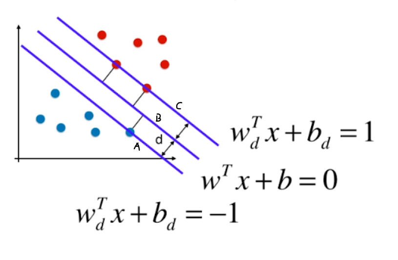

# 支撑向量机

目录：

* [什么是支撑向量机？](#what-is-SVM)
* [SVM背后的最优化问题](#The-Optimisation-Problem-Behind-SVM)
* [Soft Margin SVM与SVM的正则化](#Soft-Margin-SVM)

#### 支撑向量机

支撑向量机，简写为SVM，是其Supported Vector Machine的缩写。使用SVM可以解决回归问题以及分类问题。（*本笔记中主要尝试采用SVM来完成分类问题，在末尾会撰写如何使用SVM解决回归问题的相关内容。*）

回顾逻辑回归算法，通过运算，逻辑回归算法获取到了一个决策边界，在边界的一侧就是1，另一侧就是0等。

但是逻辑回归算法中，决策边界不是唯一的：

对于红蓝的分类来说，A于B都是一个可以正确分类的决策边界，对于这种决策边界不唯一的问题，通常有一个专门的术语：**不适定问题(ill-posed problem)**，逻辑回归在解决这种不适定问题的时候采用了这样的策略：

1. 定义一个概率函数Sigmoid
2. 根据这个概率函数进行建模，形成了一个损失函数
3. 最小化这个损失函数，求出决策边界

其中，损失函数是完全由训练数据集决定的。

SVM的策略稍微有些不同：

 来看一个例子：

现在通过算法计算出了一个决策边界，获得了具体的模型，尝试实用其对为止的数据进行分类：

根据这个决策边界，这些绿色的点，显然会被分类为蓝色，实际上这些点距离红色更近，也就是说，其更大概率应该是红色，而不是蓝色。决策边界距离红色很近，所以很多接近红色的样本被误分类成了红色之外。所以这种情况下，模型的泛化能力可能比较差。

根据这种思想，什么样的决策边界泛化能力更好呢？Like this：

感性上来说这个直线作为决策边界更好，理论上这个直线有这样特征：

距离这跟直线最近的点（图中的2红1蓝），与这跟直线的距离，都尽可能地远。换句话说：我们希望决策边界距离红色的点远的同时，与蓝色的点距离也远，同时还能很好的分别红蓝数据点。

SVM的思想，并没有把模型的未来的泛化能力的考量寄望在数据的预处理阶段，或者是正则化阶段，而是放置在算法内部。

实际上这样的假设不仅仅是直观的假设，背后也是后数学理论的。数学上是可以证明在不适定问题上使用SVM找到的决策边界的泛化能力是好的。也正因如此，SVM也是统计学中，非常重要的方法，其背后是有很多统计理论的支撑。

对于SVM要找的决策边界：

1. 可以正确的分类
2. 距离两个类别的数据点尽可能地远(距离决策边界最近的数据点到决策边界的距离都尽可能的远)

基于这个考量，在这个红蓝分类案例中，这些特殊的点（距离决策边界最近的点），它们又定义出了两根直线：

这两根直线与SVM得到的决策边界相互平行，这两根直线定义的区域中，不再有任何的数据点。SVM最终得到的决策边界，相当于是这跟区域中间的那根线。

**总而言之，SVM尝试寻找一个最优的决策边界，距离两个类别的最近的样本最远。**

对于这些**最近的点**，就被称作**支撑向量(Supported Vector)**，本案中就是：

这样的三个点。

支撑向量定义了一个区域，这跟区域定义了决策边界，决策边界就是这跟区域的中间的那根线。换句话说，最终找到的最优的决策边界是被这些支撑向量定义的。正因如此，支撑向量是这跟算法中最重要的元素。

在这个案例中，这三根直线（A,B,C）之间有一个距离$d$，本案例中上下两根直线到决策边界的距离都是一样的，同为$d$：

确定这跟区域两根直线A与B之间的距离，通常叫做**margin**，其大小就是$2 \times d$

SVM需要最大化这跟**margin**。这跟例子是一个**线性可分问题**，简单来说就是假设这些样本点之间存在一根可以划分其的直线/在高维空间中存在一个超平面可以划分这些样本点，这种情况下才定义出了margin。

这种算法一般叫做**Hard Margin SVM**，算法是非常严格的，切切实实地找到了决策边界，完全正确地划分了样本点同时最大化了margin。

真实情况下，许多数据是线性不可分地，SVM可以进一步改进，得到**Soft Margin SVM**算法。Soft Margin SVM是基于Hard Margin SVM改进出来的算法，所以后续部分会先介绍Hard Margin SVM。

最后，如何使用数学语言来描述“最大化Margin”呢？

#### SVM背后的最优化问题

在前一节提及的例子中，$margin = 2d$，最大化$margin$，就需要最大化$d$，所以只需要找到$d$的表达式，就可以顺藤摸瓜找到$margin$的表达式。

前置知识：

在2维平面上，点$p = (x, y)$到直线$Ax + By + C = 0$（$y = kx +b$表达式是由局限性的，直线与x轴垂直or与y轴平行的时候，k是正无穷，但是这跟可以）的距离$d$为：

$$
d = \frac{|Ax + By + C|}{\sqrt{A^2 + B^2}} \tag{2维平面点到直线的距离表达式}
$$
在之前的线性回归，逻辑回归中都把线性方程描述成这个样子:
$$
\theta^Tx_b = 0
$$
一个参数乘以一个$x$，之所以有个小$b$是因为$\theta$里有一个$\theta_0$，为了适配这个$\theta_0$，在样本矩阵$x$中加一个全部为的列。

本节中直线方程表达为
$$
w^T x + b = 0
$$
把$\theta_0$乘以$x_0$单独拿出来，用单独的$b$表示，为截距。真实的系数用$w$表示，一般是weight单词的首字母，表示权值。

注意，不要混淆，若$x$有$n$个特征的话：

* $\theta$有$n+1$个元素
* $w$有$n$个元素，$b$是截距

观察2维平面中的距离公式，分母部分中不包含$C$，是与截距无关的，拓展到$N$维空间，任意一点$x$到$w^T x + b = 0$的距离是
$$
d = \frac{|w^Tx + b|} {||w||}
$$
对于SVM来说，若决策边界就是$w^T x + b = 0$，两类数据距离决策边界最近的点（aka支撑向量）到决策边界的距离为$d$，换句话说，所有的点到决策边界的距离都应该是$\ge d$的，这样的想法若用分成两类讨论的话：
$$
\left \{
\begin {align}
    d_i = \frac{w^Tx^{(i)} + b} {||w||} \ge d &, \forall y^{(i)} = 1 \\
    d_i = \frac{w^Tx^{(i)}  + b} {||w||} \le -d &, \forall y^{(i)} = -1 \\
\end{align}
\right.
\tag{SVM-1}
$$

* 其中$y^{(i)}$为样本的输出标记，之前用$(0, 1)$来区分类别，但是为了方便计算，这里采用$(1, -1)$
* 注意计算距离的式子中没有了绝对值，因为拆分了情况。
* $d_i$表示第$i$个样本到决策边界的距离
* $(d, -d)$表示两类数据距离决策边界最近的点（aka支撑向量）到决策边界的距离
* 意思是：
    * 对于任意一个输出标记为1的样本，其距决策边界的距离$d_i$，都应该大于等于距离决策边界最近的点到决策边界的距离
    * 对于任意一个输出标记为-1的样本，其距决策边界的距离$d_i$，都应该小于等于距离决策边界最近的点到决策边界的距离

这就得到了一个**限定条件**，对这个限定条件继续整理：

对公式SVM-1的两条子式，都进行左右两边同时除以$d$的操作，则有：
$$
\left \{
\begin {align}
    \frac{w^Tx^{(i)}  + b} {||w||d} \ge 1 &, \forall y^{(i)} = 1 \\
    \frac{w^Tx^{(i)}  + b} {||w||d} \le -1 &, \forall y^{(i)} = -1 \\
\end{align}
\right.
\tag{SVM-2}
$$

* $d$表示一个距离，绝对是一个整数，所以除后不等号开口不变

* $w$是一个向量，$||w||$是$w$的模，是一个标量，因此分母是两个标量相乘，是一个具体的数

* 对于分子来说：

    * 前一项，$\frac{w^Tx}{||w||d}$可以理解为将$w$向量中的每一个数都除以分母，做完除法以后，管除法后的向量叫做$w_d$的话
    * 后一项可以理解为截距$b$除以分母，除法运算后的得到$b_d$的话

    则有：
    $$
    \left \{
    \begin {align}
        w_b^T x^{(i)} +b_d  \ge 1 , \forall y^{(i)} = 1 \\
        w_b^T x^{(i)} +b_d  \le -1 , \forall y^{(i)} = -1 \\
    \end{align}
    \right.
    \tag{SVM-3}
    $$
    

那么到此为止就应该有：

* 直线$C$的表达式(**注意是$w_d$不是$w$**):
    $$
    w_d^Tx+b_d = 1
    $$

* 直线$B$为决策边界，表达式为(**注意是$w$不是$w_d$**)：
    $$
    w^Tx+b = 0
    $$

* 直线A的表达式(**注意是$w_d$不是$w$**)：
    $$
    w_d^Tx+b_d = -1
    $$
    

$w$与$w_d$之间只差一个$||w||d$，若使得决策边界$B$的左右两侧也同时除以$||w||d$，则有决策边界$B$的新的表达式：
$$
w_d^Tx+b_d = 0
$$
到此为止，所有的变量都变成了$w_d, b_d$，那么不妨给这俩重新命名，让$w_d$就叫$w$， $b_d$就叫$b$，带入表达式SVM-3：
$$
\left \{
\begin {align}
    w^T x^{(i)} +b  \ge 1 , \forall y^{(i)} = 1 \\
    w^T x^{(i)} +b  \le -1 , \forall y^{(i)} = -1 \\
\end{align}
\right.
\tag{SVM-4}
$$
注意：

* SVM-4中的$w$已经不是原来的$w$了，是换皮$w_d$，$b$同理

SVM-4中的两个子不等式的左边都是一致的，只有右边不同，若使得不等式左右两边同时乘以输出标记$y^{(i)}, y^{(i)} \in \set{-1, 1}$的话：

* 对于$ \forall y^{(i)} = 1$来说，左右两边等同于互相乘1，所以没变化
* 对于$ \forall y^{(i)} = -1$来说，左右两边同时乘以$-1$，所以$\le$变为$\ge$

所以，SVM-4变形为
$$
\tag{SVM-5}
y^{(i)} (w^Tx^{(i)}  + b) \ge 1
$$
SVM-5就同时表达了SVM-4中的两个不等式的关系。注意**SVM-5是个限定条件**

但是不要忘记了目标是最大化$d$，对于任意支撑向量$x$，最大化$d$就是:
$$
\max{\frac{|w^T + b|}{||w||}} \tag{SVM-6}
$$
也就是，把任意支撑向量$x$带入与决策边界$w^Tx+b = 0$的距离公式中。

对于某一个支撑向量，带入$w^Tx+b$，结果要么是$1$要么是$-1$(也就是要么是红方阵营要么是蓝方阵营)，不管在那一侧，带进去，取绝对值，都是$1$，所以SVM-6可以进行进一步变化：
$$
\max{\frac{1}{||w||}} \tag{SVM-6}
$$
最大化$\frac{1}{||w||}$相当于最小化$||w||$：
$$
\min{||w||} \tag{SVM-7}
$$
但是具体求解的时候，为了方便求导，通常最小化的目标需要转换：
$$
\min{\frac{1}{2}||w||^2} \tag{SVM-7}
$$
Okay! 到此为止，SVM算法要做的事情就变成了这样的最优化问题：
$$
\min{\frac{1}{2}||w||^2} \tag{SVM-7}
$$
其中限定条件，就是，所有的数据都需要满足限定条件：
$$
y^{(i)} (w^Tx^{(i)}  + b) \ge 1
$$
通常在数学上用s.t.（such that）来表示限定条件，所以支撑向量机背后的最优化问题：
$$
\min{\frac{1}{2}||w||^2}, \text{s.t. $y^{(i)} (w^Tx^{(i)}  + b) \ge 1$} \tag{Hard Margin SVM}
$$
之前所撰写的线性回归，逻辑回归的最优化问题都是全局最优化问题，也就是没有限定条件的，但是这个是有的。

有条件与没条件的最优化问题的解决方法是大不同的，没有任何条件的时候，对于目标函数，求导，取极值，应该就是极大值or极小值，但是有条件的时候，求解起来就麻烦了很多，需要拉普拉斯算子来进行求解。太复杂了，本科数学估计都不够用，所以略。另外到此为止解决的只是Hard margin SVM，数据必须线性可分，这太过于理想，所以下一节撰写Soft margin SVM。

####  Soft Margin SVM与SVM的正则化

还是之前的红蓝分类的例子， 如果样本分布变成这样：

通过hard margin svm算法所得到的决策边界很有可能是这样的一条直线：

对于这样的直线，看似正确的分类了两个类别，但是单看这个图，会让人不得不怀疑其泛化能力，很显然对于大多数蓝色的点都在左下侧，但是决策边界非常强的受到了最右边的蓝色样本的影响。

这个蓝色点很可能是个Outlier，可能是个噪音，如果因为这一个点，而将决策边界画在这里，显然有过拟合的倾向，放宽要求，如果将决策边界放到这里：

虽然分错了一个点，但是实际上，这样的决策边界可能会比上面那个更好。也就是所谓的泛化能力更强。

所以必须思考一个机智，SVM所获取的决策边界，要能够有一定的容错能力，可以把一些点错误的分类，换取更高的泛化能力。

另外，如果数据是线性不可分的，没有任何一根直线可以正确地分割红蓝阵营的话：

Hard Margin SVM算法在这种问题上已经不是泛化能力强不强的问题了，而是根本无法应用，不管从哪个角度分析，都必须引入一个具有容错里的SVM。

这种SVM，就叫做Soft Margin SVM。

回到Hard Margin SVM的式子：
$$
\min{\frac{1}{2}||w||^2}, \text{s.t. $y^{(i)} (w^Tx^{(i)}  + b) \ge 1$} \tag{Hard Margin SVM}
$$
其中有个限定条件：对于Margin区域中，不存在任何数据点。

为了引入容错，可以引入一个新的宽松量$\zeta_i$，使得所有的数据点不一定要在Margin区域的外头：
$$
\min{\frac{1}{2}||w||^2}, \text{s.t. $y^{(i)} (w^Tx^{(i)}  + b) \ge 1 - \zeta_i$} ， \zeta_i \ge 0\tag{Soft Margin SVM}
$$
回顾Margin是怎么来的：

是图中的$w^Tx^{(i)}  + b = 1$与$w^Tx^{(i)}  + b = -1$这两根直线的距离。SVM背后的最优化的目标就是最大化这个Margin。

加入宽松量宽松量$\zeta_i$，实际上是这样：

这个上侧虚线所对应的方程，我们管它叫：
$$
w^Tx^{(i)}  + b = 1 -\zeta
$$

对于$\zeta$来说：

* **必须大于等于0**的，如果是个负数，相当于是把缓冲区划到了实线的外头，反而使得条件更加严格。

* 不是一个固定值，对于每一个数据点（红点，蓝点）都有一个自己的值，有$m$个数据点，$\zeta$就有$m$个

* 大于等于0也不能太大，来个正无穷也遭不住，需要限制$\zeta$ 的大小。希望它存在容错，但是又不能太大，需要对最优化的目标函数修改：
  $$
  \min{\frac{1}{2}||w||^2} + \sum_{i=1}^m \zeta_i, \text{s.t. $y^{(i)} (w^Tx^{(i)}  + b) \ge 1 - \zeta_i$} ， \zeta_i \ge 0
  $$
  这样一来，最小化的式子就既可以顾及SVM的思想所要做的事情，也是的在最小程度上容忍一定的错误。

另外，最小化优化的时候，$\zeta$的部分以及$w$的部分的优化占比是被要求可以控制的，类似于岭回归/LASSO中，加入一个参数来控制这个多项式中的子项在优化过程中的重要程度。综合考虑，Soft Margin SVM的表达式应该是：
$$
\min{\frac{1}{2}||w||^2} + C\sum_{i=1}^m \zeta_i, \text{s.t. $y^{(i)} (w^Tx^{(i)}  + b) \ge 1 - \zeta_i$} ， \zeta_i \ge 0 \tag{Soft Margin SVM}
$$
通过$C$来控制前后的优化占比。是一个新的超参数。$C$越大，容错空间越小。

另外，加上$\sum$这一项，通常也叫“在SVM中加入了L1正则项。”，因为$\zeta$被限定大于等于0，所以不需要加入绝对值。

换句话说，$\zeta$这一项是一个正则化项，用于避免模型向极端方向发展，把它拉回正常的方向。

话又说回来，不论是线性模型也好，其他模型也罢，加入正则化项的最终目的其实也可以理解成：**给予模型在学习训练数据集时一些容错，使其对训练数据集中的极端数据不那么敏感，以此来提高其泛化能力。**

这里可以加入L1正则，就可以加入L2正则：
$$
\min{\frac{1}{2}||w||^2} + C\sum_{i=1}^m \zeta_i ^2, \text{s.t. $y^{(i)} (w^Tx^{(i)}  + b) \ge 1 - \zeta_i$} ， \zeta_i \ge 0 \tag{Soft Margin SVM}
$$
到此为止，线性的SVM的（Linear Soft Margin SVM）理论部分，结束。

