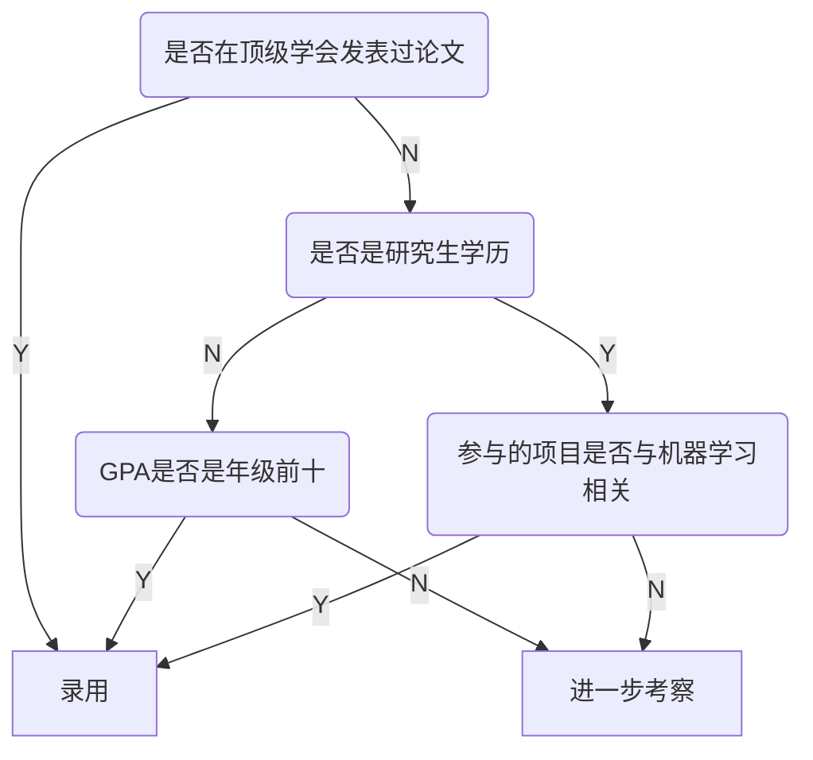

# 决策树

目录：

* [什么是决策树](#DecisionTree)

#### 什么是决策树？

决策树是一种生活中很常见的算法，很多时候人类不自觉的就会使用这种方法来解决问题。

比如，现在要招聘一个机器学习算法工程师，我们会走这样的一个流程：

这样的一个过程，形成了树的结构，最后的叶子结点处，就是最终作出的决策，这就可以理解成我们对某一个输入（应聘者的信息）进行分类，分成N类，这样的一个过程就叫做决策树。

决策树包含了计算机科学中，树的各种性质：

* Depth
  * 从第一个分叉开始，到“参与的项目是否与机器学习相关”这个分叉为止，进行了三次判断，所以，“参与的项目是否与机器学习相关”这个结点的深度为3。
* 节点，其中包含：
  * 根结点
  * 叶子结点

从此就引入一个问题：输入的数据很多时候不是一个标签（Yes/No），很多时候可能是一个数值，如何处理数值是一个比较重要的问题。

在这里我们先使用scikit-learn包中的决策树进行算法的演示，在回过头来回答这个问题。[进入代码]()