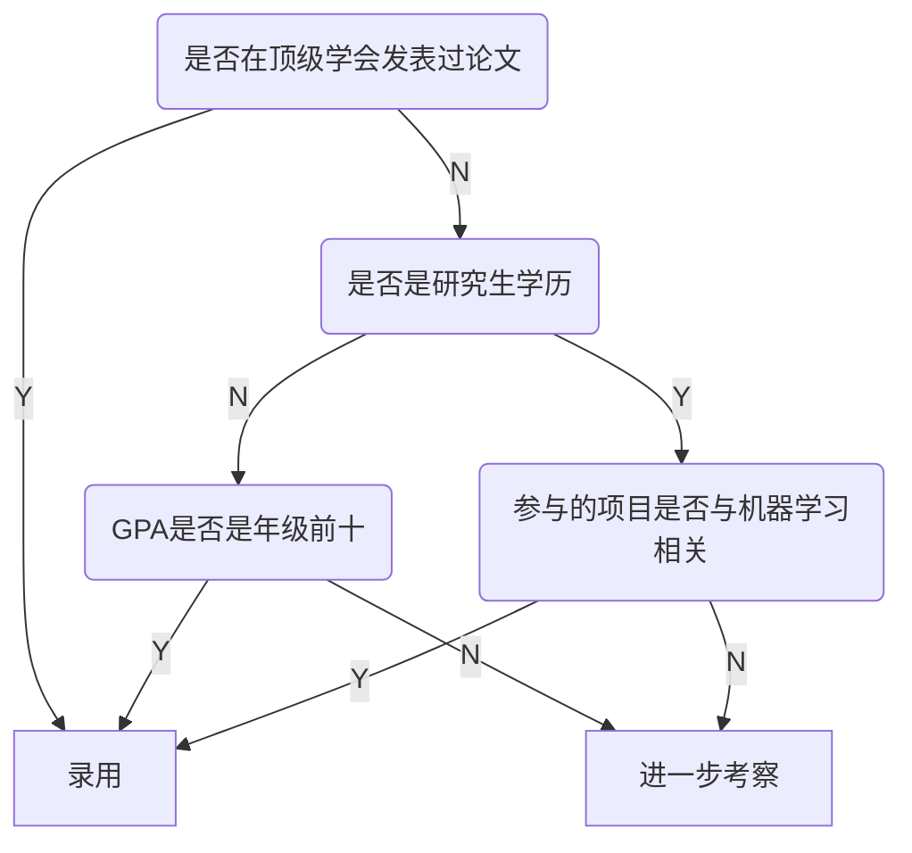
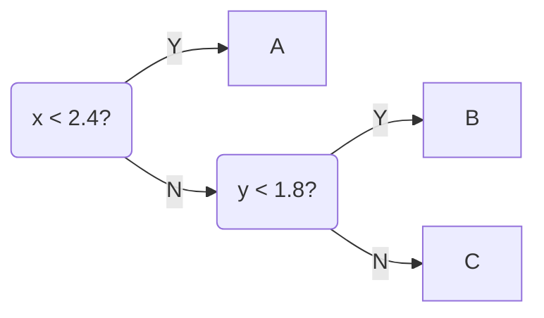

# 决策树

目录：

* [什么是决策树](#DecisionTree)
* [使用信息熵](#Entropy)

#### 什么是决策树？

决策树是一种生活中很常见的算法，很多时候人类不自觉的就会使用这种方法来解决问题。

比如，现在要招聘一个机器学习算法工程师，我们会走这样的一个流程：

这样的一个过程，形成了树的结构，最后的叶子结点处，就是最终作出的决策，这就可以理解成我们对某一个输入（应聘者的信息）进行分类，分成N类，这样的一个过程就叫做决策树。

决策树包含了计算机科学中，树的各种性质：

* Depth
  * 从第一个分叉开始，到“参与的项目是否与机器学习相关”这个分叉为止，进行了三次判断，所以，“参与的项目是否与机器学习相关”这个结点的深度为3。
* 节点，其中包含：
  * 根结点
  * 叶子结点

从此就引入一个问题：输入的数据很多时候不是一个标签（Yes/No），很多时候可能是一个数值，如何处理数值是一个比较重要的问题。

在这里我们先使用scikit-learn包中的决策树进行算法的演示，在回过头来回答这个问题。[进入代码](../notebooks/chp10-Desision-Tree/01-DecisionTree-in-sklearn.ipynb)

使用决策树来对鸢尾花数据集进行分类，得到了这样的决策边界：

每个数据都有两个特征，$x, y$，算法做出这样的决策边界，是经过这样的流程的：

再面对数值特征的时候，决策树需要选择一个阈值以及一个特征作为分支条件。

决策树：

* 是一个非参数学习算法
* 可以解决分类问题，并且天然的可以解决多分类问题
* 也可以解决回归问题，方法很简单，把最终落在某个叶子结点的所有样本的平均值作为输出就可以
* 有非常好的可解释性

问题：

* 每个节点在哪个维度做划分？
* 某个维度在哪个值上做划分？

一个比较不错的解决方案是：

#### 使用信息熵

信息熵代表随机变量不确定度的度量。

* 数据的不确定性越高，熵越大
* 数据的不确定性越低，熵越小

信息熵的计算方法：
$$
H =-\sum^n_{i=1}P_i\log P_i
$$
这里就不赘述了。

对于2分类问题，一类的占比如果是$x$，另一类的占比必然是$1-x$，则信息熵的公式可以改成：
$$
H = -x\log(x)-(1-x)\log(1-x)
$$
[2分类问题的信息熵计算公式的图像](../notebooks/chp10-Desision-Tree/02-Entropy.ipynb)

计算了信息熵后如何使用信息熵来寻找最优划分呢？

* 每一个节点上都希望在某一个维度上基于某一个阈值进行划分，划分后使得信息熵降低，使得系统更加确定。
* 对所有的划分的可能性进行搜索，找到划分后信息熵最小的那个划分方法即可。

[参考代码](../notebooks/chp10-Desision-Tree/04-Entropy-Split-Simulation.ipynb)
