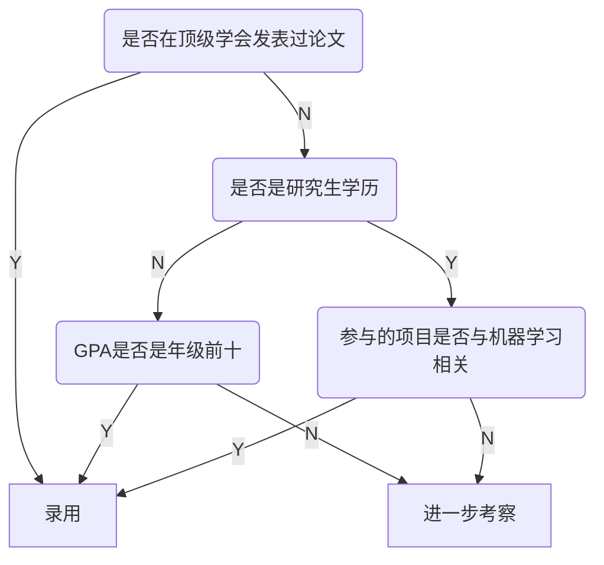
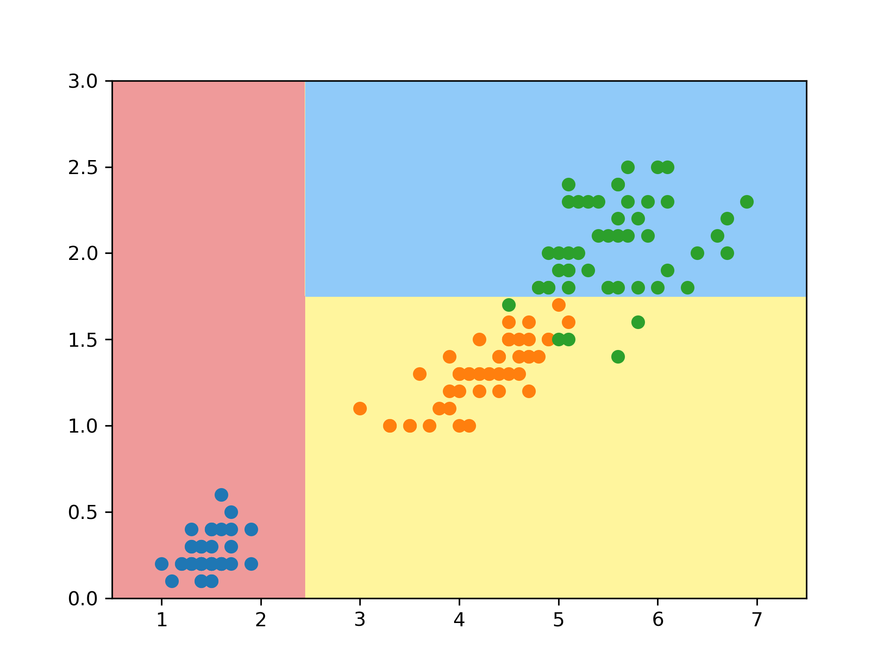
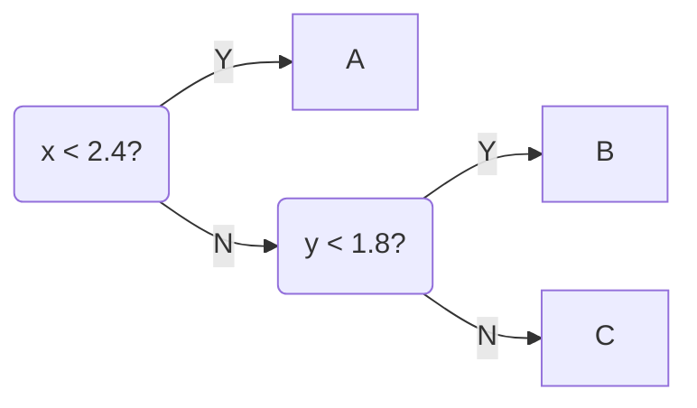
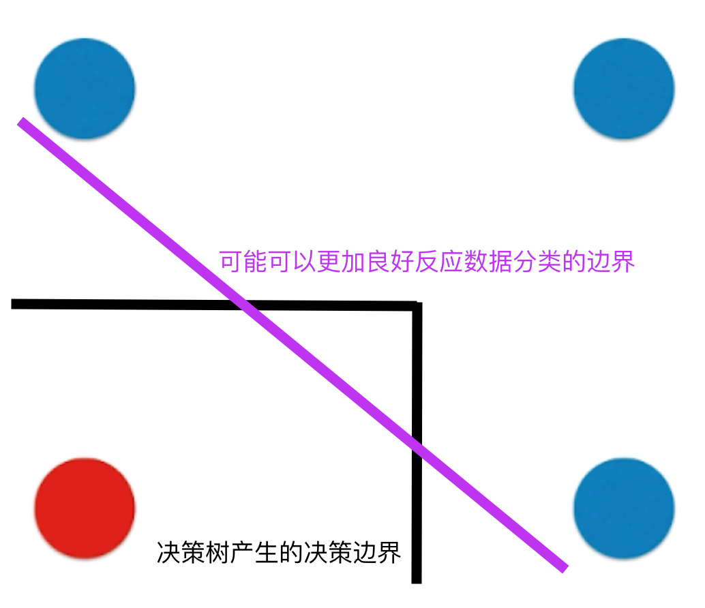
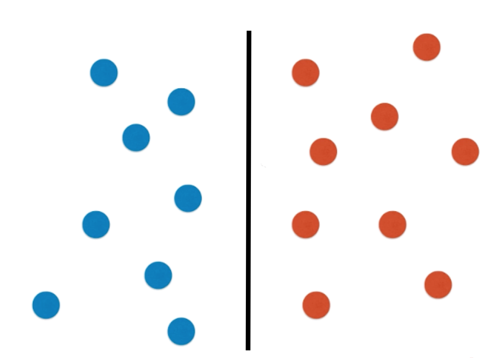
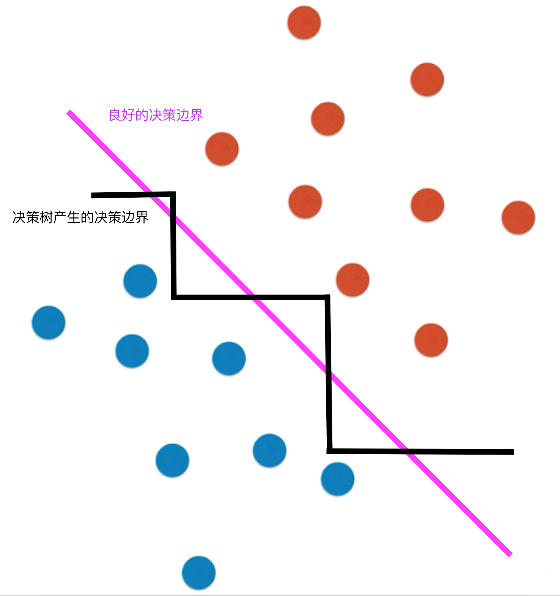

# 决策树

目录：

* [什么是决策树](#DecisionTree)
* [使用信息熵](#Entropy)
* [基尼系数](#Gini)
* [CART与决策树中的超参数](#CART与决策树中的超参数)
* [决策树与回归问题](#DT-Regression)
* [决策树的局限性](#DT-limits)

#### 什么是决策树？

决策树是一种生活中很常见的算法，很多时候人类不自觉的就会使用这种方法来解决问题。

比如，现在要招聘一个机器学习算法工程师，我们会走这样的一个流程：

这样的一个过程，形成了树的结构，最后的叶子结点处，就是最终作出的决策，这就可以理解成我们对某一个输入（应聘者的信息）进行分类，分成N类，这样的一个过程就叫做决策树。

决策树包含了计算机科学中，树的各种性质：

* Depth
  * 从第一个分叉开始，到“参与的项目是否与机器学习相关”这个分叉为止，进行了三次判断，所以，“参与的项目是否与机器学习相关”这个结点的深度为3。
* 节点，其中包含：
  * 根结点
  * 叶子结点

从此就引入一个问题：输入的数据很多时候不是一个标签（Yes/No），很多时候可能是一个数值，如何处理数值是一个比较重要的问题。

在这里我们先使用scikit-learn包中的决策树进行算法的演示，在回过头来回答这个问题。[进入代码](../notebooks/chp10-Desision-Tree/01-DecisionTree-in-sklearn.ipynb)

使用决策树来对鸢尾花数据集进行分类，得到了这样的决策边界：

每个数据都有两个特征，$x, y$，算法做出这样的决策边界，是经过这样的流程的：

再面对数值特征的时候，决策树需要选择一个阈值以及一个特征作为分支条件。

决策树：

* 是一个非参数学习算法
* 可以解决分类问题，并且天然的可以解决多分类问题
* 也可以解决回归问题，方法很简单，把最终落在某个叶子结点的所有样本的平均值作为输出就可以
* 有非常好的可解释性

问题：

* 每个节点在哪个维度做划分？
* 某个维度在哪个值上做划分？

一个比较不错的解决方案是：

#### 使用信息熵

信息熵代表随机变量不确定度的度量。

* 数据的不确定性越高，熵越大
* 数据的不确定性越低，熵越小

信息熵的计算方法：
$$
H =-\sum^n_{i=1}P_i\log P_i
$$
这里就不赘述了。【参考 [情報理論-2021コース-note](./else/情報理論-2021.md)】

对于2分类问题，一类的占比如果是$x$，另一类的占比必然是$1-x$，则信息熵的公式可以改成：
$$
H = -x\log(x)-(1-x)\log(1-x)
$$
[2分类问题的信息熵计算公式的图像](../notebooks/chp10-Desision-Tree/02-Entropy-Gini-plots.ipynb)

计算了信息熵后如何使用信息熵来寻找最优划分呢？

* 每一个节点上都希望在某一个维度上基于某一个阈值进行划分，划分后使得信息熵降低，使得系统更加确定。
* 对所有的划分的可能性进行搜索，找到划分后信息熵最小的那个划分方法即可。

[参考代码](../notebooks/chp10-Desision-Tree/03-Entropy-Split-Simulation.ipynb)

#### 基尼系数

基尼系数的计算方式比信息熵简单很多：
$$
G = 1 - \sum_{i=1}^k p_i^2
$$
假设数据分为三个类别，各占$\frac{1}{3}$，则其基尼系数为：
$$
G = 1 - (\frac{1}{3})^2 - (\frac{1}{3})^2 - (\frac{1}{3})^2 = 0.6666
$$
若，三个类别分别占比$\frac{1}{10},\frac{2}{10},\frac{7}{10}$，其基尼系数为：
$$
G = 1 - (\frac{1}{10})^2 - (\frac{2}{10})^2 - (\frac{7}{10})^2 = 0.46
$$

* 其性质和信息熵有些类似，第二组数据的确定性比第一组数据低，所以基尼系数也比较低。
* 越高，数据的不确定性越强
* 越低，数据的确定性越强

若，三个类别分别占比$1, 0, 0$，其基尼系数为$0$

因此，基尼系数是可以用作为数据划分的标准的。

如果是2分类问题，则：
$$
G = 1 - x^2 - (1 - x)^2 = -2x^2 + 2x
$$
[2分类问题的基尼系数计算公式的图像](../notebooks/chp10-Desision-Tree/02-Entropy-Gini-plots.ipynb)

使用基尼系数作为划分指标的[参考代码](../notebooks/chp10-Desision-Tree/04-Gini.ipynb)

关于信息熵vs基尼系数

* 信息熵的计算比基尼系数稍慢
* 
* 默认为基尼系数
* 大多数时候二者没有特别的效果优劣

#### CART与决策树中的超参数

[参考代码](../notebooks/chp10-Desision-Tree/05-CART-and-Decision-Tree-Hyperparameters.ipynb)

到此为止谈论的决策树还有个名字：CART，Classification And Regression Tree。既可以解决分类问题也可以解决回归问题，其特点就在于，它会根据某一个维度$d$和某一个阈值$v$进行二分。sklearn中的决策树的实现就是CART。除了CART，还有[ID3](https://zh.wikipedia.org/zh-cn/ID3%E7%AE%97%E6%B3%95)，[C4.5](https://zh.wikipedia.org/zh-cn/C4.5%E7%AE%97%E6%B3%95)，C5.0等其他的创建决策树的手段。

整体可以看出来，因为CART决策树在建立完成后，其做决定，预测的时间复杂度为其高度，即$O(\log m)$,$m$是样本个数。

反之，训练过程的时间复杂度为$O(n \times n \times \log m)$，因为对于$\log m$层，每一层都需要做$n\times m$次尝试。

决策树很容易产生过拟合，当然也不是决策树的问题，类似于kNN，所有的非参数学习的算法都很容易产生过拟合。对于决策树来说，一个有效的解决方法就是**剪枝**，其目的就是降低复杂度，解决过拟合。

CART的超参数：

* 限制树的高度，越大越容易过拟合，对应sklearn中的参数：`max_depth`
* 限制叶子结点个数，越多越容易过拟合，对应sklearn中的参数：`max_leaf_nodes`
* 分裂一个内部节点所需的最小样本数，越小越容易欠拟合，对应sklearn中的参数：`min_samples_split`
* 叶节点所需的最小样本数，越大越容易过拟合，对应sklearn中的参数：`min_samples_leaf`

[sklearn的决策树的文档](https://scikit-learn.org/stable/modules/generated/sklearn.tree.DecisionTreeClassifier.html)

#### 决策树与回归问题

决策树建立以后：

* 每一个叶子结点都会包含若干个数据
* 尝试将新的特征输入决策树，决策树最后会把这个样本放到某一个叶子节点中
* 使用这个叶子结点中的数据点的标签的平均值作为回归输出。

[sklearn中使用决策树解决回归问题](../notebooks/chp10-Desision-Tree/06-Decision-Tree-Regression.ipynb)

#### 决策树的局限性

观察这个图，每一个决策边界都是与坐标轴平行的，原因很简单，因为生成决策边界的时候，是基于某一个特征值的，这里就是x，y轴。对于这样的决策边界，一个显而易见的局限性就是，对于使用与x，y轴平行的决策边界不可分的数据来说，其性能就会很差：

更严重一点的话，数据分布假设是这样：

这样看没啥问题，但是，同样的分布，稍微旋转一下，决策树产生的边界就会很奇怪：

再来，决策树，或者说大多数的非参数学习的算法，都对个别的数据比较敏感。[参考代码](../notebooks/chp10-Desision-Tree/07-Problems-of-Decision-Tree.ipynb)

尽管如此，决策树依然是很良好的算法。因为很多时候不是单独使用的。

更多时候决策树是用在集成学习，随机森林的算法中的。
