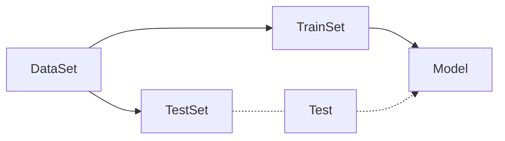
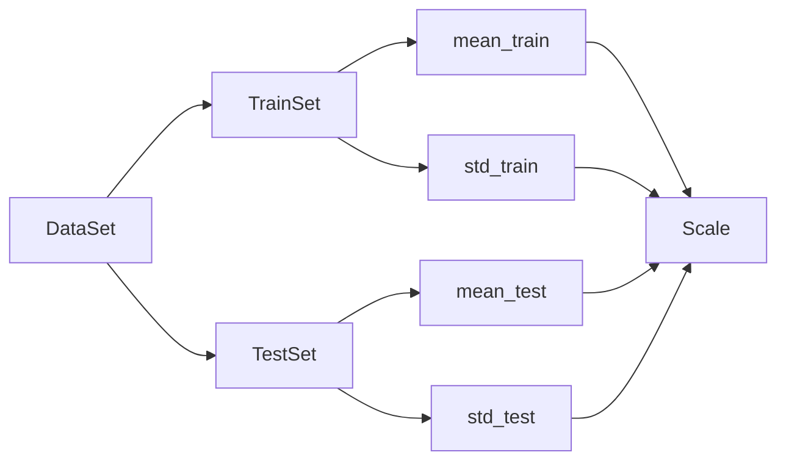
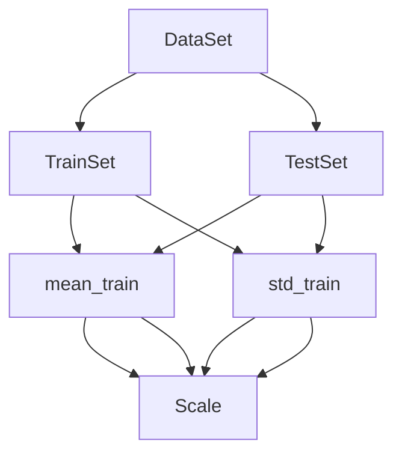
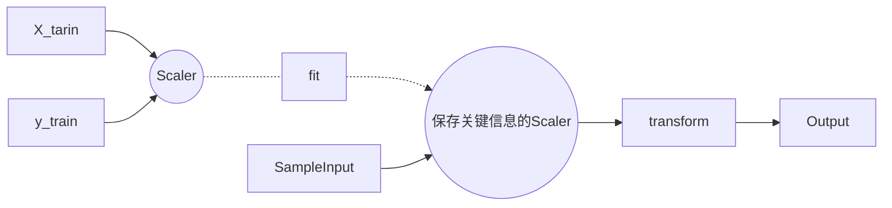

# 机器学习算法基础内容

### 如何衡量一个算法的性能？

#### Train Test Split

假设有一批训练数据，我们使用全部的数据训练出一个模型，并且尝试把模型用于真是的环境中，即：

数据集->模型->使用，会出现几个问题：

* 模型很差，真实损失(比如，股市，一个很差的模型会导致在股市上真正的损失)
* 真实环境难以拿到真是的label(无法拿到label，就无法判断一个模型的好坏)

一个有效的解决方法就是，把训练用的数据集拆分成两份，一份用于测试，一份用于训练，这个做法叫做

**Train Test Splits**

[实现](../modules/model_selections.py)

即:

这个流程中我们可以人为的指定训练，测试集在原始数据集中的占比。

测试数据中有真实的Label值，可以很好的判断模型的好坏。 

当然这样也会产生问题，比如过拟合

(这里没写完)

#### 分类准确度(Accuracy)

[实现](../modules/metrics.py)

计算模型产生的label和测试数据集已有的label之间的差异即可

比如180个有179个分类准确，则，其分类准确度为 $179 / 180$

#### 超参数

* 超参数: 在算法运行前需要决定的参数
* 模型参数：算法过程中学习的参数

kNN算法没有模型参数，但是k是kNN算法中的超参数

寻找好的超参数，比如kNN算法中的k，需要一定的领域知识，经验，实验等。

当然，也可以使用网格搜索的方法来完成。详细部分见notebook网格搜索

#### 数据归一化Feature Scaling

假设，有这样两个数据:

|         | 肿瘤大小(cm) | 发现天数(days) |
| :-----: | :----------: | :------------: |
| Sample1 |      1       |      200       |
| Sample2 |      5       |      100       |

如果使用这样的一组数据，作为训练数据集，样本间的距离被发现时间这一项所主导

若，我们将发现时间转化为年
|         | 肿瘤大小(cm) | 发现天数(years) |
| :-----: | :----------: | :-------------: |
| Sample1 |      1       |   200=0.55年    |
| Sample2 |      5       |   100=0.27年    |

可以发现，样本间的距离又会被肿瘤大小所影响
这是因为两种数据之间的量纲不一致导致的。

解决的方案很简单，就是将数据进行归一化，**将所有的数据映射到同一尺度**

##### 最值归一化 normalization

把所有的数据映射到$0-1$之间：
$$
x_{scale} = \frac{x - x_{min}} {x_{max} - x_{min}}
$$

对于每一个特征我们都求出其最大值和最小值，比如对于肿瘤大小我们就可以找出最大的肿瘤和最小的肿瘤的数据，然后用每一个肿瘤的大小减去最小的肿瘤的大小然后除以最大最小肿瘤之间的差

* 适用于分布有明显边界的情况，比如学生的分数，最左值就是0，最右值就是满分，图像的像素等
* 受outlier影响较大，比如打工人和马云收入。

一个更好的解决方案就是：

##### 均值方差归一化 standardization

[Scaler实现](../modules/preprocessing.py)

把所有的胡数据归一到均值为0方差为1的分布中

这样做并不保证数据在0~1之间，但是可以保证其均值为0，整体数据的方差为1

* 适用于数据分布没有明显的边界，可能存在极端数据的情况
当然，这不意味着有明显边界的数据不适用这种方法

$$
x_{scale} = \frac{x - \bar{x}} {S} \\
\bar{x} = \frac{1}{n} \sum_{i=1}^n x_i (均值) \\
S = \frac
	{ \sum_{i=1}^n x_i-\bar{x}}
	{n - 1} (方差)
$$

将归一化算法用在机器学习的过程中的时候有一个注意事项

数据集被拆分为训练数据集和测试数据集以后，就要开始训练模型，归一化操作具体怎么来做？

一个显而易见的浅显方式是

也就是说，将训练数据集和测试数据集分别进行归一化，然后训练后测试。

这个方法是**错误的**

正确的做法应该是

将测试数据集使用训练数据集求取的平均值和方差来进行归一化

换句话说：

$$
\frac{(x_{test} - mean_{train})}
	{std_{train}}
$$
原因如下：
* 真实环境很有可能无法得到所有测试数据的均值和方差
* 对数据的归一化也是算法的一部分

总结来说就是我们需要**保存训练数据得到的均值和方差**

