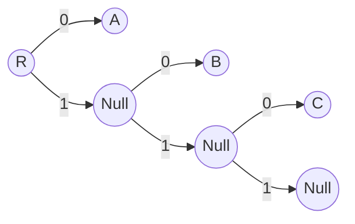
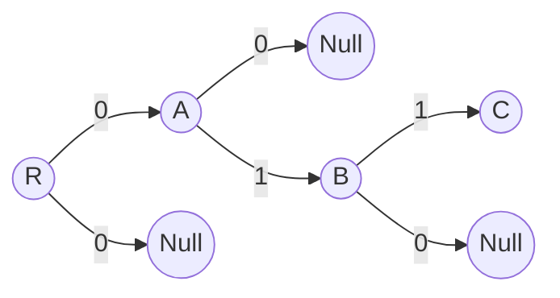
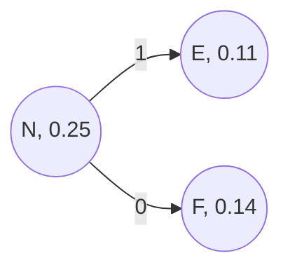
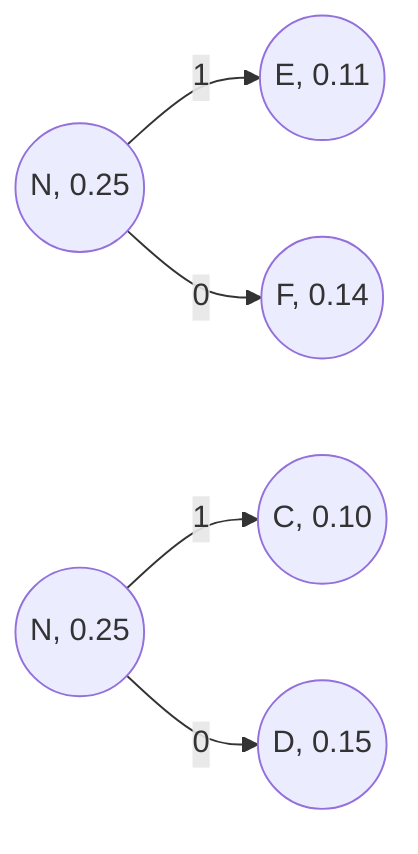
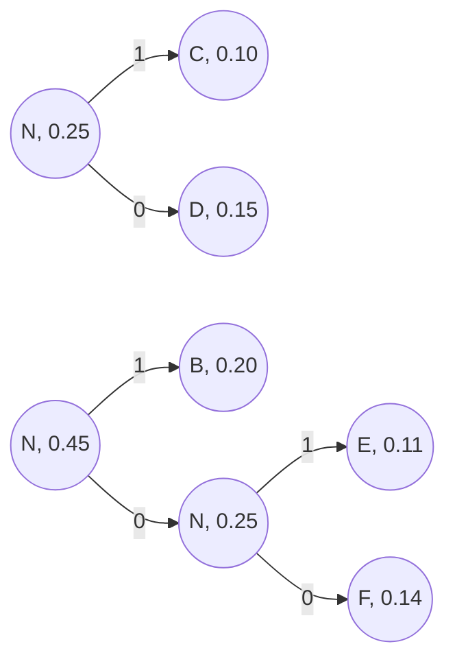
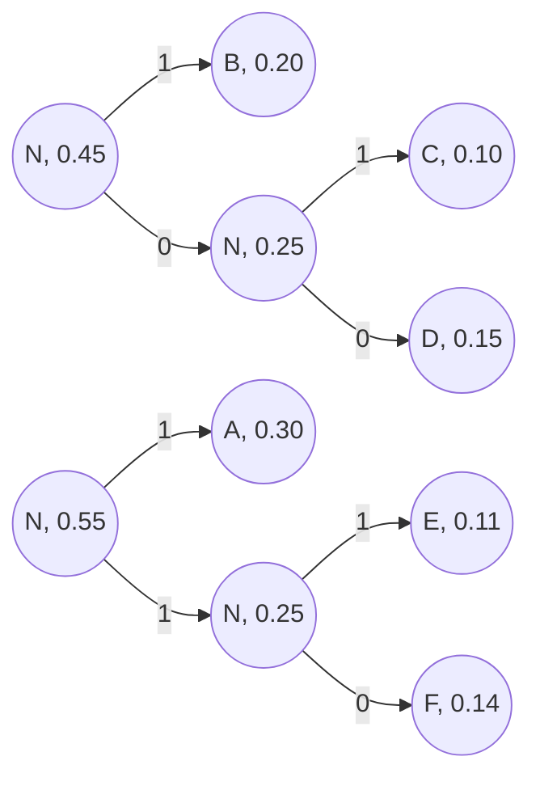
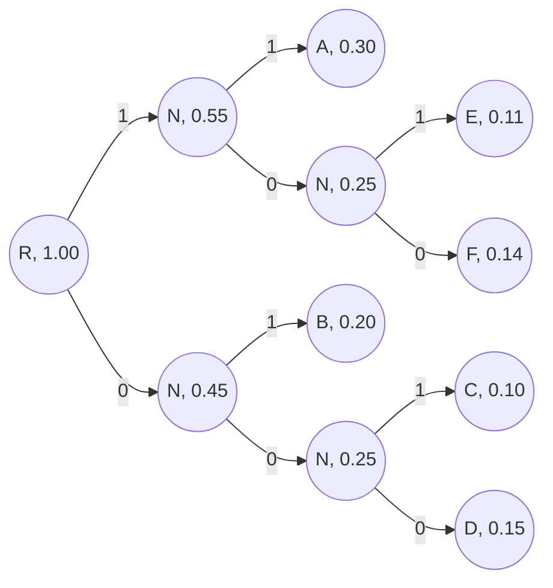

# 情報理論

### 概述

#### 情報源符号化

- 情報源の統計的性質を利用して通信や記録の効率の向上。

#### 通信路符号化

- 通信路の雑音や誤りに対処し通信や記録の高信頼化。

#### 符号化

- ある目的を達成するために。元の記号を別の記号列に変換すること。
- 変換された後の記号列の事を符号語と呼ぶ。

#### 情報通信モデル


#### 誤り検出と誤り訂正

- 誤り検出：誤りが発生したということがわかる。
- 誤り訂正：誤りが発生したということがわかり、さらにどこが誤ったかがわかる。
- 誤り検出を目的とする符号：誤り検出符号。

- 誤り訂正を目的とする符号：誤り訂正符号。

### 情報源符号化

#### 情報源

- 情報源とは、記号(シンボル　 Symbol)を発生させるもの。

- $M $種類の記号を発生させる情報源のことを$M$元情報源と呼ぶ。

  _（比如骰子就是 6 元情报源头，它一共有 6 个点数，可以发出六种不同的信号，所以称之为 6 元情报源。）_

- $M$が有限の情報源「すなわち、$M \lt \inf$」にのことを離散情報源、そうでない情報源にを連続情報源と呼ぶ。

- 情報源から発生する記号の集合を情報源アルファベットジュと呼ぶ。

情報理論では、情報源から出力されるシンボルは、**事前に決められた確率法則に従って発生するという前提で話をする。**

例えば：

- 天気
  - $P(晴) = 0.6,P(雨) = 0.1,P(雲) = 0.2,P(雪) = 0.1$
- サイコロ
  - $P(1)=P(2)=P(3)=P(4)=P(5)=P(6)=\frac{1}{6}$

#### 無記憶情報源とマルコフ情報源

- 無記憶情報源：ある時刻に発生するシンボルの確率が、それ以前に発生したシンボルに依存しない。

  _（比如骰子，第二次投掷的数值不依赖于第一次投掷的数值）_

- マルコフ情報源（马尔可夫信源）：ある時刻に発生するシンボルの確率が、それ以前に発生したシンボルに依存する。

  _（比如英语，后一个词与前一个词的关系比较强烈）_

#### 情報の数量化

何かの知らせを受けた時に：

- どの程度驚くか
- それを知った価値がどの程度あるか

によって情報の量を測る。

_「北海道で雪が降る」と「沖縄で雪が降る」では、後ろの方が、よりニュース性（情報量）がある。_

#### シャノンによる情報量の定義

確率が$P(E)$である事象 E が生じたことを知った時：
$$
I(E) = -log_2P(E)[bit]
$$

```python
# implement
import math
def sumI(p):
    return -math.log2(p)
```

の量の情報を受け取ったと定義する（この量のことを自己情報量と呼ぶ）。

例えば：

$P(E)=0.6 : I(E)=0.74$

$P(E)=0.4：I(E)=1.32$

**つまり、確率が小さいほど、自己情報量は大きい。（反比例函数）**

例題

ある所は晴れる確率が 70%、天気予報で「ある所は晴れる」と聞いた時ので自己情報量を求めよう。

$I(E) = -\log_2(0.7) \approx 0.51$

#### 平均情報量

ある事象系$A = \{a_1, a_2, \cdots, a_n \}$を考える。こと時、事象系$A$の平均情報量$H(A)$を

$$
H(A) = P(a_1)I(a_1)+P(a_2)I(a_2)+\cdots+P(a_n)I(a_n) \\
= P(a_1)(\log_2P(a_1)) + P(a_2)(\log_2P(a_2))+\cdots+P(a_n)(\log_2P(a_n))  \\
= -\sum^n_{i=1}P(a_i)\log_2 P(a_i)
\\(let: 0\log_20=0)
$$

と定義し、**エントロピー**と呼ぶ。（也就是，信息压缩的极限，也就是信息的熵。**也就是大 sigma 这一条公式**）

```python
# implementation
import numpy as np
log2 = np.log2
def sum_shannon_entropy(p_list: np.ndarray): # p_list: 事件群中各个事件发生的概率
    if not isinstance(p_list, np.ndarray):
        p_list=np.array(p_list)
    p_list[p_list == 0] = 1 # let log2(0) = 0
    return np.sum(p_list * np.array([-log2(p) for p in p_list]))
```

#### エントロピー（信息熵）

エントロピーとは、事象系の「曖昧さ」「無秩序さ」「不明確さ」「予測の難しさ」などの表現するものと考えればよい

例えば：

「当たる確 50%、外れる確率 100％」のくじ A と「当たる確 0%、外れる確率 100％」のくじ B とでは、くじ A のエントロピーの方が大きい。

- くじ A：引いてみるまで結果は全くわからない、つまりとても曖昧。
- くじ B：引く前から、結果がわかってる、曖昧さが全くない。

計算してみる：

くじ A に対し、当たるを$a_1$外れるを$a_2$とします。

$$
P(a_1)*I(a_1) + P(a_2)*I(a_2) = 0.5 + 0.5 = 1
$$

くじ B に対し、当たるを$b_1$外れるを$b_2$とします。

$$
P(b_1)*I(b_1) + P(b_2)*I(b_2) = 0
$$

#### エントロピーの性質

- 全ての事象の確率が同じ時、エントロピーは最大値

$$
\log_2n
$$

になる。n が事象数

#### 一意復号可能

- ある符号語列を受信したときに、一つの解釈しかできない（元の通りに復号できる）符号」のことを一意復号可能な符号と呼ぶ。

一意復号可能ではない例：

A を 1、B を 0、C を 10 とすると、

「1010」を受信した時、以下の四つ通りに解釈できる：

「ABAB」　「ABC」　「CAB」　「CC」

#### 瞬時復号可能

- 復号語列を受信した時、前から次々と復号できる場合と、後ろまで見ないと復号できない場合がある。

前者の例：

A を 1、B を 0、C を 10 とすると：

010 を受信した場合、直ちに AB と復号できる

今の例：

A を 1、B を 0、C を 10 とすると：

- 001 を受信した時、まず最初の０を受信した段階では、「A」「B」「C」の３通りの可能性がある
- 次の０を受信した段階で、初めて最初の 0 が A であると判定できる

#### 情報源符号の木表現

- 情報源符号を木で表現すると、瞬時復号可能かどうか判断できる。

瞬時復号可能である場合は、木のリーフにのみ符号語が対応付けられるが、きのノードには符号語が対応付けられない。

**できる**木構造：



すなわち：$A = 0, B = 10, C = 110$

**できない**木構造：





すなわち：$A = 0, B = 01, C = 011$

#### クラフトの不等式

情報源アルファベットの数が M ご個であったとする。

各シンボルの符号語の長さを：

$$
L_1,L_2,L_3,\cdots ,L_n
$$

とした時、この符号が**瞬時復号可能**であれば、以下の：

$$
2^{-L_1} + 2^{-L_２} + \cdots +　2^{-L_M} \le 1
$$

の不等式が**成り立つ**。

この不等式のことを、クラフト不等式と呼ぶ。

$$
p: 瞬時復号可能 \\
q: 不等式が成り立つ\\
p \rarr q\space が \space q \rarr pじゃない
$$

例：

符号

$$
A: 01, B: 100,C:101,D:111,E:00,F:10
$$

は、クラフト不等式を満足しているか？

```python
import numpy as np
np.sum(np.array([2**-i for i in [2, 3, 3, 3, 2, 2]]))
```

より、結果が 1.125$\ge$1 より、不満足。

#### 平均符号長

M 元情報源のシンボルの発生確率が

$$
p_1, p_2 \cdots p_M
$$

符号長が

$$
L_1, L_2 \cdots L_M
$$

であるとき、平均符号長$\bar L$を以下のように定義する：

$$
\bar L = p_1\cdot L_1 + p_2\cdot L_2 \cdots + p_M\cdot L_M = \sum_{i=1}^{M} p_i\cdot L_i
$$

これは、**符号化の性能を測る量**である。

```Python
import numpy as np
def sum_mean_L(P:np.ndarray, L:np.ndarray):
    return np.sum(P * L)
```

**瞬時復号化可能な符号の平均符号長の限界はエントロピー。エントロピーより小さいと瞬時復号化できない。**

ある情報源のエントロピーを$1.49$とすると、符号化すると、平均符号長が$1.4$だったら、瞬時復号化できない。

#### 符号化効率

瞬時復号化可能な符号の平均符号長は、エントロピーに近いほど良い。そこで、符号化効率$e$を以下の式で定義します。

$$
e = \frac{H}{\bar L},(0 \le e \le 1)
$$

**$e$は、大きいほど、効率が良い**

$\bar{L} = H$のとき、符号化効率が最大値１になる。

#### コンパクト符号

符号化効率の最もよい瞬時復号化可能な符号を、コンパクト符号と呼ぶ。

コンパクト符号を作成する具体的な方法として、ハフマン符号化がある。

#### ハフマン木(哈夫曼树)

哈夫曼树的构建过程：

Implemented at [MXCC::Coding::Huffman](https://github.com/MuxFox/MXCC/blob/master/utl/coding/huffman.hpp);

有下列一组符号：

$$
\begin{align}
Symbols &= \{A, B, C, D, E, F \} \\
P(A) &= 0.3 \\
P(B) &= 0.2 \\
P(C) &= 0.1 \\
P(D) &= 0.15 \\
P(E) &= 0.11 \\
P(F) &= 0.14 \\
\end{align}
$$

1. 将所有的符号，按照频率，由小到大依次排序

2. 按照频率，从下往上生成结点，保证每一个符号都处于叶子节点上，每两个节点一单连接成一个节点，新的节点的频率为其子节点的频率和，就像这样：

    ```mermaid
    graph LR
    Node1((0.3)) --> Node2((0.2))
    Node1((0.3)) --> Node3((0.1))
    ```

构建过程：

最小的两个节点，分别是$E, F$，$N_i$表示节点不表示任何符号，则：



此时，所有的符号只剩下了：

$$
P(A) = 0.3 \\
P(B) = 0.2 \\
P(C) = 0.1 \\
P(D) = 0.15 \\
P(EF) = 0.25
$$

再一次找出频率最小的两个节点，分别是$C,D$，则：



此时，所有的符号只剩下了：

$$
P(A) = 0.3 \\
P(B) = 0.2 \\
P(CD) = 0.25 \\
P(EF) = 0.25
$$

再一次找出最小的两个，这一次分别是$B, CD$或者是$D,EF$


此时，所有的符号只剩下了：
$$
P(A) = 0.3 \\
P(BCD) = 0.45 \\
P(EF) = 0.25
$$
再一次找出最小的两个，这一次分别是$EF, A$


此时，所有的符号只剩下了：
$$
P(BCD) = 0.45 \\
P(AEF) = 0.55
$$
拼接剩下的两个节点$R$表示根节点：


至此为止，我们就得到了一棵哈夫曼树，然后遍历这个哈夫曼树，就得到了编码：
$$
A = 11\\
B = 01 \\
C = 001 \\
D = 000 \\
F = 100 \\
E = 101
$$
至此，哈夫曼编码生成。

观察哈夫曼编码，可以发现，频率越大的符号，其编码相对短，

频率越小的符号，往往需要遍历到树更深层的地方才能解码，这在某种程度上也加速了编码解码的过程，提高了效率。

<h4 style="color: red; text-align:center;">到此为止是情報源符号化</h4><hr>

### 通信路符号化

#### 通信路で発生する誤り

通信路では、さまざまな原因で情報の誤りが発生する

誤りは、検出や訂正ができないといけない

#### ハミング距離

同じ長さの 2 つの文字列の間の**ハミング距離**（英語：Hamming distance）は、2 つの文字列の対応する位置にある異なる文字の数である。 言い換えれば、ある文字列を別の文字列に変換するために、*置き換え*が必要な文字数です。
ハミングウェイトとは、同じ長さのゼロの文字列に対する文字列のハミング距離のことで、文字列に含まれるゼロでない要素の数を表します。2 進法の文字列の場合、$1$の数なので、$11101$のハミングウェイトは 4 となります。

#### 冗長（じょうちょう）ビット

$2^k$種類の情報は本来$k$ビットあれば表現できるが、誤りの検出や訂正をさせるためには、余分なビットが必要となる。

余分なビットは、冗长ビットという

#### (n, k)符号

本来$k$ビットで表現できる情報を$n$ビットの符号語で符号化するような符号のことを$(n, k)$符号

$n$ビットにうち、情報を担っている$k$ビットの情報を情報ビットと呼ぶ

残りの$(n-k)$ビットを冗长ビットビットであるが、誤りの有無の検査に用いるため、検査ビットと呼ばれる。

#### 符号化率と冗長度

$(n, k)$符号の符号化率$\eta$と冗長度$\rho$は以下のように与えられる

符号化率：

$$
\eta = \frac{k}{n}
$$

冗長度

$$
\rho = 1 - \eta = 1 - \frac{k}{n} = \frac{n-k}{n}
$$

#### ハミング距離と誤り訂正

例えば、001 を受信した、A が 000、B が 111、それぞれのハミング距離が

$$
001 \rightarrow A: ハミング距離が１ \\
001 \rightarrow B: ハミング距離が2
$$

なので、A に訂正する。ハミング距離近い方に訂正する。

#### 符号語と非符号語

A に 001、B を 111 という符号語が割り当てられていると
そのほかの
001 010 011 100 101 110
は符号語としては使われていない
このようなものを非符号語と呼ぶ

誤り検出や訂正にために、非符号語が必要。

#### 符号空間

符号を空間の座標点に対応させたものを符号空間と呼ぶ。其实就是把编码按照空间排布，比如 A 对应 010，那就是空间中 x 坐标取 0，y 取 1，z 取 0 的点。

#### 最小ハミング距離

符号語間のハミング距離で最小のものを最小ハミング距離と呼び、誤り検出、訂正の性能を評価する指標の一つである

#### パリティチェック方式（奇偶校验法）

符号語に０か１の１ビットを付加し、符号語の１の数を偶数にし、誤り検出を行う。使得 0 或者 1 的个数必然是偶数或者是奇数，双方约定好，如果发现不是偶数/奇数，则错误发生。

例えば、転送したいビット列が$1001110$

偶数パリティ方式：

全体の１の個数が背でに偶数なので、パリティチェックは０、すなわち、

$10011100$ とする。

奇数パリティ方式：

全体の１の個数が背でに偶数なので、パリティチェックは 1、すなわち、

$10011101$ とする。

#### 排他的論理和 $\oplus$

| 输入 | 输入 | 输出 |
| :--: | :--: | :--: |
|  0   |  0   |  0   |
|  0   |  1   |  1   |
|  1   |  0   |  1   |
|  1   |  1   |  0   |

(相同为 0，不同为 1)

偶数パリティ方式で付加するビットは、元のビット列の各ビットの排他的理論和の値とする。

#### 水平垂直パリティチェック符号（長方形符号）

送りたい情報を長方形に並べ、横方向、縦方向の両方にパリティチェックビットを付加する方式のことを、水平垂直パリティチェック符号という。一個の誤りを訂正できる符号化の一つである。

例：

送りたい情報：$0010\space1001\space1100\space0001\space0000\space0100$

この情報ビットが以下長方形に並べられます：

$$
0010 \space 1101  \\
1100 \space 0001 \\
0000 \space 0100
$$

以上の、情報ビットに対して、横、縦方向のビット列の排他的論理和を付加すると

$$
0010 \space 1101 \space \textcolor{#FF0000}{0} \\
1100 \space 0001 \space \textcolor{#FF0000}{1} \\
0000 \space 0100 \space \textcolor{#FF0000}{1} \\
\textcolor{#FF0000}{1110\space  1000 \space  0}
$$

第４行目と最後の一列は、付加ビットです。

#### 水平垂直パリティチェック符号構成法（方块校验法）

送りたい情報を長さ$l \times m$　ビットであるとする。

$$
\left \{
\begin{matrix}
x_{11} & x_{12} & x_{13} & \cdots &x_{1m} \\
x_{21} & x_{22} & x_{23} & \cdots &x_{2m} \\
\cdots & \cdots & \cdots & \cdots & \cdots & \\
x_{l1} & x_{l2} & x_{l3} & \cdots &x_{lm} \\
\end{matrix}
\right \}
\tag{元ビット列}
$$

水平垂直パリティチェック符号を付加すると、以下のようになります

$$
\left[
\begin{matrix}
x_{11} & x_{12} & x_{13} & \cdots &x_{1m} & p_{1}\\
x_{21} & x_{22} & x_{23} & \cdots &x_{2m} & p_{2} \\
\cdots & \cdots & \cdots & \cdots & \cdots & p_{3} \\
x_{l1} & x_{l2} & x_{l3} & \cdots &x_{lm} & \dots \\
 q_{1} & q_{2} & q_{3} & \cdots & q_{m} & q_{m+1}
\end{matrix}
\right]
\tag{元ビット列と訂正ビット}
$$

その中、

$$
q_{i} = x_{i1} \oplus x_{i2} \oplus \cdots \oplus x_{im} (i = 1,2\cdots, l)  \\
q_{j} =  x_{1j} \oplus x_{2j} \oplus \cdots \oplus x_{lj} (j = 1,2\cdots, m) \\
q_{m+1} = p_1 \oplus p_2 \oplus \cdots \oplus p_l
$$

この符号化では、結局個の検査ビットが付加されている。

したがって、符号化率$\eta$は

$$
\eta = \frac{l \times m}{ l \times m + l + m + 1 }
$$

となる

#### 方块校验法的错误订正

$i$ 行目と$j$列目の 1 の数が奇数となったとすると$x_{ij}$に誤りが発生したことがわかるのでそのビットを反転（0 ならば 1、1 ならば 0 に）する


$$
\begin{matrix}
0010\space 1101\space \textcolor{#FF0000}{0} \\
1100\space 0001\space \textcolor{#FF0000}{1} \\
0000\space 0100\space \textcolor{#FF0000}{1} \\
\textcolor{#FF0000}{1110\space 1000\space} \textcolor{#FF0000}{0} 
\end{matrix}　\rightarrow


\begin{matrix}
001 \textcolor{#66CCFF}{0}\space 1101\space \textcolor{#FF0000}{0} \\
\textcolor{#3443f3}{110} \textcolor{#FF00FF}{1}\space \textcolor{#3443f3}{0001}\space \textcolor{#FF0000}{1} \\
000 \textcolor{#66CCFF}{0}\space 0100\space \textcolor{#FF0000}{1} \\
\textcolor{#FF0000}{111\textcolor{#66CCFF}{0}\space 1000\space} \textcolor{#FF0000}{0} 
\end{matrix} \tag{誤り訂正仕組み}
$$

​     

#### 三角校验法

送りたい情報を三角形に並べ、パリティチェックビット付加する方式んのことを、三角形符号と呼び、一個の誤りを訂正できる符号の一つである。

例：

送りたい情報：$0010110001$

$$
\left[
\begin{matrix}
0 & 0 & 1 & 0 \\
1 & 1 & 0\\
0 & 0\\
1
\end{matrix}
\right]
\tag{元の情報ビット}
$$

$$
\left[
\begin{matrix}
0 & 0 & 1 & 0 & \bf\textcolor{#FF0000}{1} \\
1 & 1 & 0 & \bf\textcolor{#FF0000}{0}\\
0 & 0 & \bf\textcolor{#FF0000}{1}\\
1 &\bf\textcolor{#FF0000}{0}\\
\bf\textcolor{#FF0000}{0}
\end{matrix}
\right]
\tag{元の情報ビット}
$$

第一行的最后一个 1，来自于三角形第一行，第一行只有 1 个 1，所以补充一个 1，使 1 的个数为偶数

第二行最后的一个 0，来自于第二行本身，以及第一行的第四个位，也就是说，110（第二行）和第一行最后的一个 0，一共两个 1，不用补充 1

第三行的最后一个 1，来自于第三行本身以及，第二行，第一行的第三个位，也就是 00（第三行）和 0（第二行）和 1（第一行），需要补充一个 1。

最后一行的 0，来自于第一列一整列，0101，不需要补充 1。

以此类推。


#### 三角校验法的数学表达

まず、送りたい情報を三角形で表現する。例えば送りたい情報が 10 ビットである場合は以下のようにすればよい

$$
X =
\left[
\begin{matrix}
x_{11} & x_{12} & x_{13} & x_{14} \\
x_{21} & x_{22} & x_{23} \\
x_{31} & x_{32} \\
x_{41} \\
\end{matrix}
\right]
\tag {元ビット列}
$$

$$
Y =
\left[
\begin{matrix}
x_{11} & x_{12} & x_{13} & x_{14} & \textcolor{#FF0000}{p_1} \\
x_{21} & x_{22} & x_{23} & \textcolor{#FF0000}{p_2}\\
x_{31} & x_{32} & \textcolor{#FF0000}{p_3}\\
x_{41} & \textcolor{#FF0000}{p_4}\\
\textcolor{#FF0000}{p_5}
\end{matrix}
\right]
\tag {元ビット列} \\

p_1 = x_{11} \oplus x_{12} \oplus x_{13} \oplus x_{14} \\
p_2 = x_{21} \oplus x_{22} \oplus x_{23} \oplus x_{14} \\
p_3 = x_{31} \oplus x_{32} \oplus x_{13} \oplus x_{23} \\
p_4 = x_{41} \oplus x_{12} \oplus x_{22} \oplus x_{32} \\
p_5 = x_{11} \oplus x_{21} \oplus x_{31} \oplus x_{41} \\
$$

#### 三角校验法的错误订正


$$
\left\{
    \begin{matrix} 
        \textcolor{#009900}0 & \textcolor{#009900}0 & \textcolor{#009900}1 & \textcolor{#009900}0 & \textcolor{#66ccff}1 \\
        \textcolor{#009900}1 & \textcolor{#FF0000}0 & \textcolor{#009900}0 & \textcolor{#66ccff}0 \\
        \textcolor{#009900}0 & \textcolor{#009900}0 & \textcolor{#66ccff}1 \\
        \textcolor{#009900}1 & \textcolor{#66ccff}0 \\
        \textcolor{#66ccff}0
    \end{matrix}\tag{誤り訂正仕組み}
\right \} 
$$
例えば に誤りが発生したとする，このとき
$$
p_2 = x_{21} \oplus x_{22} \oplus x_{23} \oplus x_{14} \\
p_4 = x_{41} \oplus x_{12} \oplus x_{22} \oplus x_{32} \\
$$

が成立しなくなる。

したがって、二つの式に共通の要素であるに誤りが発生したことがわかるので、そのビットを反転（0 ならば 1 に、1 ならば 0 に）する。

#### ハミング符号

- 1950 年に R Hamming によって提案された誤り訂正符号

- １びっとの誤りを訂正することができる

- ある整数$m$に対し
  $$
  n = 2^m -1, k = n-m
  $$

 が成立するような$(n, k)$符号である

#### $(7, 4)$ハミング符号の例

情報ビットを$a_1, a_2, a_3, a_4$ 、検査ビットを$c_1, c_2, c_3$とする。

情報ビットから検査ビットを決める方法は様々あるが、今回は以下のような例で考える。

$$
c_1 = a_1 \oplus a_2 \oplus a_3 \\
c_2 = a_2 \oplus a_3 \oplus a_4 \\
c_3 = a_1 \oplus a_2 \oplus a_4 \\
$$

例えば情報ビットが$0101$ならば検査ビットは$100$になる。

これで、ハミング、符号化できる。

誤り検出と訂正

受信者が$(\tilde{a_1}, \tilde{a_2},\tilde{a_3},\tilde{a_4},\tilde{c_1},\tilde{c_2},\tilde{c_3})$を受信したとする。
誤りがなければ

$$
\tilde{a_1} \oplus \tilde{a_2}\oplus \tilde{a_3}\oplus \tilde{c_1} =a_1\oplus a_2\oplus a_3\oplus c_1 = 0 \\
\tilde{a_2} \oplus \tilde{a_3}\oplus \tilde{a_4}\oplus \tilde{c_2} =a_2\oplus a_3\oplus a_4\oplus c_2 = 0 \\
\tilde{a_1} \oplus \tilde{a_2}\oplus \tilde{a_4}\oplus \tilde{c_3} =a_1\oplus a_2\oplus a_4\oplus c_3 = 0 \\
$$

が成立する。もし誤っていれば、上記の式は成立しない。
そこで、

$$
s_1 = \tilde{a_1} \oplus \tilde{a_2} \oplus \tilde{a_3} \oplus \tilde{c_1} \\
s_2 = \tilde{a_2} \oplus \tilde{a_3} \oplus \tilde{a_4} \oplus \tilde{c_2} \\
s_3 = \tilde{a_1} \oplus \tilde{a_2} \oplus \tilde{a_4} \oplus \tilde{c_3} \\
$$

とおき、$s_1, s_2, s_3$を計算する。

符号語の誤りパターンを$(e_1, e_2, e_3, e_4, e_5, e_6, e_7)$以下のように定義する。

$$
(\tilde{a_1}, \tilde{a_2},\tilde{a_3},\tilde{a_4},\tilde{c_1},\tilde{c_2},\tilde{c_3}) = \\
(a_1 \oplus e_1,a_2 \oplus e_2,a_3 \oplus e_3,a_4 \oplus e_4,a_5 \oplus e_5,a_6 \oplus e_6,a_7 \oplus e_7)
$$

ここで$s_1$を計算してみると、以下のようになる

$$
s_1 = a_1 \oplus e_1 \oplus a_2 \oplus e_2 \oplus a_3 \oplus e_3  \oplus c_1 \oplus e_5 \\
 = (a_1\oplus a_2\oplus a_3\oplus c_1)\oplus(e_1\oplus e_2\oplus e_3 \oplus e_4) \\
= (e_1\oplus e_2\oplus e_3 \oplus e_4)
$$

同様に計算すると、以下のようになる

$$
s_2 = e_2 \oplus e_3 \oplus e_4 \oplus e_6 \\
s_3 = e_1 \oplus e_2 \oplus e_4 \oplus e_7
$$

まとめると

$$
s_1= e_1\oplus e_2\oplus e_3 \oplus e_4 \\
s_2 = e_2 \oplus e_3 \oplus e_4 \oplus e_6 \\
s_3 = e_1 \oplus e_2 \oplus e_4 \oplus e_7
$$

となる。すなわち, $(s_1, s_2, s_3)$は送信符号には無関係に誤りパターンのみで決まる。

この$(s_1, s_2, s_3)$の組み合わせのことをシンドローム（syndrome）と呼ぶ

例えば、3 ビット目が誤った場合、すなわち$e_3=1$の場合、 $1,1,0 $となる。

上記のように、

$$
s_1 = \tilde{a_1} \oplus \tilde{a_2} \oplus \tilde{a_3} \oplus \tilde{c_1} \\
s_2 = \tilde{a_2} \oplus \tilde{a_3} \oplus \tilde{a_4} \oplus \tilde{c_2} \\
s_3 = \tilde{a_1} \oplus \tilde{a_2} \oplus \tilde{a_4} \oplus \tilde{c_3} \\
$$

であれば、シンドロームが$101$であるとき

$$
s_1= e_1\oplus e_2\oplus e_3 \oplus e_4 = 1 \\
s_2 = e_2 \oplus e_3 \oplus e_4 \oplus e_6 = 0\\
s_3 = e_1 \oplus e_2 \oplus e_4 \oplus e_7 =1
$$

となるのは、以下の場合である。

$$
e_1 = 1 \\
e_2 = e_3 = e_4 = e_5 = e_6 = e_7 = 0
$$

よって、1 ビット目が誤ったと考えられる。
